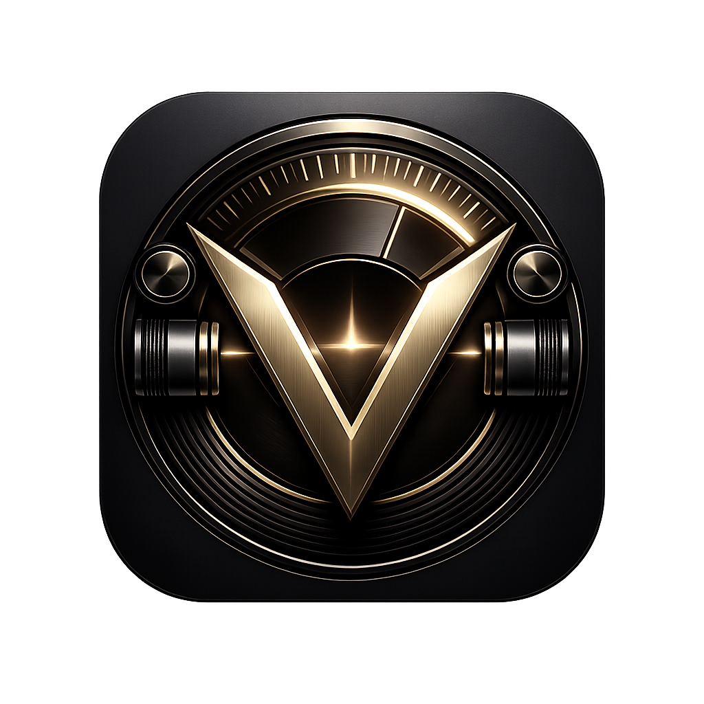
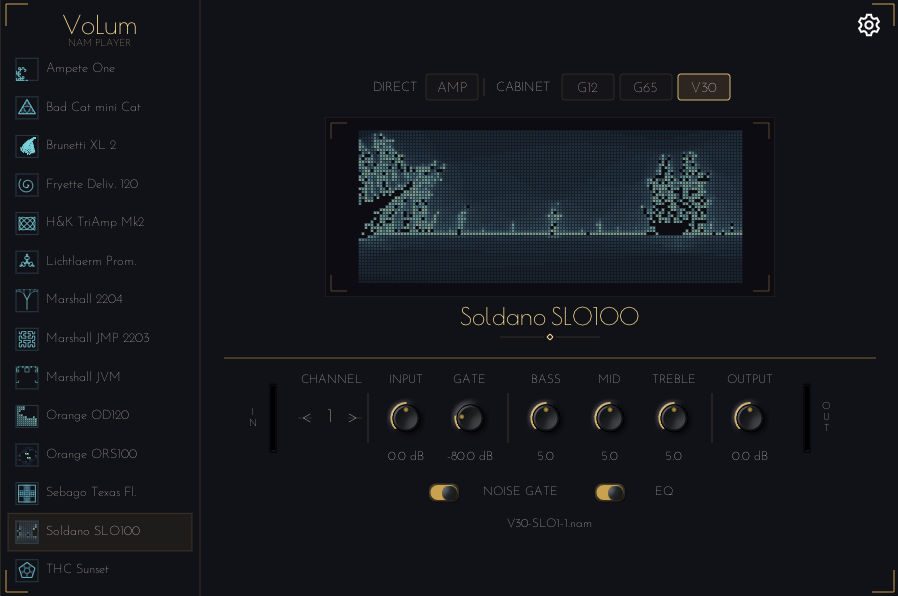

# VoLum -- NAM Player

<p align="center">
  
</p>



A guitar amp collection player built on [Neural Amp Modeler](https://github.com/sdatkinson/NeuralAmpModelerPlugin). Ships 14 amp profiles with a custom UI for instant browsing and switching -- standalone app and VST3 plugin.

## Features

- **14 bundled amps** with 4 speaker modes and multiple gain stages each (~224 profiles total)
- **Dark-theme UI** with sidebar amp browser, speaker buttons, channel stepper, and grouped knobs
- **Per-amp settings** -- knobs, toggles, speaker mode, and channel are saved per amp and restored on next launch
- **Fast amp switching** -- models load on a background thread; switching back to a previously loaded amp is instant
- **Keyboard shortcuts** -- Up/Down: switch amp; Left/Right: switch channel; click a knob for keyboard fine-tuning
- **Standalone + VST3** -- same UI and features in both formats

## Download

[](https://github.com/guitarlum/VoLum/actions/workflows/build-native.yml)

Grab the latest build from [**Actions > Build Native**](https://github.com/guitarlum/VoLum/actions/workflows/build-native.yml) -- pick the latest green run, scroll to **Artifacts**, and download **VoLum-win** (Windows) or **VoLum-mac** (macOS).

Tagged releases appear under [**Releases**](https://github.com/guitarlum/VoLum/releases) with separate artifacts for each install path:

- `VoLum-Setup.exe` for the recommended Windows install
- `VoLum-vX.Y.Z-win-portable.zip` for portable Windows use
- `VoLum-vX.Y.Z-mac-app.dmg` for the recommended macOS standalone app install
- `VoLum-vX.Y.Z-mac-vst3.zip` for macOS VST3 plugin installation

## Install

### Windows (portable zip from CI)

1. Download and unzip the **VoLum-win** artifact. Inside you will find two zips -- open the **main** one (not the `-pdbs` symbols archive).
2. You should see this layout:

```
VoLum_x64.exe                    (standalone app)
VoLum.vst3/                      (VST3 plugin bundle)
  Contents/x86_64-win/VoLum.vst3
VoLumRigs/                       (amp profiles -- required!)
  Ampete One/
  Marshall JMP 2203 1976/
  ...
```

3. **Standalone** -- just run `VoLum_x64.exe`. It finds `VoLumRigs` next to itself.
4. **VST3 in a DAW** -- copy the `VoLum.vst3` **folder** and the `VoLumRigs` **folder** into your VST3 scan path so they sit side by side:

```
C:\Program Files\Common Files\VST3\
  VoLum.vst3/                    <-- the whole folder, not just the inner file
  VoLumRigs/                     <-- amp profiles, right next to it
```

### Windows (installer from a tagged release)

Run `VoLum-Setup.exe`. It places the standalone in `Program Files\VoLum`, the VST3 bundle in `Common Files\VST3`, and the amp profiles under the install directory. The VST3 finds models automatically via registry -- no manual copying needed.

### macOS (portable zip from CI)

1. Unzip the **VoLum-mac** artifact, open the main zip.
2. The extracted folder contains:

```
VoLum.app/                        (standalone app; rigs already embedded)
VoLum.vst3/                       (VST3 plugin bundle)
VoLumRigs/                        (amp profiles for the VST3 plugin)
```

3. **Standalone** -- double-click `VoLum.app`. It already contains `VoLumRigs` inside `Contents/Resources`.
4. **VST3** -- copy `VoLum.vst3` and `VoLumRigs` side by side into `~/Library/Audio/Plug-Ins/VST3/`:

```
~/Library/Audio/Plug-Ins/VST3/
  VoLum.vst3/
  VoLumRigs/
```

### macOS (tagged release)

1. **Standalone app** -- download `VoLum-vX.Y.Z-mac-app.dmg`, open it, drag `VoLum.app` into `Applications`, then launch it. The app already contains the bundled rigs.
2. **VST3 plugin** -- download `VoLum-vX.Y.Z-mac-vst3.zip`, unzip it, then copy `VoLum.vst3` and `VoLumRigs` side by side into `~/Library/Audio/Plug-Ins/VST3/`.
3. Because the mac builds are currently unsigned, macOS may ask you to right-click `VoLum.app` and choose `Open` the first time.

## Bundled amps

| Amp | Channels |
|-----|----------|
| Ampete One | 4 |
| Bad Cat mini Cat | 3 |
| Brunetti XL 2 | 3 |
| Fryette Deliverance 120 | 2 |
| H&K TriAmp Mk2 | 6 |
| Lichtlaerm Prometheus | 3 |
| Marshall 2204 1982 | 6 |
| Marshall JMP 2203 1976 | 6 |
| Marshall JVM 210H OD1 | 6 |
| Orange OD120 1975 | 5 |
| Orange ORS100 1972 | 2 |
| Sebago Texas Flood | 2 |
| Soldano SLO100 | 3 |
| THC Sunset | 5 |

Each amp has 4 speaker modes (AMP direct, G12, G65, V30) and a number of gain-stage channels.

## Settings

Your per-amp knob, toggle, speaker, and channel settings are stored automatically:

- **Windows:** `%LOCALAPPDATA%\VoLum\volum-settings.json`
- **macOS:** `~/Library/Application Support/VoLum/volum-settings.json`

Settings persist across sessions for both standalone and VST3.

## Keyboard controls

- With no knob selected: `Up/Down` switches amp, `Left/Right` switches channel
- Click a knob to select it for keyboard control
- Selected knobs show their valid range and step size in the UI
- Selected knob: arrow keys adjust it
- Hold `Shift` for finer `0.1` adjustments
- Press `Enter` for exact numeric entry
- Press `Esc` to leave knob keyboard mode and return arrows to amp/channel navigation

## Build from source

See the [developer guide](NeuralAmpModeler/README.md).

## Credits

- [Neural Amp Modeler](https://github.com/sdatkinson/neural-amp-modeler) by Steven Atkinson
- [NAM Plugin](https://github.com/sdatkinson/NeuralAmpModelerPlugin) -- upstream fork base
- [iPlug2](https://iplug2.github.io) -- plugin framework
- Amp profiles by Lum
