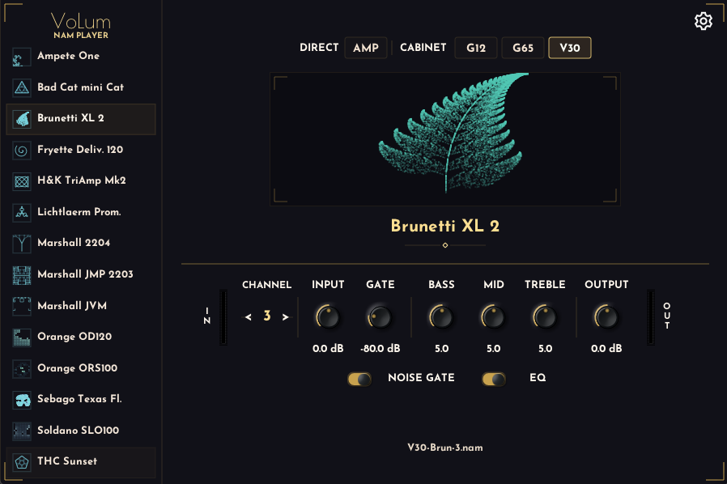

**Languages:** English | [Deutsch](README.de.md)

# VoLum -- NAM Player



A guitar amp collection player built on [Neural Amp Modeler](https://github.com/sdatkinson/NeuralAmpModelerPlugin). Ships 14 amp profiles with a custom UI for instant browsing and switching -- standalone app and VST3 plugin.

## Features

- **14 bundled amps** with 4 speaker modes and multiple gain stages each (~224 profiles total)
- **Dark-theme UI** with sidebar amp browser, speaker buttons, channel stepper, and grouped knobs
- **Per-amp settings** -- knobs, toggles, speaker mode, and channel are saved per amp and restored on next launch
- **Fast amp switching** -- models load on a background thread; switching back to a previously loaded amp is instant
- **Keyboard shortcuts** -- Up/Down: switch amp; Left/Right: switch channel; click a knob for keyboard fine-tuning
- **Standalone + VST3** -- same UI and features in both formats

## Download

[](https://github.com/guitarlum/VoLum/actions/workflows/ci.yml)

Get VoLum from **[Releases](https://github.com/guitarlum/VoLum/releases)**, or **[Actions → CI](https://github.com/guitarlum/VoLum/actions/workflows/ci.yml)** for the latest workflow artifacts.

**Windows**

- **`VoLum-vX.Y.Z-windows-setup.exe`** — **recommended:** one installer for standalone, VST3, and bundled rigs.
- **`VoLum-vX.Y.Z-windows-portable.zip`** — **optional:** unpack anywhere; for portable or scripted setups.

**macOS**

- **`VoLum-vX.Y.Z-macos-installer.dmg`** (contains **`VoLum Installer.pkg`**) — **recommended** when this asset is listed: a normal step-by-step installer; pick **standalone app**, **VST3 plug-in**, or **both**; bundled rigs go to the right places without hand-copying folders (you may be asked for an administrator password for system-wide locations).
- **`VoLum-vX.Y.Z-macos-standalone.dmg`** — **standalone app only:** drag `VoLum.app` into Applications — use this if you do not need the DAW plug-in.
- **`VoLum-vX.Y.Z-macos-vst3.zip`** — **optional / advanced:** VST3 bundle plus `VoLumRigs` for **manual** install under your user `~/Library/Audio/Plug-Ins/VST3/`; choose this if you already know how plug-in folders work or you are automating installs.

Releases do not always attach every file type; open the release and use the assets that match what you need.

## Install

### Windows (recommended)

Run `VoLum-vX.Y.Z-windows-setup.exe`.

It installs:

- `VoLum.exe` in `C:\Program Files\VoLum`
- `VoLum.vst3` in `C:\Program Files\Common Files\VST3`
- `VoLumRigs` in the VoLum install folder

The VST3 plugin finds the bundled rigs automatically through the installer registry entry, so no manual copying is needed.

### Windows (portable)

Use `VoLum-vX.Y.Z-windows-portable.zip` from a release, or the Windows artifact from **CI** (Actions).

1. Unzip the portable package.
2. You should see this layout:

```
VoLum_x64.exe                    (standalone app)
VoLum.vst3/                      (VST3 plugin bundle)
  Contents/x86_64-win/VoLum.vst3
VoLumRigs/                       (amp profiles -- required!)
  Ampete One/
  Marshall JMP 2203 1976/
  ...
```

3. **Standalone** — run `VoLum_x64.exe`. It finds `VoLumRigs` next to itself.
4. **VST3 in a DAW** — copy the `VoLum.vst3` **folder** and the `VoLumRigs` **folder** into your VST3 scan path so they sit side by side:

```
C:\Program Files\Common Files\VST3\
  VoLum.vst3/                    <-- the whole folder, not just the inner file
  VoLumRigs/                     <-- amp profiles, right next to it
```

### macOS — installer `.pkg` (recommended)

Open the **installer DMG** and double-click **`VoLum Installer.pkg`**. Follow the steps; you can enable **standalone app**, **VST3 plug-in**, and **bundled amp rigs** as separate options. This is the simplest path: no manual copying into hidden folders.

Installed locations (system-wide; macOS may ask for an **administrator password**):

- **`VoLum.vst3`** → `/Library/Audio/Plug-Ins/VST3/`
- **Bundled amps** → `/Library/Application Support/VoLum/VoLumRigs/` (normal macOS **Application Support** layout — VoLum finds rigs here automatically)

Unsigned builds: you may need **right-click → Open** on the `.pkg`, or **System Settings → Privacy & Security → Open Anyway**, the first time.

### macOS — standalone app only

Use this if you **do not** need the DAW plug-in.

1. Download `VoLum-vX.Y.Z-macos-standalone.dmg`.
2. Open it and drag `VoLum.app` into **Applications**.
3. Launch `VoLum.app`.

The app already contains the bundled rigs inside the bundle. If the build is unsigned, use **right-click → Open** the first time if macOS blocks it.

### macOS — VST3 zip (advanced / manual)

Use **`VoLum-vX.Y.Z-macos-vst3.zip`** when you are **not** using the installer `.pkg` — for example if no installer DMG is attached to the release, or you prefer to place files yourself.

VoLum is a **VST3** plug-in. It does **not** appear in **Logic Pro** (Logic uses Audio Units, not VST3). Use a DAW that supports VST3 on Mac, such as **REAPER**, **Ableton Live**, **Cubase**, **Studio One**, or **Bitwig**.

**You need two things in the same folder:** the plug-in bundle (`VoLum.vst3`) **and** the amp profiles folder (`VoLumRigs`). If you copy only `VoLum.vst3`, the plug-in may open but the bundled amps will not load correctly.

1. Download `VoLum-vX.Y.Z-macos-vst3.zip` and double-click it to unzip. You should see **`VoLum.vst3`** (a package/bundle) and **`VoLumRigs`** (a folder of amp names).
2. Open your Mac’s user plug-in folder in Finder:
   - In the menu bar: **Go → Go to Folder…** (shortcut: **⇧⌘G** — hold **Shift**, **Command**, and **G**)
   - Paste: `~/Library/Audio/Plug-Ins/VST3`
   - Press **Return**.  
   **Why not browse there by hand?** The **Library** folder inside your home folder is **hidden** in Finder by default, so you usually will not see it next to Desktop or Documents. You don’t need to: **Go to Folder** jumps straight to the path above. (On some macOS versions, **Go** shows **Library** while you hold **Option (⌥)** — the key left of Command, not Command. If **Library** doesn’t appear, **Go to Folder** above still works.)  
   If that folder does not exist yet, create it: **File → New Folder** and name the nested folders `Audio`, `Plug-Ins`, `VST3` as needed, or let your DAW create the path once.
3. Drag **both** `VoLum.vst3` and `VoLumRigs` into that `VST3` folder so they sit **next to each other** (same level, not nested inside one another):

```
~/Library/Audio/Plug-Ins/VST3/
  VoLum.vst3/          ← the whole bundle (icon may look like a single file)
  VoLumRigs/           ← folder with amp subfolders and .nam files
```

4. Open your DAW, open its **plug-in preferences**, and run **Rescan** (or restart the DAW). Then add VoLum on a track like any other effect (often **FX** or **Insert**).

**First run / security:** macOS builds may be unsigned. If the plug-in does not show up after a rescan, remove quarantine in Terminal (copy-paste, then press Return):

```bash
xattr -cr ~/Library/Audio/Plug-Ins/VST3/VoLum.vst3
```

Then rescan plug-ins again.

**Example (REAPER):** **REAPER → Settings/Preferences → Plug-ins → VST** → confirm the VST3 path includes `~/Library/Audio/Plug-Ins/VST3` → **Re-scan**. Insert **FX** on a track and search for **VoLum** under VST3.

### macOS preview builds

If you are installing from **CI** artifacts instead of a tagged release:

1. Open **Actions → CI**, pick the latest green run, and download **VoLum-mac** (and **VoLum-win** on Windows if needed).
2. Prefer **`*-macos-installer.dmg`** ( **`VoLum Installer.pkg`** ) when it is included; otherwise use **`*-macos-standalone.dmg`** for the app and **`*-macos-vst3.zip`** for the manual plug-in install.
3. Follow the matching sections above (**installer**, **standalone only**, or **VST3 zip**).

## Bundled amps


| Amp                     | Channels |
| ----------------------- | -------- |
| Ampete One              | 4        |
| Bad Cat mini Cat        | 3        |
| Brunetti XL 2           | 3        |
| Fryette Deliverance 120 | 2        |
| H&K TriAmp Mk2          | 6        |
| Lichtlaerm Prometheus   | 3        |
| Marshall 2204 1982      | 6        |
| Marshall JMP 2203 1976  | 6        |
| Marshall JVM 210H OD1   | 6        |
| Orange OD120 1975       | 5        |
| Orange ORS100 1972      | 2        |
| Sebago Texas Flood      | 2        |
| Soldano SLO100          | 3        |
| THC Sunset              | 5        |


Each amp has 4 speaker modes (AMP direct, G12, G65, V30) and a number of gain-stage channels.

## Settings

Your per-amp knob, toggle, speaker, and channel settings are stored automatically:

- **Windows:** `%LOCALAPPDATA%\VoLum\volum-settings.json`
- **macOS:** `~/Library/Application Support/VoLum/volum-settings.json`

Settings persist across sessions for both standalone and VST3.

## Keyboard controls

- With no knob selected: `Up/Down` switches amp, `Left/Right` switches channel
- Click a knob to select it for keyboard control
- Selected knob: `Up/Down` adjusts, `Left/Right` selects the next knob
- Hold `Shift` for finer `0.1` adjustments
- Press `Enter` for exact numeric entry
- Press `Delete` or `Backspace` to reset the selected knob to its default value
- Press `Esc` to leave knob keyboard mode and return arrows to amp/channel navigation

## Build from source

See the [developer guide](NeuralAmpModeler/README.md).

## Credits

- [Neural Amp Modeler](https://github.com/sdatkinson/neural-amp-modeler) by Steven Atkinson
- [NAM Plugin](https://github.com/sdatkinson/NeuralAmpModelerPlugin) -- upstream fork base
- [iPlug2](https://iplug2.github.io) -- plugin framework
- Amp profiles by Lum

