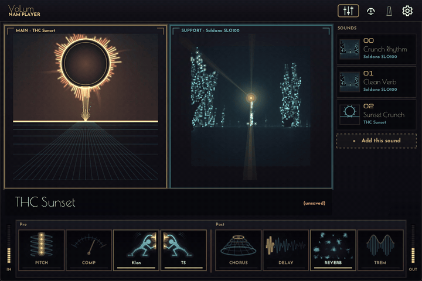
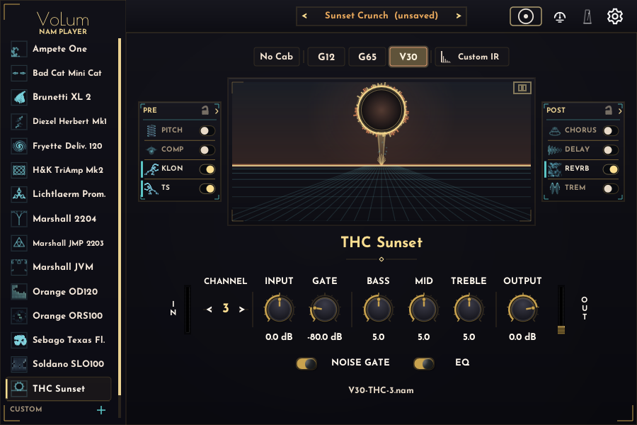

**Languages:** English | [Deutsch](README.de.md)

# VoLum

**Open-source guitar amps for the stage, the studio and the practice desk.**



VoLum opens on **PLAY**: your Sounds on the right, eight stomp switches below, and amp art that moves with your playing. Click a Sound or step through them from a MIDI foot controller, switch pedals on and off, and play. Five Factory Sounds are ready on programs 0 to 4, so there is something to play from the first minute.

When you want to change a tone, switch to **BUILD**. A **Tweak your sound** note points at the switch until you have used it once.

[Download VoLum](https://github.com/guitarlum/VoLum/releases) or read the [user guide](docs/user-guide.en.md).

## Why It Stands Out

- **Made for playing:** PLAY is the whole rig on one screen: your Sounds, PRE and POST stomp switches, the meters, the tuner and the metronome.
- **MIDI recall without Learn:** 128 program numbers, the same list PLAY shows. Send Program Change, or the Recall CC (102) when your host does not pass Program Change on.
- **Dual Amp:** two amps at once, each with its own channel, cab or IR, knobs and pan.
- **15 curated amps, 21 Factory presets:** put any of them on PLAY without saving first.
- **Your own content:** load your own NAM amps, IRs and pedals. A `.volumpack` backs up, moves or shares all of it in one file.
- **Standalone, VST3 and AU:** runs on the [Neural Amp Modeler](https://github.com/sdatkinson/NeuralAmpModelerCore) core, on Windows and macOS.
- **Update reminder only:** VoLum can tell you a newer release exists. It never downloads anything itself.

## Download

[](https://github.com/guitarlum/VoLum/actions/workflows/ci.yml)

Get stable packages from **[Releases](https://github.com/guitarlum/VoLum/releases)**. **[Actions -> CI](https://github.com/guitarlum/VoLum/actions/workflows/ci.yml)** has preview builds of the latest development state only.

| Platform | Asset | When to choose it |
| --- | --- | --- |
| Windows | `VoLum-vX.Y.Z-windows-setup.exe` | Easiest install: standalone app, VST3 and bundled rigs. |
| Windows | `VoLum-vX.Y.Z-windows-portable.zip` | Portable or scripted setup. Keep `VoLum.vst3` and `VoLumRigs` together. |
| macOS | `VoLum-vX.Y.Z-macos-installer.dmg` | Easiest install: standalone app, VST3, AU and bundled rigs. |
| macOS | `VoLum-vX.Y.Z-macos-standalone.dmg` | Standalone app only. |
| macOS | `VoLum-vX.Y.Z-macos-vst3.zip` | Manual VST3 install. |
| macOS | `VoLum-vX.Y.Z-macos-component.zip` | Manual AU install, for Logic Pro and GarageBand. |

Not every release has every asset. Open the release page and pick the package for your system.

## Important Security Notice

VoLum release signing is still being set up. See the [code signing policy](CODE_SIGNING.md).

- **Windows:** SmartScreen may warn about an unknown publisher. If you trust the source, choose **More info -> Run anyway**.
- **macOS:** Gatekeeper may block the app or installer. Try to open it once, then go to **System Settings -> Privacy & Security** and click **Open Anyway**.
- **macOS plug-in zips:** if your DAW still hides the plug-in after a rescan, remove the quarantine flag:

```bash
xattr -cr ~/Library/Audio/Plug-Ins/VST3/VoLum.vst3
xattr -cr ~/Library/Audio/Plug-Ins/Components/VoLum.component
```

Treat preview builds from CI as unsigned test builds.

## Quick Install

### Windows Installer

Run `VoLum-vX.Y.Z-windows-setup.exe`. It installs:

- `VoLum.exe` to `C:\Program Files\VoLum`
- `VoLum.vst3` to `C:\Program Files\Common Files\VST3`
- `VoLumRigs` to the VoLum install folder

The VST3 finds the bundled rigs automatically.

### Windows Portable

Unzip `VoLum-vX.Y.Z-windows-portable.zip`. For the standalone app, run `VoLum_x64.exe`. For the VST3, copy both folders into your VST3 folder:

```text
C:\Program Files\Common Files\VST3\
  VoLum.vst3\
  VoLumRigs\
```

### macOS Installer

Open `VoLum-vX.Y.Z-macos-installer.dmg` and run `VoLum Installer.pkg`. It installs the standalone app, the VST3, the AU and the bundled rigs.

### macOS Standalone

Open `VoLum-vX.Y.Z-macos-standalone.dmg`, drag `VoLum.app` to **Applications** and start it. The app includes the bundled rigs.

### macOS VST3 Zip

Unzip `VoLum-vX.Y.Z-macos-vst3.zip` and put both `VoLum.vst3` and `VoLumRigs` in your VST3 folder:

```text
~/Library/Audio/Plug-Ins/VST3/
  VoLum.vst3/
  VoLumRigs/
```

Rescan plug-ins in your DAW.

### macOS AU Zip

Unzip `VoLum-vX.Y.Z-macos-component.zip` and put both `VoLum.component` and `VoLumRigs` in your Components folder:

```text
~/Library/Audio/Plug-Ins/Components/
  VoLum.component/
  VoLumRigs/
```

Restart your DAW so it finds the new AU.

### Linux

There is no native Linux build. Some users report that the Windows VST3 works well on Linux through [yabridge](https://github.com/robbert-vdh/yabridge), but VoLum does not test that path.

## Bundled Amps

| Amp | Channels |
| --- | --- |
| Ampete One | 4 |
| Bad Cat Mini Cat | 3 |
| Brunetti XL 2 | 3 |
| Diezel Herbert Mk1 | 4 |
| Fryette Deliverance 120 | 2 |
| H&K TriAmp Mk2 | 6 |
| Lichtlaerm Prometheus | 3 |
| Marshall 2204 1982 | 6 |
| Marshall JMP 2203 1976 | 6 |
| Marshall JVM 210H OD1 | 6 |
| Orange OD120 1975 | 5 |
| Orange ORS100 1972 | 2 |
| Sebago Texas Flood | 2 |
| Soldano SLO100 | 3 |
| THC Sunset | 5 |

Every amp has four cab choices: **No Cab** (the amp alone), **G12**, **G65** and **V30**. You can also load your own cabinet IR.

## Your Sounds

PLAY starts with five Factory Sounds on programs 0 to 4: The bestest Clean, SLO Crunch, Modern Rhythm, Crack the Skye and Ampete Lead. Replace them or add your own: put any Factory preset, or a User preset you saved in BUILD, on a program number.

## BUILD

BUILD is where you shape a tone: pick an amp and channel, a cab or your own IR, set the knobs, add PRE pedals (Pitch with Transpose and Octaver, a compressor, two NAM pedal slots) and POST Chorus, Delay, Reverb and Tremolo, then save it as a preset. Press `P` or use the switch at the top right to go back and forth; switching never changes what you hear.

<p align="center">
  
</p>

## Learn More

- [User guide](docs/user-guide.en.md): BUILD and PLAY, amps and cabs, pedals and effects, Dual Amp, presets, MIDI, your own content, Packs, settings and keyboard shortcuts.
- [Developer guide](NeuralAmpModeler/README.md): build, test, packaging and architecture notes.
- [Report a bug or request a feature](https://github.com/guitarlum/VoLum/issues/new/choose): use **Bug report** for crashes or wrong behaviour and **Feature request** for ideas.

## Credits

- [Neural Amp Modeler](https://github.com/sdatkinson/neural-amp-modeler) by Steven Atkinson
- [NeuralAmpModelerPlugin](https://github.com/sdatkinson/NeuralAmpModelerPlugin), the original plug-in shell VoLum grew from
- [iPlug2](https://iplug2.github.io), the plug-in framework
- Amp profiles by Lum
