# VoLum Android UI Proposal Lab

Eight runnable Compose concepts. All use deterministic demo state; none connects to DSP/JNI.

Open the app to compare concepts, run a full first-launch journey, jump to Live or Deep Edit, and force No USB / Loading / Error states.

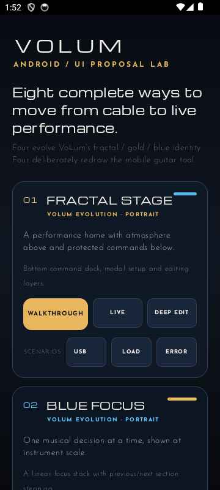

## 01 · Fractal Stage

**Thesis:** atmosphere above, protected commands below.  
**For:** players wanting immediate live status with occasional deliberate edits.  
**Navigation:** scroll-free performance home, bottom command dock, modal setup/editing.  
**Interaction:** select then horizontal scrub; live parameters locked.  
**Strengths:** strongest VoLum continuity; clear stage hierarchy.  
**Risk:** hero art spends scarce vertical space.

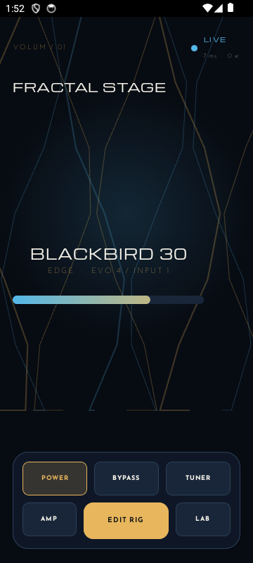
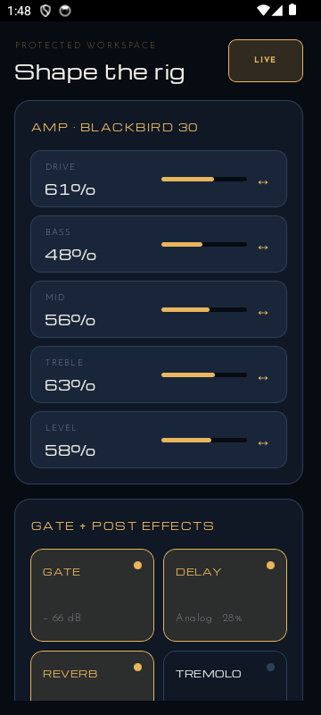

## 02 · Blue Focus

**Thesis:** one musical decision at instrument scale.  
**For:** tone-shapers who dislike dense consoles.  
**Navigation:** previous/next focus stack.  
**Interaction:** one large dial, precise step controls.  
**Strengths:** safest detailed editing; low cognitive load.  
**Risk:** slower for multi-effect changes.

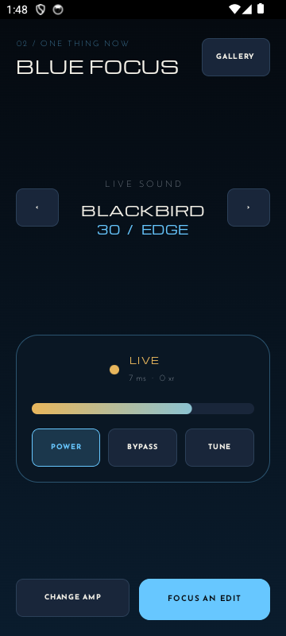
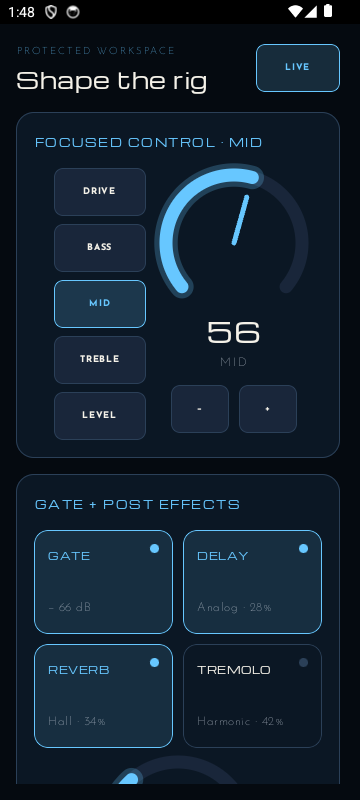

## 03 · Auric Pedalboard

**Thesis:** familiar floorboard behavior on a desk-mounted phone.  
**For:** players thinking in stomps and effect order.  
**Navigation:** pedalboard home; tapping a pedal raises its editor tray.  
**Interaction:** large stomp targets and horizontal faders.  
**Strengths:** instant effect-state recognition; tactile identity.  
**Risk:** physical metaphor constrains complex future routing.

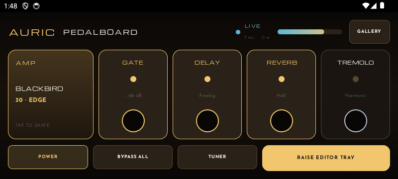
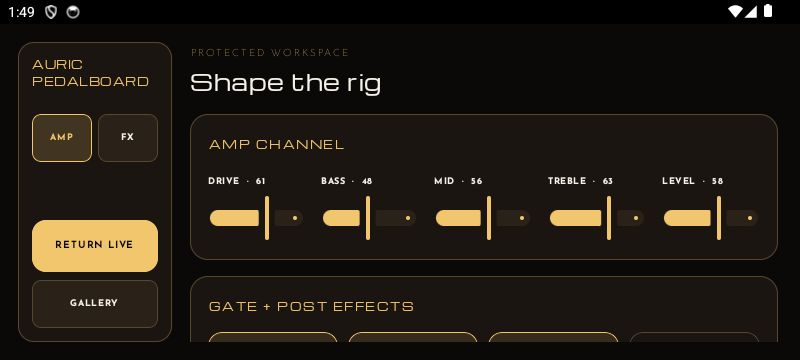

## 04 · Signal Atlas

**Thesis:** the complete signal path remains visible.  
**For:** rig builders reasoning about order and system state.  
**Navigation:** signal nodes plus persistent protected inspector.  
**Interaction:** select a node, then edit with linear controls.  
**Strengths:** clearest routing model; best scalability.  
**Risk:** more technical than performance-first concepts.

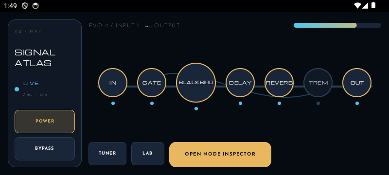
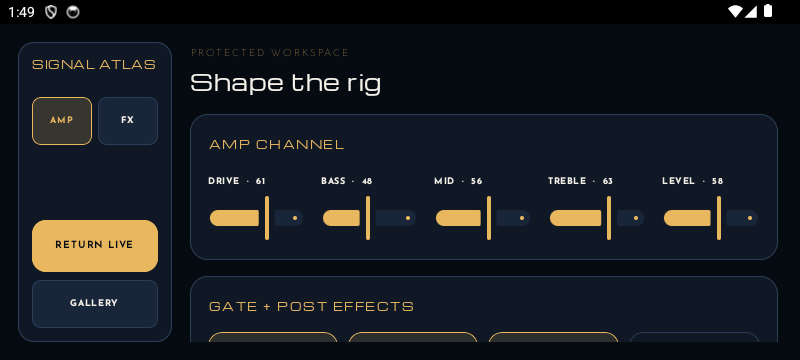

## 05 · Thumb Deck

**Thesis:** a short card sequence turns the rig into purposeful surfaces.  
**For:** mobile-native users who prefer task progression.  
**Navigation:** horizontal card deck anchored by Live and Setup.  
**Interaction:** swipe to section; tap-select before adjustment.  
**Strengths:** calm, learnable, and discoverable.  
**Risk:** distant cards hide functions.

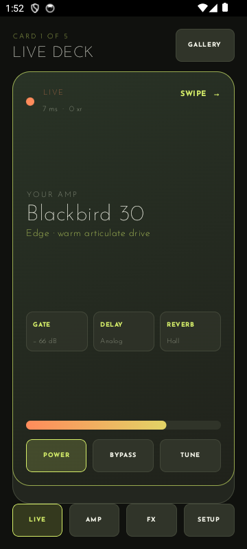
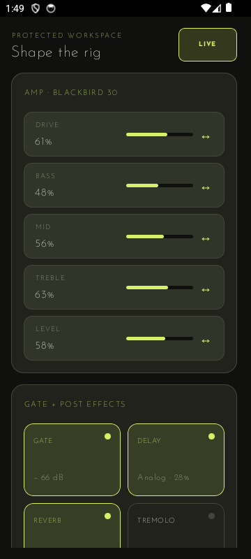

## 06 · Blackout Live

**Thesis:** performance mode is immutable and visually silent.  
**For:** players who set a rig once and demand confidence live.  
**Navigation:** minimal live face; hold to enter a separate workspace.  
**Interaction:** hold-to-edit, deliberate steppers, explicit Done.  
**Strengths:** best accidental-edit safety and dark-stage legibility.  
**Risk:** setup is intentionally less immediate.

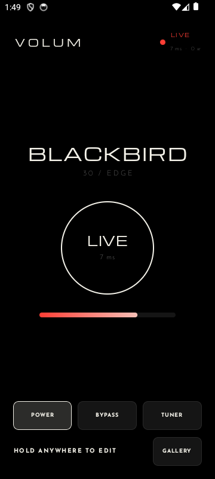
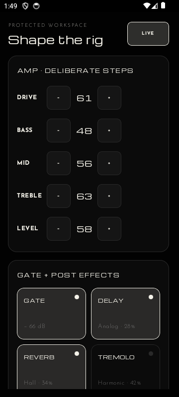

## 07 · Flight Rack

**Thesis:** rugged module bays keep system health and expansion visible.  
**For:** technical players managing larger rigs.  
**Navigation:** persistent left rail and stacked rack bays.  
**Interaction:** section-first navigation and broad faders.  
**Strengths:** ordered density; strong health/status model.  
**Risk:** industrial language may feel less musical.

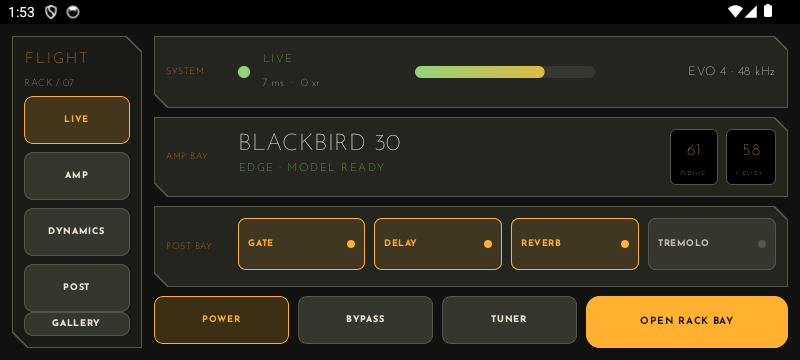
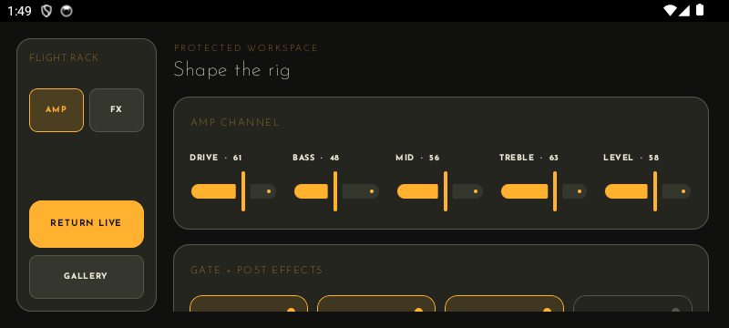

## 08 · Orbit Cockpit

**Thesis:** live status is a central instrument surrounded by spatial shortcuts.  
**For:** experimental performers valuing muscle memory.  
**Navigation:** central live core, functional sectors, right-side console.  
**Interaction:** tap a sector, then edit in a protected panel.  
**Strengths:** fast, memorable, unmistakable.  
**Risk:** steepest learning curve.

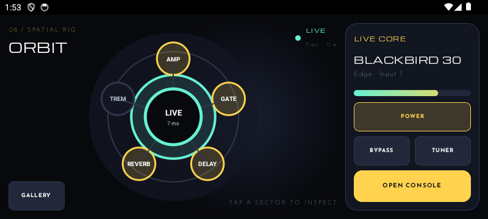
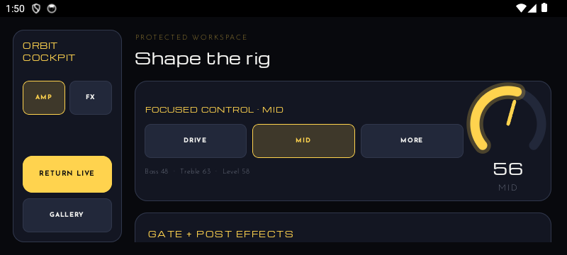

## Concise evaluation

- **Fractal Stage:** live 5/5 · discoverability 4/5 · speed 5/5 · safety 4/5 · scalability 3/5 · identity 5/5
- **Blue Focus:** live 4/5 · discoverability 5/5 · speed 3/5 · safety 5/5 · scalability 4/5 · identity 4/5
- **Auric Pedalboard:** live 5/5 · discoverability 5/5 · speed 5/5 · safety 3/5 · scalability 3/5 · identity 5/5
- **Signal Atlas:** live 4/5 · discoverability 4/5 · speed 4/5 · safety 5/5 · scalability 5/5 · identity 5/5
- **Thumb Deck:** live 4/5 · discoverability 4/5 · speed 3/5 · safety 4/5 · scalability 4/5 · identity 4/5
- **Blackout Live:** live 5/5 · discoverability 3/5 · speed 4/5 · safety 5/5 · scalability 3/5 · identity 5/5
- **Flight Rack:** live 4/5 · discoverability 4/5 · speed 4/5 · safety 5/5 · scalability 5/5 · identity 4/5
- **Orbit Cockpit:** live 5/5 · discoverability 3/5 · speed 5/5 · safety 4/5 · scalability 4/5 · identity 5/5

## Top three, not a winner

1. **Blackout Live** — strongest live confidence and edit safety; pays for it with slower setup and hidden depth.
2. **Signal Atlas** — strongest long-term information architecture; risks feeling like engineering tooling during performance.
3. **Fractal Stage** — best balance of brand, speed, and immediate comprehension; gives visual atmosphere more space than controls.

The right direction depends on whether VoLum prioritizes immutable performance, scalable rig construction, or branded emotional presence.
