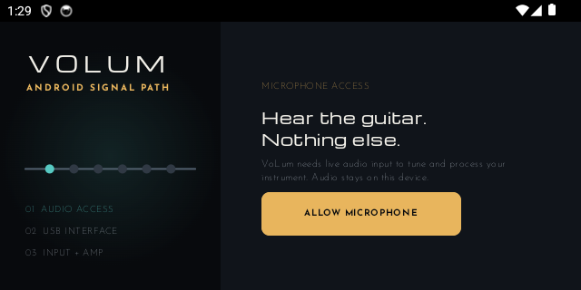
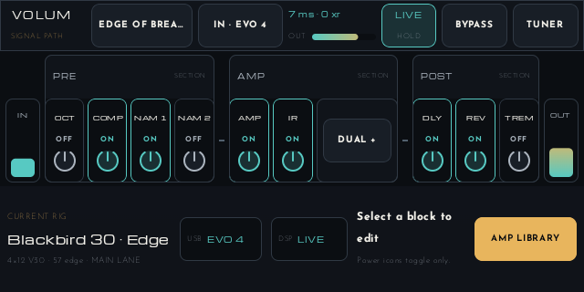
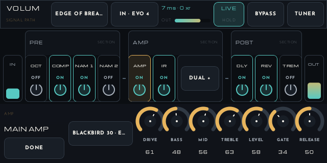
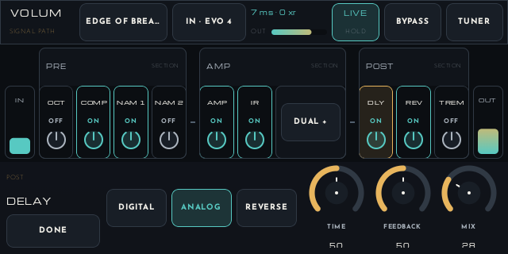
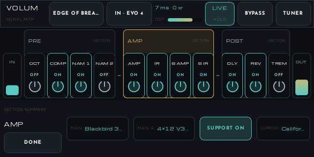
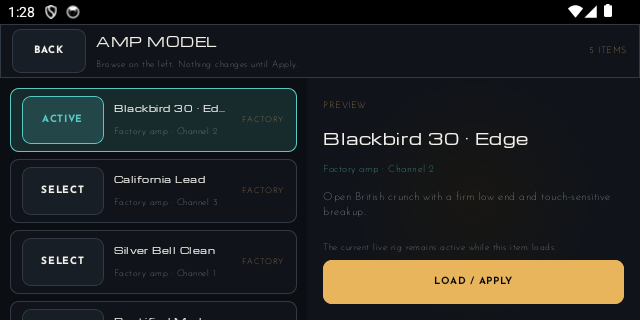
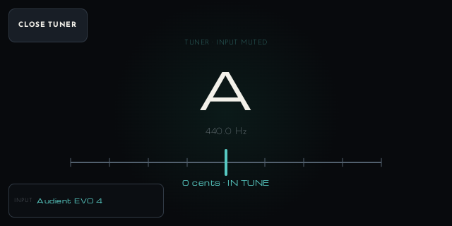
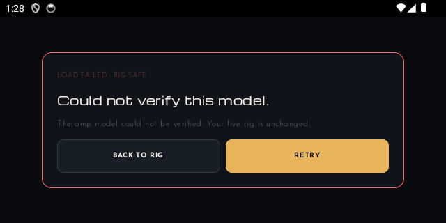

# VoLum Android Landscape UX Prototype

One runnable Compose prototype for validating information architecture before visual-direction work. It uses deterministic demo state and does not connect new controls to DSP/JNI.

## Design thesis

The complete fixed signal path is the home screen. It stays visible while a selected section or block opens a focused editor below it.

- Landscape-only, desk/stage use.
- No scrolling in setup, overview, section summaries, block editors, loading, errors, or tuner.
- Only real catalogs—devices, amps, NAM captures, IRs, presets—scroll.
- Fixed `INPUT → PRE → AMP/CAB → POST → OUTPUT` topology; no unsupported add/remove/reorder affordances.
- Tap a block body to edit. Its separate power target only toggles bypass.
- Tap PRE, AMP, or POST for section-wide controls.
- Main and Support amp/IR lanes remain explicit; Support is compact while disabled.
- Power-off requires hold. Bypass, tuner, and block power remain immediate.
- Direct knobs use vertical drag, numeric feedback, drag threshold, Undo, and hold-then-drag fine control.
- Catalog selection is preview-only until explicit Load/Apply.

## Screen flow

1. Microphone permission, including denial and retry.
2. USB absent/connected state.
3. Split input-device browser.
4. Split amp browser with verified loading.
5. Signal-path overview and live status.
6. PRE/AMP/POST summaries and focused block editors.
7. Fullscreen tuner.
8. Safe loading failure, retry, and return to unchanged rig.

## Reviewed emulator captures

### First launch

### Signal-path overview

### Amp detail

### Effect detail

### Dual amp

### Scrollable catalog

### Tuner and recovery

## Validation notes

- Screenshot-reviewed at the `volum_test` 640×320 landscape viewport.
- Rechecked at Android font scale 1.3. Dense stage surfaces cap visual text scaling at 1.1 to preserve the complete control map; accessibility semantics remain available. Setup and catalogs retain enlarged text.
- Every fixed block editor, all three section summaries, dual-amp expansion, explicit block power, tuner, held power, and knob drag were exercised through ADB/UIAutomator.
- Prototype reducer tests cover setup, focus routing, dual amp, explicit catalog apply, safe failure, Undo, modes, locks, power, and bypass.

This is the UX-structure checkpoint. Visual proposals should begin only after this interaction model is accepted.
