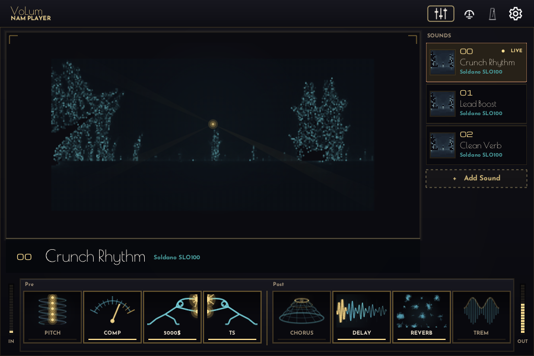
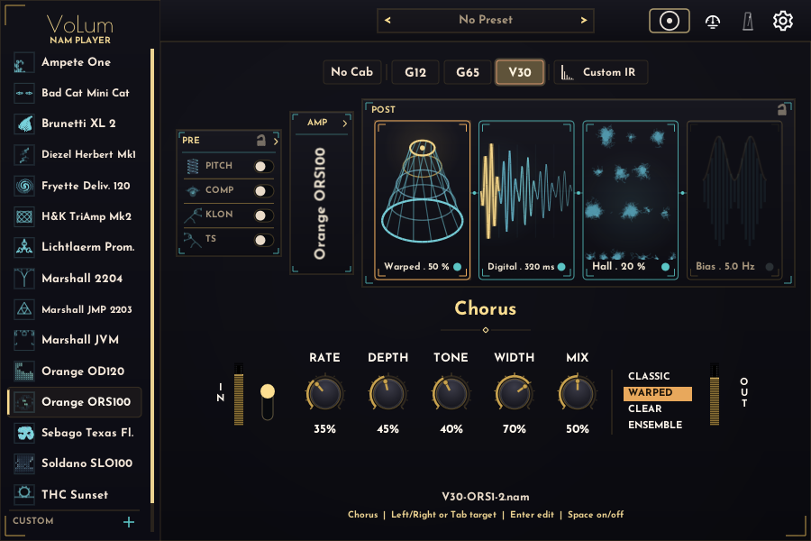
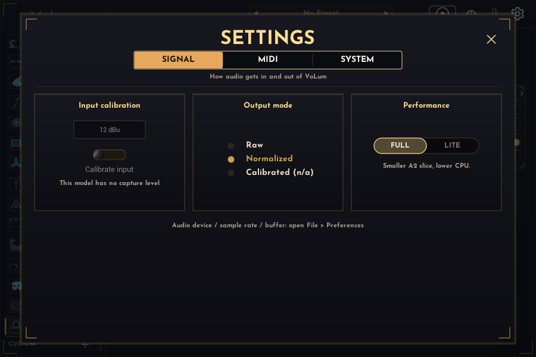
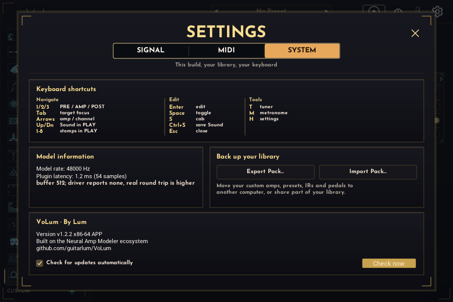
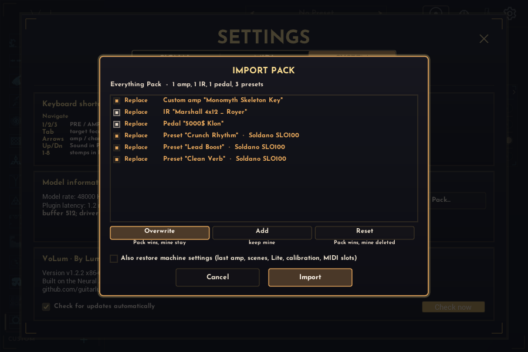

# VoLum Benutzerhandbuch

**Sprachen:** [English](user-guide.en.md) | Deutsch

Dieses Handbuch erklärt die aktuelle VoLum-Oberfläche nach der Installation. Downloads, Hinweise zu unsignierten Builds und Installationspfade stehen in der [Haupt-README](../README.de.md).

## Inhalt

- [Hauptansicht](#hauptansicht)
- [PLAY-Ansicht](#play-ansicht)
- [Amp Wählen](#amp-wählen)
- [PRE-Bereich](#pre-bereich)
- [Dual Amp](#dual-amp)
- [POST-Bereich](#post-bereich)
- [Presets](#presets)
- [Eigene Inhalte (Bring Your Own)](#eigene-inhalte-bring-your-own)
- [Tuner Und Metronom](#tuner-und-metronom)
- [Tastatur](#tastatur)
- [Einstellungen Und Sicherheit](#einstellungen-und-sicherheit)
- [Fehler Melden Oder Feature Vorschlagen](#fehler-melden-oder-feature-vorschlagen)

## Hauptansicht

1. **Amp-Browser:** wähle einen der mitgelieferten Amps.
2. **Amp-Panel:** zeigt den fokussierten Amp. Im Dual-Amp-Modus teilt es sich in MAIN und SUPPORT.
3. **Kanal- und Cab-Steuerung:** wähle zuerst den Gain-Stage-Kanal, dann das Speaker-Cab (`AMP`/`No Cab`, `G12`, `G65`, `V30`). Bei eigenen Amps kommt der Kanal zuerst: die Reihe zeigt nur die Cabs, die es für den gewählten Kanal gibt, und ein Kanalwechsel behält dein Cab, wenn es noch passt, oder springt auf ein verfügbares.
4. **Reglerzeile:** bearbeitet den fokussierten Amp, das PRE-Pedal oder den POST-Effekt.
5. **PRE | AMP | POST-Leiste:** öffnet immer genau einen Bereich.
6. **Toolbar:** Tuner, Metronom und Einstellungen sitzen oben rechts.

Die mitgelieferten NAM-Profile wurden mit einem Interface-Eingangspegel um +4 dBu aufgenommen. Nutze einen ähnlichen Pro-Line-Eingangspegel in VoLum, um den aufgenommenen Sounds möglichst nah zu kommen. Jedes mitgelieferte Amp-, Cab- und PRE-NAM-Capture ist ein NAM-Architecture-2-(A2)-Profil, trainiert auf den besten Sitz zwischen 700 und 1200 Epochen. Standardmäßig spielt VoLum die volle A2-Variante; der optionale Lite-Modus wird unter Einstellungen beschrieben.

VoLum speichert die meisten Spiel-Einstellungen pro Amp. Wenn du zu einem Amp zurückkehrst, stellt VoLum Speaker, Kanal, Regler, PRE-Pedale, POST-Effekte und Dual Amp wieder her.

## PLAY-Ansicht

Mit dem Umschalter **PLAY | BUILD** in der Kopfzeile wechselst du zwischen Bühnenoberfläche und vollständigem Editor. Jede Plug-in-Instanz merkt sich ihren Modus im Projekt; die Standalone-App merkt sich ebenfalls den letzten Modus. Der Wechsel zu PLAY ruft niemals einen Sound auf und verändert ihn nicht.

PLAY ordnet gespeicherte Sounds Program-Change-Slots zu. Klicke **Add Sound**, wähle ein Werk- oder User-Preset und danach den zu belegenden Slot. Für jeden der 15 Werk-Amps gibt es immer ein schreibgeschütztes Werk-Preset namens **Ready**; User-Presets bleiben in BUILD bearbeitbar. Ein Klick auf einen belegten Slot ruft seinen vollständigen Sound auf, ein Doppelklick ersetzt die Zuordnung und die kleine Entfernen-Schaltfläche löscht sie. Der hervorgehobene Slot ist der zuletzt aus PLAY aufgerufene und bleibt bei Live-Änderungen markiert; **EDITED** zeigt an, dass das aktuelle Rig von diesem Snapshot abweicht.

`Hoch` und `Runter` springen zum vorherigen oder nächsten belegten Slot und rufen ihn auf, damit du den Sound ohne Maus wechseln kannst. Leere Programmnummern werden übersprungen, ebenso Zuweisungen, deren Amp oder Preset fehlt; die Liste läuft an beiden Enden um.

Die acht Stomp-Schalter sind Performance-Bypässe für Pitch, Comp, NAM 1, NAM 2, Chorus, Delay, Reverb und Tremolo. Sie ändern ausschließlich die jeweiligen Effekt-Bypass-Zustände. Amp, Cab, Kanal und alle anderen Rig-Werte bleiben unangetastet.

## Amp Wählen

Die linke Seitenleiste enthält die 15 mitgelieferten Amps. Jeder Amp hat vier Speaker-Modi und eine eigene Anzahl an Gain-Stage-Kanälen. VoLum lädt Modelle im Hintergrund, deshalb ist das Zurückwechseln zu einem bereits geladenen Amp schnell.

Kurze Orientierung:

- **Clean, Blues und dynamische Boutique:** Sebago Texas Flood (ein Pedal-Platform im Stil des Dumble Steel String Singer), THC Sunset, Bad Cat Mini Cat.
- **Vintage und Classic-Rock-Crunch:** Orange ORS100, Orange OD120, Marshall JMP 2203, Marshall 2204.
- **Modern und High Gain:** Soldano SLO100, Diezel Herbert, Marshall JVM, H&K TriAmp, Fryette Deliverance, Lichtlaerm Prometheus, Brunetti XL 2.
- **Allrounder:** Der Ampete One vereint eine amerikanische und eine britische Stimme in einem Amp.

Amp-EQ und Pedal-EQ sind zusätzliche Klangregler. Sie müssen nicht den physischen Reglerstellungen entsprechen, mit denen das Profil aufgenommen wurde.

Der Amp-Regler **OUTPUT** bleibt bei `0.0 dB` auf Unity-Gain. Ganz gegen den Uhrzeigersinn zeigt er `-∞ dB` und schaltet den Amp-Ausgang vollständig stumm.

## PRE-Bereich

PRE liegt vor dem Amp. Der Bereich enthält ein Pitch-Pedal, einen Kompressor und zwei frei belegbare NAM-Pedal-Slots.
Alle PRE- und POST-Pedalregler bleiben auch im Bypass editierbar, einschließlich per Mausrad, sodass du Einstellungen vor dem Einschalten des Effekts vorbereiten kannst.

1. Klick auf **PRE**.
2. Klick auf **PITCH**, **COMP**, **NAM 1** oder **NAM 2**, um eine Karte zu fokussieren.
3. Nutze die Reglerzeile für diese Karte.
4. Klick eine fokussierte NAM-Karte erneut an, um ein Capture zu wählen.

### Pitch (Transpose + Octaver)

Das **PITCH**-Pedal sitzt ganz am Anfang der Signalkette. Wähle mit dem **TRANSPOSE / OCTAVER**-Umschalter den Modus:

- **TRANSPOSE** verschiebt das gesamte Signal nach oben oder unten. **SEMI** legt das Intervall in Halbtönen fest (−12 bis +7) — abgestimmt auf Drop-Tunings und Capo-artige Verschiebungen, **MIX** mischt das verschobene Signal mit dem Dry-Sound, und **LEVEL** trimmt den Ausgang. Die **INSTANT / POLY**-Pille wählt die Engine: **INSTANT** (Standard) ist **monophon** mit der geringsten Latenz (~8,6 ms) und dem direktesten Attack — für Einzelnoten und Lead-Linien. **POLY** ist **polyphon**: Es verfolgt ganze Akkorde (Doppelgriffe, Dreiklänge, Powerchords) mit korrekt verschobener Einzelstimme, bei etwas höherer Latenz (~14 ms) — für Riffs und Akkorde. Beide halten die Tonhöhe auch auf tiefen Drop-Tunings und erweiterten Tonumfängen sauber (bis hinunter zur 8-Saiter-F#).
- **OCTAVER** ist ein polyphoner (akkordtauglicher) Oktaver. **OCT DN** und **OCT UP** stellen den Pegel der Unter- und Oberoktave ein, **DRY** behält dein Originalsignal in der Mischung, **LEVEL** trimmt den Ausgang, und die **VINTAGE / MODERN**-Pille wählt die Klangfarbe — Vintage fügt Grit und einen dunkleren Low-Pass für einen analogen Charakter hinzu, Modern bleibt clean.

Die Pitch-Engine ist ein latenzarmer Zeitbereichs-Shifter, der für Gitarre gebaut ist: Er folgt schnell und hält seine Stimmung über ein langes Sustain stabil, statt beim Ausklingen der Note tonal wegzudriften. VoLum meldet seine Pitch-Latenz an deinen Host zur Plugin-Latenzkompensation, sodass das verschobene Signal zeitlich zum restlichen Mix ausgerichtet bleibt; der Wert hängt von der Transpose-Engine ab (etwa 8,6 ms bei INSTANT, etwa 14 ms bei POLY) und wird beim Wechsel von Engine oder Modus neu gemeldet.

Pedal-Captures sind nach Typ gruppiert und von weniger zu mehr Gain sortiert. Deine eigenen importierten Captures erscheinen unter einer **CUSTOM**-Gruppe am Ende derselben Liste. Gute Startpunkte:

- Clean- oder Low-Gain-Amps: Nuke, Bender, Myth, Mash.
- Edge-of-Breakup-Amps: Revival Drive.
- Mid-/High-Gain-Amps: Klon, TS, TS+, Fatbee.

PRE-Einstellungen werden pro Amp gespeichert.

Klicke auf das **Schloss** im PRE-Kopf, um die aktuelle PRE-Szene als globale Overlay-Szene beim Amp-Wechsel mitzunehmen. Solange PRE gesperrt ist, lädt VoLum keine PRE-Werte von anderen Amps, und deine live geänderten PRE-Einstellungen werden nicht in deren gespeicherte Daten geschrieben. Unterscheidet sich die Live-Szene vom gespeicherten PRE des aktiven Amps, erscheint ein **Store**-Pfeil — damit schreibst du das Overlay nur in den aktuellen Amp. Nochmal auf das Schloss klicken entsperrt; VoLum stellt still das gespeicherte PRE dieses Amps wieder her und verwirft ungespeicherte Overlay-Änderungen.

Der Kompressor-Regler **OUTPUT** und beide NAM-Pedal-Regler **LEVEL** schalten ihre jeweilige Stufe bei der ganz linken Einstellung `-∞ dB` vollständig stumm.

## Dual Amp

Dual Amp kombiniert den Haupt-Amp mit einem Support-Amp.

1. Öffne die AMP-Ansicht.
2. Klick auf die geteilte **Dual Amp**-Schaltfläche.
3. Klick auf die SUPPORT-Seite, um den zweiten Amp zu wählen.
4. Klick MAIN oder SUPPORT, um eine Spur zu fokussieren.
5. Stelle Speaker, Kanal, Regler und Pan für die fokussierte Spur ein.

Die Support-Spur hat einen `Ø`-Polaritätsschalter. Er ist bei neuen Dual-Amp-Setups standardmäßig aktiv, weil manche mittigen Amp-Stacks so besser summieren. Wenn ein Stack dünn oder phasig klingt, schalte `Ø` um und prüfe danach Speaker und Kanal beider Spuren.

Jede Spur behält ihren eigenen Speaker/Cab, Kanal und ihre eigene Custom IR. Fokussiere eine Spur und stelle dann deren Cab oder Custom IR ein; die andere Spur bleibt unverändert. Ein eigener Amp als SUPPORT-Partner merkt sich sein Cab und seinen Kanal zusammen mit dem restlichen Rig — über Preset-Aufruf, App-Neustarts und DAW-Projekte hinweg.

VoLum gleicht MAIN- und SUPPORT-NAM-Latenzen aus, bevor die Spuren gepannt und summiert werden.

Der **OUTPUT**-Regler der SUPPORT-Spur schaltet diese Spur bei der ganz linken Einstellung `-∞ dB` ebenfalls vollständig stumm.

## POST-Bereich

POST liegt hinter dem Amp. Der Bereich enthält in dieser Reihenfolge Chorus-, Delay-, Reverb- und Tremolo-Karten.

1. Klick auf **POST**.
2. Klick auf **CHORUS**, **DELAY**, **REVERB** oder **TREM**.
3. Nutze den Karten-Button oder die Leertaste zum Ein- und Ausschalten.
4. Bearbeite die fokussierte Karte in der Reglerzeile.

**Chorus** läuft als Erstes, vor Delay und Reverb, und moduliert damit den trockenen Amp-Klang, statt die Fahnen zu verwaschen. Der **CLASSIC / WARPED / CLEAR / ENSEMBLE**-Wähler bestimmt den Charakter:

- **Classic** ist ein kurzer, heller Einstimmen-Swirl.
- **Warped** ist länger, dunkler und tiefer — die Werks-Standardstimme. Bei **MIX** 100 % bleibt kein Trockensignal übrig, das ergibt ein Vibrato.
- **Clear** verdoppelt das Signal mit zwei um eine Viertelperiode versetzten Stimmen und verbreitert transparent.
- **Ensemble** stapelt drei Stimmen zu einem dichten, langsamen Teppich.

Die Regler sind **RATE**, **DEPTH**, **TONE**, **WIDTH** und **MIX**, und jede Stimme nutzt alle fünf. RATE und DEPTH decken je Modus einen anderen Bereich ab: Dieselbe Reglerstellung ist in Warped langsam und tief, in Classic schnell und flach. TONE ist ein Tiefpass nur auf der Chorus-Stimme, du kannst sie also abdunkeln, ohne den trockenen Amp zu dämpfen. WIDTH bestimmt, wie weit die Modulation von links und rechts auseinanderläuft: bei 0 % laufen beide Kanäle gleich und das Ergebnis bleibt monokompatibel. **MIX** auf 0 % ist ein bit-genauer Bypass, du kannst die Karte also eingeschaltet lassen und den Effekt aus dem Nichts einregeln. Dieses Pedal hat keinen Tempo-Sync.

**Delay** bietet Digital, Analog und Reverse. Die Regler sind Time, Feedback, Mix, Tone und ein modusspezifischer Charakterregler: `Grit`, `Wear` oder `Bloom`. Ping-Pong gibt es für Digital und Analog. Mit **TEMPO SYNC** koppelst du die Wiederholungen ans Tempo: Der **TIME**-Regler wird zu einem musikalischen **DIVISION**-Stepper (1/2 bis 1/16, inklusive punktierter und Triolen-Werte).

Beide tempo-synchronisierten POST-Pedale — Delay und Tremolo — teilen sich eine Tempoquelle. Im DAW folgen sie dem Host-Tempo, in der Standalone-App dem Metronom-BPM (im Metronom-Overlay einstellbar; es gilt auch, wenn der Metronom-Klick stummgeschaltet ist).

**Reverb** bietet Hall, Plate und Oktaverb. Hall und Plate liefern klassische Räume. Oktaverb ergänzt die Pitch-Wash-Stimmen `HALO`, `SHIMMER` und `BLOOM` mit Intensity-Regler.

`PRE-DLY` legt fest, wie lange der Reverb wartet, bevor er einsetzt. Seit 1.2.1 ist das die ganze Wahrheit: Das Effektsignal beginnt genau dort. Frühere Versionen hatten davor noch eine eigene Verzögerung, zu der der Regler nur hinzuaddiert hat — deshalb liegt der Standardwert für neue Patches jetzt bei kurzen 10 ms statt bei den 20–30 ms, die vorher darin versteckt waren. Deine gespeicherten Presets behalten ihre Werte.

**Tremolo** läuft als Letztes, hinter dem Reverb, und moduliert so den gesamten Effektklang. Der **OPTICAL / BIAS / HARMONIC**-Wähler bestimmt den Charakter:

- **Optical** ist ein hackender Photozellen-Lautstärke-Gate.
- **Bias** ist eine weiche, symmetrische Sinus-Modulation — das klassische „Bang Bang (My Baby Shot Me Down)"-Tremolo und die Werks-Standardstimme.
- **Harmonic** teilt das Signal an einer Trennfrequenz und moduliert tiefes und hohes Band gegenphasig für einen phasigen Sweep.

Die gemeinsamen Regler sind **RATE**, **DEPTH**, **SHAPE** (formt den LFO von weichem Sinus hin zu hartem Rechteck) und **MIX**. Im Harmonic-Modus erscheint ein zusätzlicher **X-OVER**-Regler für die Trennfrequenz. Mit **TEMPO SYNC** koppelst du die Rate ans Tempo: im DAW folgt sie dem Host-Tempo, in der Standalone-App dem Metronom-BPM. Bei aktivem Sync wird der RATE-Regler zu einem musikalischen **DIVISION**-Stepper (1/2 bis 1/16, inklusive punktierter und Triolen-Werte). Linker und rechter Kanal bleiben phasengekoppelt für ein kohärentes Stereo-Tremolo.

Die LED auf jeder Karte zeigt, ob sie aktiv ist. Das Label zeigt den aktuellen Modus oder eine kurze Preset-Zusammenfassung. POST-Einstellungen werden pro Amp gespeichert, genau wie PRE. Das **Schloss** im POST-Kopf funktioniert wie bei PRE, damit du eine Chorus/Delay/Reverb/Tremolo-Szene beim Durchklicken der Amps mitnimmst; der **Store**-Pfeil erscheint, wenn du das Overlay im aktuellen Amp speichern kannst. Entsperren stellt das gespeicherte POST dieses Amps ohne Rückfrage wieder her. Ein Doppelklick auf einen POST-Regler stellt dessen Default wieder her.

Beim Wechsel von Chorus-Stimme, Delay-Modus, Ping-Pong, Reverb-Modus oder Oktaverb-Stimme wird der alte Tail gelöscht, damit Wiederholungen und Raum aus dem vorherigen Modus nicht in den neuen Modus bluten. Jedes POST-Pedal merkt sich außerdem seine Reglerstellungen pro Modus: Wenn du die Stimmen durchsteppst und zurückkehrst, stehen deine Einstellungen noch so, wie du sie verlassen hast.

## Presets

Ein Preset ist eine benannte Momentaufnahme des gesamten Rigs für den fokussierten Amp: Speaker/Cab, Kanal, alle Regler, PRE-Pedale, POST-Effekte und das Dual-Amp-Setup.

1. Stelle einen Sound ein und öffne die Preset-Leiste in der AMP-Kopfzeile.
2. Mit **Save current as new** speicherst du ihn unter einem Namen.
3. Mit den Pfeilen `<` / `>` blätterst du gespeicherte Presets direkt durch, oder du wählst eines aus der Liste.
4. **Update** überschreibt das gewählte Preset mit dem aktuellen Rig (mit Rückfrage); **Rename** und **Delete** verwalten die Liste.

Presets sind pro Amp: Jeder Amp (Werk oder eigen) hat seine eigene User-Liste. Jeder Werk-Amp besitzt zusätzlich ein schreibgeschütztes Werk-Preset namens **Ready**. Wenn du Ready bearbeitest und speicherst, entsteht eine User-Kopie; Werk-Zeilen werden nie überschrieben oder gelöscht. Die Leiste zeigt **(unsaved)**, sobald das aktuelle Rig vom geladenen Preset abweicht, und wird wieder sauber, sobald das Rig wieder übereinstimmt. Die fest angeheftete Zeile **Default (factory settings)** setzt den fokussierten Amp oberhalb der Bereiche Factory und User auf seine Auslieferungswerte zurück.

## Eigene Inhalte (Bring Your Own)

VoLum kann eigene NAM-Amp-Captures, Impulsantworten und Pedal-Captures laden. Importierte Dateien werden in eine VoLum-eigene Inhaltsbibliothek kopiert, damit sie auch nach dem Verschieben oder Löschen der Originale funktionieren, und alle Formate sehen dieselbe Bibliothek:

- **Windows:** `%LOCALAPPDATA%\VoLum\content`
- **macOS:** `~/Library/Application Support/VoLum/content`

**Eigene Amps.** Klicke auf das **+** im CUSTOM-Bereich des Amp-Browsers, um den Builder zu öffnen. Benenne den Amp, füge eine oder mehrere `.nam`-Dateien hinzu und ordne jede einem Cab-Slot und Kanal zu (Dateien im Schema `PREFIX-CODE-CHANNEL.nam` füllen das automatisch aus). Jede Datei ist eine separate Aufnahme einer Gain-Stage/Cab-Kombination; VoLum schaltet zwischen ihnen und leitet aus einem Ordner mit mehreren Captures keinen stufenlosen Gain-Regler ab. Sowohl NAM-Architecture-1-(A1)- als auch Architecture-2-(A2)-Captures laden, auch aus Windows-Benutzernamen/Ordnern oder Dateinamen mit Nicht-ASCII-Zeichen. Beim **Save** kopiert und validiert VoLum jedes Capture, bevor der Amp gespeichert wird. Kann eine Datei nicht kopiert oder gelesen werden, wird der gesamte Speichervorgang abgebrochen, der Builder bleibt offen und zeigt den fehlerhaften Dateinamen; gültige Captures werden nie still als Amp gespeichert, der weiterhin das vorherige Werksmodell spielt. Gespeicherte eigene Amps erscheinen in der CUSTOM-Liste und werden genau wie Werk-Amps geladen und gespielt — auch als Dual-Amp-SUPPORT-Partner. Mit den Stift-/Papierkorb-Symbolen bearbeitest oder löschst du einen. Fehlt eine früher importierte Datei später oder ist sie beschädigt, meldet der Footer den Ladefehler und nennt das letzte weiterhin aktive, funktionierende Capture.

**Eigene IRs.** Eine Custom IR faltet das **DIRECT**-Capture (nur Amp) des Amps — den rohen Amp ohne eingebackenen Speaker. Sie wird nie zusätzlich auf den bereits in CB1/CB2/CB3-Captures eingebackenen Speaker angewendet. Sie ist für einen eigenen Amp gedacht, der ein DIRECT-Capture enthält; die Auswahl des Cabs **Custom IR** schaltet den Amp zuerst auf sein DIRECT/No-Cab-Capture. Ein eigener Amp, der nur aus vollen Amp-plus-Cab-Captures gebaut ist, hat kein rohes Signal, das eine IR formen könnte — auf einem Kanal ohne DIRECT-Capture sind die Schaltflächen **Custom IR** und **No Cab** ausgegraut (fahre mit der Maus darüber für den Grund) und lassen sich nicht auswählen; wechsle auf einen Kanal mit DIRECT-Capture, um sie zu nutzen. Wähle in der Speaker-Reihe das Cab **Custom IR** und importiere dann über dessen Dropdown eine `.wav`-Impulsantwort. Die Custom IR gehört zur **fokussierten Spur**: im Dual-Amp-Modus haben die MAIN- und die SUPPORT-Spur jeweils ihre eigene Custom IR, das Ändern der einen wirkt sich nie auf die andere aus. Impulsantworten sind kurze Box-Captures — nur der erste Sekundenbruchteil wird genutzt — daher lehnt VoLum sehr große WAV-Dateien (z. B. ein versehentlich gewählter ganzer Song) mit einer Meldung ab, statt sie zu laden. Custom IRs werden beim Import automatisch pegelangepasst, sodass sie in etwa auf Lautstärke der Werks-Cabs liegen, statt viel leiser anzukommen. Zum Feinjustieren öffne **Manage custom IRs** und klicke auf das **Zahnrad** in der jeweiligen Zeile: ein kleines Panel bietet **Level** (±24 dB), einen **Low cut** und einen **High cut**. Mit den **+/−**-Schaltflächen springst du durch die üblichen Werte — eine Schaltfläche wird ausgegraut, sobald der Wert am Ende seines Bereichs angekommen ist — oder du klickst auf die Zahl und tippst einen exakten Wert ein. Getippte Werte sind frei und nicht an die Schritte der Stepper gebunden, `2.5k`, `-3 dB` und `137` funktionieren also alle, und `0` oder `off` schaltet den jeweiligen Cut ab. Das Panel bleibt offen, bis du außerhalb davon klickst. Diese Einstellungen werden mit der IR in deiner Bibliothek gespeichert, folgen ihr also überall, wo sie verwendet wird (beide Spuren); ein golden dargestelltes Zahnrad markiert eine bearbeitete IR.

Namen für eigene Inhalte (Amps, IRs, Pedale und Presets) haben sinnvolle Längenbegrenzungen, damit sie immer in ihre Beschriftungen passen — lange Namen werden bereits bei der Eingabe gekürzt.

**Eigene Pedale.** Im PRE-NAM-Capture-Dropdown kannst du in der **CUSTOM**-Gruppe eigene `.nam`-Pedal-Captures importieren und verwalten; ein importiertes Capture lädt wie ein Werk-Capture in seinen PRE-Slot.

Die Inhaltsbibliothek wird von allen geöffneten Instanzen und Spuren geteilt. In einer DAW speichert das Projekt stabile Referenzen (IDs) auf deine eigenen Amps, IRs, Pedale und das aktive Preset, sodass das erneute Öffnen eines Projekts sie wiederherstellt, solange die Einträge noch in deiner Bibliothek vorhanden sind. Zwei VoLums dürfen die Bibliothek gleichzeitig bearbeiten – die Standalone-App und eine in deiner DAW oder zwei Spuren – und jedes schreibt nur seine eigenen Änderungen. Eine in einem Fenster importierte IR kann also nicht mehr verschwinden, weil das andere Fenster ein Preset speichert.

Löschst du etwas, das gerade klingt, wandert die betroffene Lane in derselben Aktion mit – in dem Fenster, in dem du gelöscht hast: ein gelöschter Haupt-Amp fällt auf den Werk-Amp aus der Liste zurück, ein gelöschtes Pedal lässt seinen PRE-Slot leer, eine gelöschte IR kehrt zur eingebackenen Box des Amps zurück, und ein gelöschtes Preset wird einfach vergessen. Die Bestätigung nennt vorher, was gerade klingt und wohin es geht. Ein anderes offenes VoLum spielt weiter, was es hat, bis es den gelöschten Eintrag das nächste Mal braucht.

Wie du eine Bibliothek auf einen anderen Rechner bringst oder einen Teil davon weitergibst, steht unter [Packs der Inhaltsbibliothek](#packs-der-inhaltsbibliothek).

## Tuner Und Metronom

Öffne den Tuner über die Toolbar. Solange er geöffnet ist, schaltet VoLum den Ausgang stumm, damit du lautlos stimmen kannst. Klick außerhalb des Fensters oder drücke `Esc`, um ihn zu schließen.

Öffne das Metronom über die Toolbar. Du kannst es einschalten, BPM mit `+` / `-` oder direkter Eingabe setzen, die Lautstärke ändern und `1/4`, `2/4`, `3/4`, `4/4` oder `6/8` wählen.

## Tastatur

- In PLAY: `Hoch` / `Runter` springt zum vorherigen oder nächsten belegten Sound und ruft ihn auf. Leere Programmnummern und Zuweisungen, deren Amp oder Preset fehlt, werden übersprungen; die Liste läuft an beiden Enden um.
- In BUILD, ohne gewählten Regler: `Hoch` / `Runter` wechselt den Amp, `Links` / `Rechts` wechselt den Kanal in der AMP-Ansicht.
- `1` / `2` / `3` wechselt PRE / AMP / POST.
- `Tab` / `Umschalt+Tab` bewegt den Fokus im aktuellen Bereich; `Links` / `Rechts` auch in PRE/POST.
- `Enter` bearbeitet das fokussierte Ziel. In der Standalone-App schaltet `Leertaste` es ein/aus. Im Plugin übernimmt `B` diese Funktion, damit `Leertaste` für Start/Stopp der DAW frei bleibt.
- `S` wechselt Speaker/Cab der fokussierten Amp-Spur; `Umschalt+S` rückwärts.
- `T` öffnet den Tuner; `M` öffnet das Metronom; `H` öffnet die Einstellungen und schließt sie wieder.
- Gewählter Regler: `Hoch` / `Runter` ändert den Wert, `Links` / `Rechts` wählt einen anderen Regler, `Umschalt` macht kleinere Schritte.
- `Enter` gibt einen exakten Wert ein, `Entf` / `Rücktaste` setzt zurück, `Esc` beendet die Reglerbearbeitung.
- Im Eingabefeld für den exakten Wert gilt ein Komma als Dezimaltrennzeichen, und die angezeigte Einheit (`dB`, `%`, `ms`, `Hz`, `s`, `st`) darf hinter der Zahl mitgetippt werden. Was sich nicht als Zahl lesen lässt, lässt den Regler unverändert; eine Zahl außerhalb des Bereichs rastet am nächstliegenden Ende ein.

Das deckt den wichtigsten Spiel- und Bearbeitungsablauf ab. Vollständige Screenreader-Unterstützung gibt es noch nicht.

## Einstellungen Und Sicherheit

Öffne Einstellungen über das Zahnrad oben rechts oder mit `H`, und schließe sie wieder mit dem Zahnrad, erneut `H` oder `Esc`.

Das Overlay hat drei Reiter.

**SIGNAL** regelt, wie Audio hinein und hinaus gelangt: Eingangskalibrierung, Ausgangsmodus und Performance (FULL / LITE).

**MIDI** legt fest, auf welchem Kanal diese Instanz hört (Omni oder `1`–`16`) und was jede Program-Change-Nummer aufruft. Es ist dieselbe Liste, die PLAY zeigt: Ein hier hinzugefügter Sound erscheint auch auf der PLAY-Leiste und umgekehrt.

**SYSTEM** beschreibt diesen Build und diesen Rechner: Tastaturübersicht, Informationen zum geladenen Modell, den Platz für die Inhaltsbibliothek, um deine Bibliothek zwischen Rechnern zu bewegen (Pack exportieren / importieren), und den About-Block mit Version und Update-Hinweis.

VoLum öffnet die Einstellungen wieder auf dem zuletzt genutzten Reiter.

VoLum speichert Benutzereinstellungen automatisch:

- **Windows:** `%LOCALAPPDATA%\VoLum\volum-settings.json`
- **macOS:** `~/Library/Application Support/VoLum/volum-settings.json`

Nutze die Standalone-App als Editor für deine Klangbibliothek. Sie schreibt die globalen Defaults pro Amp in diese Datei, inklusive Speaker, Kanal, Regler, PRE-Pedale, POST-Effekte und Dual-Amp-Setup.

Neue VST3-Instanzen lesen diese Defaults, wenn du VoLum auf eine Spur lädst. Danach gehört der Zustand dieser Plugin-Instanz dem DAW-Projekt. Reaper, Cubase, Live und andere Hosts speichern und laden den VST3-Zustand mit dem Projekt und mit ihren normalen Plugin-Preset-Systemen. VST3-Instanzen schreiben keine globalen Amp-Szenen, deshalb können zwei Spuren einander ihre Rigs nicht überschreiben. Die unten beschriebene Eingangskalibrierung ist die bewusste Ausnahme: Eine direkt bearbeitete Kalibrierung wird zum Rechner-Default, während der gespeicherte Projektzustand beim Laden weiterhin Vorrang hat.

### MIDI Program Change

VoLum empfängt MIDI Program Change in VST3, AU und der Standalone-App. Die Slots `0` bis `127` rufen Sounds auf: Jede Zuweisung verbindet einen Amp mit einem seiner benannten Presets einschließlich Cab, Kanal, PRE, POST und Dual-Amp-Setup.

Zuweisen kannst du auf beiden Oberflächen, je nachdem, welche vor dir liegt:

- In **PLAY** belegst du mit **+ Add** die nächste freie Programmnummer, indem du zuerst einen Amp und dann ein benanntes Preset wählst; ein Klick auf eine belegte Zeile ersetzt ihren Sound, ein Klick auf ihr `×` löscht sie.
- Unter **Settings -> MIDI** steht dieselbe Liste als Tabelle aus Programmnummer, Sound und Amp, mit demselben Knopf **+ Add Sound**. Es gibt nur eine Liste: Beide Oberflächen lesen und schreiben dieselben Zuweisungen.

Der Reiter **Settings -> MIDI** wählt außerdem Omni oder einen Eingangskanal für diese Instanz. Die Zuweisungsliste gilt rechnerweit; der Kanal wird dagegen pro Plugin-Instanz gespeichert. Omni ist die Voreinstellung.

Ein unbelegter Slot oder eine Zuweisung, deren Amp oder Preset gelöscht wurde, wird ignoriert; der aktuelle Sound spielt unverändert weiter. Ein gelöschter Sound behält in beiden Listen seine Programmnummer und wird rot dargestellt: Das Programm gibt es weiterhin, das Ziel dahinter nicht mehr. MIDI-Noten, Pitch Bend, Bank Select `CC0`/`CC32`, MIDI Learn und MIDI-Ausgabe werden nicht unterstützt. In der Standalone-App wählst du den MIDI-Eingangs-**Port** unter **File -> Preferences**; der Kanal bleibt in den VoLum-Einstellungen. In einer DAW routest du MIDI zum VoLum-Plugin und wählst den Kanal in VoLum.

Durch MIDI-Eingang ändert sich der Komponententyp von VoLums AU von `aufx` zu `aumf`. Bereits vorhandene AU-Instanzen müssen nach dem Update eventuell entfernt und neu eingesetzt werden.

### Update-Prüfung Und Datenschutz

Standalone-App und Plugin prüfen höchstens einmal in 24 Stunden, ob eine neuere stabile VoLum-Version verfügbar ist. Ein goldener Punkt am Einstellungs-Zahnrad weist auf ein Update hin. Öffne die Einstellungen, um den Hinweis zu lesen; der Punkt bleibt sichtbar, bis du die Update-Zeile oder **Check now** benutzt. Die Update-Zeile öffnet die Release-Seite im Browser. VoLum weist nur auf Updates hin und lädt oder installiert nichts.

**Check automatically** ist standardmäßig aktiv und lässt sich in den Einstellungen abschalten; **Check now** startet eine manuelle Prüfung. Jede Prüfung ist ein einfacher HTTPS-GET auf `https://guitarlum.github.io/VoLum/appcast.json` — ohne Query-String, Telemetrie oder von VoLum erzeugte Kennung. Die 24-Stunden-Drosselung und der Hinweiszustand liegen getrennt in `volum-update-state.json` neben der Haupt-Einstellungsdatei.

### Eingangskalibrierung

Die Karte **Input calibration** beschreibt den analogen Pegel deines Audiointerfaces bei digital 0 dBFS. Trage den Interface-Wert in dBu ein und aktiviere **Calibrate input**. Enthält das geladene NAM-Capture einen Eingangskalibrierungswert, gleicht VoLum den AMP-Input-Gain so an, dass das Modell den Pegel seiner Aufnahme erhält; bei Modellen ohne diese Metadaten bleiben die Kalibrierungsfelder nicht verfügbar.

Der Calibrate-Schalter und der dBu-Wert sind rechnerweite Start-Defaults. Eine direkte Änderung in Standalone, VST3 oder AU schreibt diese beiden Werte in `volum-settings.json`, sodass neue Instanzen gleich kalibriert starten. Der im DAW-Projekt gespeicherte Plugin-Zustand hat beim erneuten Öffnen weiterhin Vorrang und darf bewusst andere Kalibrierungswerte verwenden.

### A2 Lite-Modus (Performance)

Die **Performance**-Karte der Einstellungen hat einen **FULL / LITE**-Schalter; der aktive Modus ist hervorgehoben (FULL ist die Voreinstellung), du siehst also stets, welcher Qualitätsmodus läuft. Lite tauscht ein wenig Qualität gegen geringere CPU-Last. VoLums A2-Amp- und Pedal-Captures sind so gepackt, dass jede Datei sowohl eine volle Version als auch eine kleinere „Lite“-Version enthält. Schaltest du auf Lite, nutzt VoLum die kleinere Version auf jeder NAM-Spur: beide PRE-NAM-Pedale, der Haupt-Amp und die Dual-Amp-Support-Spur. Der separate Pitch/Octaver-DSP wird dadurch nicht verändert; umgehe Pitch/Octaver oder nutze einen größeren Audiopuffer, wenn dieser Effekt die CPU-Grenze verursacht.

Der Lite-Modus ist eine Einstellung pro Rechner: Er wird in `volum-settings.json` gespeichert, nicht im Projekt. Er bleibt also für jedes Projekt und jede DAW-Sitzung auf diesem Rechner aktiv, und ein auf einem schnellen Rechner gespeichertes Projekt spielt auf einem langsamen weiterhin Lite. Captures, die keine A2-Container sind (ältere Modelle mit nur einer Größe und die meisten eigenen Importe), bleiben unberührt — der Schalter hat dort einfach keine Wirkung. Standard ist Full.

### Packs der Inhaltsbibliothek

Die Zeile **Content library** in den Einstellungen hat **Export Pack...** und **Import Pack...**. Ein Pack ist eine einzige `.volumpack`-Datei, die die von dir ausgewählten eigenen Amps, IRs, Pedale und Presets samt ihrer Capture-Dateien enthält. Damit kannst du deine Bibliothek sichern, auf einen anderen Rechner umziehen oder einen Teil davon weitergeben.

**Export** bietet drei Umfänge:

- **Everything** – die gesamte Bibliothek. In der Standalone-App reisen zusätzlich deine Rechner-Einstellungen und MIDI-Slots mit.
- **Sounds** – hake benannte Presets an. Jede Zeile nennt den Amp, zu dem das Preset gehört, und PLAY-Zuweisungen stehen oben mit ihrer Program-Change-Nummer. Ein angehaktes Sound nimmt jede IR, jedes Pedal und jeden Dual-Amp-Partner mit, den es braucht.
- **A whole amp** – hake einen eigenen Amp an, und jedes Preset darauf reist mit.

Voraussetzungen, die du nicht angehakt hast, stehen namentlich im hervorgehobenen Feld unter der Liste und lassen sich nicht weglassen: Ein Pack, das auf Inhalte verweist, die es nicht mitbringt, würde als defekter Amp ankommen. Ein Preset auf einem *Werk*-Amp nimmt seine eigene IR und sein eigenes Pedal mit, aber keinen Amp-Eintrag – das Werk-Capture liegt VoLum ohnehin bei.

**Import** zeigt vor jeder Änderung, was passieren würde: was hinzukommt, was ersetzt wird, was denselben Namen wie ein vorhandener Eintrag trägt (beide bleiben – Namen sind Beschriftungen, IDs sind Identität) und was dein Rig gerade spielt und daher neu laden müsste. Ein Everything-Pack bietet zusätzlich drei Wege, Konflikte aufzulösen:

- **Overwrite** – bei Uneinigkeit gewinnt das Pack; alles, was das Pack nicht erwähnt, bleibt erhalten.
- **Add** – bei Uneinigkeit gewinnt deine Bibliothek; nur wirklich neue Einträge kommen hinzu.
- **Reset** – das Pack ersetzt deine Bibliothek; nicht enthaltene Einträge werden gelöscht.

Ein Pack, das dir jemand geschickt hat, wird wie bei Overwrite über IDs zusammengeführt und bietet kein Reset an – ein Pack von einem Freund kann deine Sammlung also nie löschen.

**Also restore machine settings** ist ein eigenes Kästchen, das nur die Standalone-App und nur für ein Everything-Pack anbietet. Es stellt den letzten Amp, die Knopfstellungen pro Amp, den Lite-Modus, die Eingangskalibrierung und die MIDI-Slots wieder her. Plug-ins schreiben diese Dinge nie und bieten das Kästchen daher auch nicht an.

Der Import geschieht in einem Schritt. Deine vorherige Bibliothek bleibt daneben als `volum-content.json.pre-import.bak` liegen, ein beschädigtes oder abgeschnittenes Pack ändert überhaupt nichts, und ein Pack aus einem neueren VoLum als deinem wird namentlich abgelehnt statt halb gelesen. PRE-Slot-Nummern gelten nur auf deinem Rechner: Ist der Slot eines importierten Pedals schon belegt, wird es umnummeriert, und die Presets des Packs folgen ihm.

### Standalone-Audio- und MIDI-Einstellungen

In der Standalone-App öffnest du **File -> Preferences** oder drückst `Ctrl+,`, um Audiotreiber, getrennte Ein- und Ausgabegeräte, Samplerate, Kanalrouting und MIDI-Eingangs-Port zu wählen. In der VST3-Version nutzt du stattdessen das Audio- und MIDI-Routing deiner DAW.

Wähle Eingabe- und Ausgabegerät unabhängig voneinander. Unter macOS erscheinen Mikrofon und Lautsprecher oft als getrennte Geräte. Wähle einen Mono-Eingangskanal für das Gitarrensignal und route Output L/R nach Bedarf. Die Standalone-Bufferliste nutzt eine stabile Auswahl gängiger Pro-Audio-Größen: 48, 64, 96, 128, 256, 512, 1024, 2048, 4096 und 8192 Samples. Ältere gespeicherte Werte unterhalb der sichtbaren Liste werden auf die nächste sichtbare Größe angehoben. Manche Treiber lehnen die gewählte Größe ab und geben eine andere zurück; VoLum behält dann die vom Treiber vergebene Größe, sodass Liste und gespeicherter Wert das beschreiben, was tatsächlich läuft.

Wenn du einen Treiber ohne nutzbares Gerät auswählst, zum Beispiel ASIO auf einem Laptop ohne ASIO-Interface, zeigt VoLum eine Fehlermeldung und stellt die vorher funktionierende Audiokonfiguration wieder her, statt sich zu schließen.

Besteht das Problem schon beim Start - dein Interface ist nicht angeschlossen oder ausgeschaltet -, gibt es nichts, worauf VoLum zurückgehen könnte. Deine Einstellungen bleiben deshalb unverändert erhalten und VoLum startet ohne Audio. Schließe das Interface an und starte VoLum erneut, dann ist alles genau so, wie du es verlassen hast.

Sollte VoLum einmal nicht starten und melden, es laufe bereits, dann läuft diese Kopie tatsächlich noch: Beende sie im Task-Manager, und der nächste Start funktioniert. Eine Kopie, die Windows zwar noch auflistet, die aber bereits beendet ist, blockiert nichts mehr.

Die angezeigte Samplerate ist die, mit der der Treiber tatsächlich läuft. Manche Interfaces beziehen ihre Rate aus dem eigenen Kontrollpanel oder von einer externen Clock und ändern sie auf Anfrage nicht; VoLum zeigt dann, was wirklich passiert ist, und nicht, was angefragt wurde, und sagt dir außerdem, welche Rate abgelehnt wurde und welche stattdessen läuft. Änderst du die Rate im Kontrollpanel deines Interfaces, während VoLum läuft, folgt VoLum und öffnet den Stream mit der neuen Rate erneut. Ist eine aus einer früheren Sitzung gespeicherte Rate auf dem aktuellen Gerät nicht verfügbar, wählt VoLum die nächstgelegene verfügbare und speichert diese.

Die Zeile **Latency** zeigt in der Standalone-App die tatsächlich hörbare Gesamtlatenz — die eigene Verarbeitungszeit von VoLum plus die vom Treiber gemeldete Latenz — sofern der Treiber eine meldet. ASIO-Treiber tun das. WASAPI und DirectSound meist nicht; in diesem Fall zeigt VoLum nur die eigene Verzögerung samt Puffergröße und weist darauf hin, dass die echte Gesamtlatenz höher liegt, anstatt eine Schätzung als Zahl auszugeben: der Unterschied ist erheblich, und ein plausibel aussehender Wert wäre schlechter als gar keiner. Der größte Teil der Gesamtlatenz entfällt auf Treiber und Puffergröße — ein kleinerer Puffer oder ein besserer Treiber bewegt den Wert also deutlich mehr als jede VoLum-Einstellung.

Die eigene Verzögerung von VoLum beträgt völlig zu Recht **0,0 ms**, wenn deine Captures mit der Samplerate des Hosts laufen und kein Pitch-Shifting aktiv ist — unabhängig davon, wie viele NAM-Blöcke aktiv sind: Amp- und Pedal-Captures brauchen keinen Vorlauf und fügen daher keine Verzögerung hinzu. Sie wird nur dann größer als null, wenn die Samplerate eines Captures von der des Hosts abweicht (Resampling, etwa 1,4 ms bei 44,1 kHz) oder wenn das PITCH-Pedal aktiv ist (etwa 8,6 ms in INSTANT, 14 ms in POLY). Im Plugin gehört das Audiogerät der DAW, deshalb zeigt dieselbe Zeile dort nur die Verzögerung von VoLum selbst, die deine DAW automatisch kompensiert.

VoLum besitzt außerdem eine immer aktive Ausgangs-Schutzstufe nach Delay und Reverb. Normales Spielen bleibt unverändert. Wenn ein heißes Rig und starke POST-Effekte durchgehende Peaks erzeugen, wird das OUT-Meter rot und der Footer zeigt `Output safety active - lower output or wet mix`. Drehe Output, Delay Mix oder Reverb Mix zurück, wenn du das oft siehst.

## Fehler Melden Oder Feature Vorschlagen

Erstelle ein [Issue auf GitHub](https://github.com/guitarlum/VoLum/issues/new/choose). Nutze die Vorlage **Bug report** für Abstürze oder Fehlverhalten und **Feature request** für Ideen.

VoLum schreibt ein kleines Diagnoseprotokoll, das sich gut anhängen lässt:

- **Windows:** `%LOCALAPPDATA%\VoLum\volum.log`
- **macOS:** `~/Library/Application Support/VoLum/volum.log`

Es enthält Start und Version, die verwendete Samplerate und Puffergröße, jeden geladenen Amp und jede geladene IR mit Dateipfad und dem Grund eventueller Fehlschläge sowie Aktualisierungen der Bibliothek. Es hat eine Größenbegrenzung und kürzt sich selbst — du musst also nichts einschalten und nichts aufräumen.
