# VoLum Benutzerhandbuch

**Sprachen:** [English](user-guide.en.md) | Deutsch

VoLum ist eine Gitarren-Amp-Sammlung für Bühne, Studio und Übungsplatz. In **BUILD** baust du einen Sound, in **PLAY** spielst du deine Sounds. Dieses Handbuch beschreibt VoLum 1.3. Downloads und Installation stehen in der [README](../README.de.md).

## Inhalt

- [Schnellstart](#schnellstart)
- [Die BUILD-Ansicht](#die-build-ansicht)
- [Amps und Cabs](#amps-und-cabs)
- [PRE-Pedale](#pre-pedale)
- [POST-Effekte](#post-effekte)
- [Dual Amp](#dual-amp)
- [Presets](#presets)
- [PLAY](#play)
- [MIDI-Fußcontroller](#midi-fußcontroller)
- [Tuner und Metronom](#tuner-und-metronom)
- [Eigene Amps, IRs und Pedale](#eigene-amps-irs-und-pedale)
- [Sichern und Teilen mit Packs](#sichern-und-teilen-mit-packs)
- [Einstellungen](#einstellungen)
- [VoLum in einer DAW](#volum-in-einer-daw)
- [Tastenkürzel](#tastenkürzel)
- [Fehlerbehebung](#fehlerbehebung)
- [Wo VoLum deine Dateien ablegt](#wo-volum-deine-dateien-ablegt)
- [Fehler melden oder Feature vorschlagen](#fehler-melden-oder-feature-vorschlagen)

## Schnellstart

1. **Gitarre anschließen.** Öffne in der Standalone-App die Einstellungen (das Zahnrad oben rechts), bleib auf **SIGNAL** und klicke **Audio & MIDI devices...**. Wähle dein Audio-Interface, einen Mono-Eingang für die Gitarre und deine Ausgänge. In einer DAW legst du VoLum auf eine Spur, die deine Gitarre aufnimmt.
2. **Amp wählen** in der linken Liste, dann Kanal und Cab.
3. **Pedale und Effekte hinzufügen.** Klicke **PRE** für Pedale vor dem Amp, **POST** für Chorus, Delay, Reverb und Tremolo.
4. **Sound speichern.** Drücke **Strg+S**, gib einen Namen ein und drücke Enter.
5. **Spielen.** Drücke **P**, um zu PLAY zu wechseln. Fünf Sounds liegen schon auf den Programmen 0 bis 4. Klicke einen an oder schalte mit den Pfeiltasten oder einem MIDI-Fußcontroller durch.

## Die BUILD-Ansicht

In BUILD baust du einen Sound.

1. **Amp-Liste:** die 15 mitgelieferten Amps, darunter deine eigenen unter **CUSTOM**.
2. **Amp-Panel:** der Amp, den du bearbeitest. Mit Dual Amp teilt es sich in **MAIN** und **SUPPORT**.
3. **Kanal- und Cab-Reihe.**
4. **Reglerzeile:** die Regler des gewählten Amps, Pedals oder Effekts.
5. **PRE | AMP | POST-Leiste:** öffnet immer einen Bereich (oder drücke `1`, `2`, `3`).
6. **Toolbar (oben rechts):** PLAY/BUILD-Umschalter, Tuner, Metronom und Einstellungen.

Der Preset-Name steht in der Mitte der Kopfzeile, mit `<` und `>` zum Durchschalten der Presets.

**Regler:** ziehen oder Mausrad. Doppelklick setzt einen Regler zurück. Pedal- und Effektregler bleiben auch bei ausgeschaltetem Pedal bedienbar.

### Jeder Amp merkt sich sein Rig

VoLum merkt sich Cab, Kanal, Regler, PRE-Pedale, POST-Effekte und Dual Amp für jeden Amp getrennt. Wechselst du zu einem Amp zurück, ist alles so, wie du es verlassen hast.

Willst du beim Ausprobieren verschiedener Amps dieselben Pedale oder Effekte behalten, klicke das **Schloss** in der PRE- oder POST-Kopfzeile. Weichen die gesperrten Pedale von dem ab, was dieser Amp gespeichert hat, erscheint ein **Store**-Pfeil; ein Klick speichert sie für diesen Amp. Entsperren bringt die eigenen Pedale des Amps zurück. Der Wechsel zu PLAY behält, was du hörst: VoLum speichert den gesperrten Bereich für den aktuellen Amp und entsperrt.

## Amps und Cabs

Wähle einen Amp in der linken Liste oder drücke `Up` / `Down`. Zur Orientierung:

- **Clean, Blues und Boutique:** Sebago Texas Flood (eine Pedal-Plattform im Stil des Dumble Steel String Singer), THC Sunset, Bad Cat Mini Cat.
- **Vintage und Classic-Rock-Crunch:** Orange ORS100, Orange OD120, Marshall JMP 2203, Marshall 2204.
- **Modern und High Gain:** Soldano SLO100, Diezel Herbert, Marshall JVM, H&K TriAmp, Fryette Deliverance, Lichtlaerm Prometheus, Brunetti XL 2.
- **Allrounder:** Der Ampete One vereint eine amerikanische und eine britische Stimme in einem Amp.

**Kanäle:** jeder Amp hat zwei bis sechs Kanäle, einen pro aufgenommener Gain-Einstellung.

**Cabs:** **No Cab** (nur der Amp), **G12**, **G65**, **V30** oder **Custom IR** für dein eigenes Cab (siehe [Eigene IRs](#eigene-irs)). `S` / `Shift+S` schalten durch No Cab, G12, G65 und V30 (Custom IR wählst du mit seiner eigenen Schaltfläche).

**Regler:** **INPUT**, **GATE** (Noise Gate), **BASS**, **MID**, **TREBLE** und **OUTPUT**. **OUTPUT** ganz zu (`−∞`) schaltet den Amp stumm.

Alle mitgelieferten Amps, Cabs und PRE-Pedale sind NAM-A2-Captures. Kommt dein Rechner nicht mit, probiere **LITE** in den [Einstellungen](#signal-tab).

## PRE-Pedale

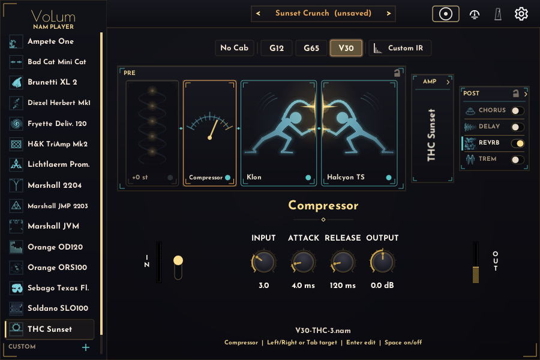

PRE-Pedale liegen vor dem Amp: **PITCH**, **COMP**, **NAM 1**, **NAM 2**. Klicke **PRE** (oder drücke `1`), klicke eine Pedalkarte an, schalte sie mit ihrer LED ein (oder `Space`; `B` im Plug-in) und stell sie in der Reglerzeile ein.

### Pitch

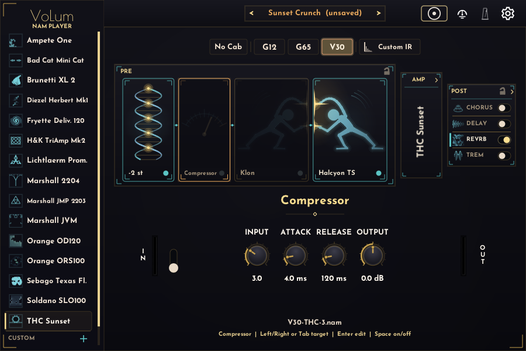

Wähle **TRANSPOSE** oder **OCTAVER** (Standard).

- **TRANSPOSE** verschiebt dein ganzes Signal für Drop-Tunings. **SEMI** geht von −12 bis +7 Halbtönen (Start bei −2), **MIX** mischt deinen trockenen Ton dazu, **LEVEL** stellt den Ausgang ein. **INSTANT** (Standard) ist für Einzeltöne und Leads, mit der geringsten Latenz; **POLY** ist für Akkorde, mit etwas mehr Latenz.
- **OCTAVER** fügt Oktaven hinzu und folgt Akkorden. **OCT DN**, **OCT UP** und **DRY** stellen die Lautstärke von unterer Oktave, oberer Oktave und deinem eigenen Ton ein; **LEVEL** stellt den Ausgang ein. **VINTAGE** klingt rauer und dunkler, **MODERN** bleibt sauber.

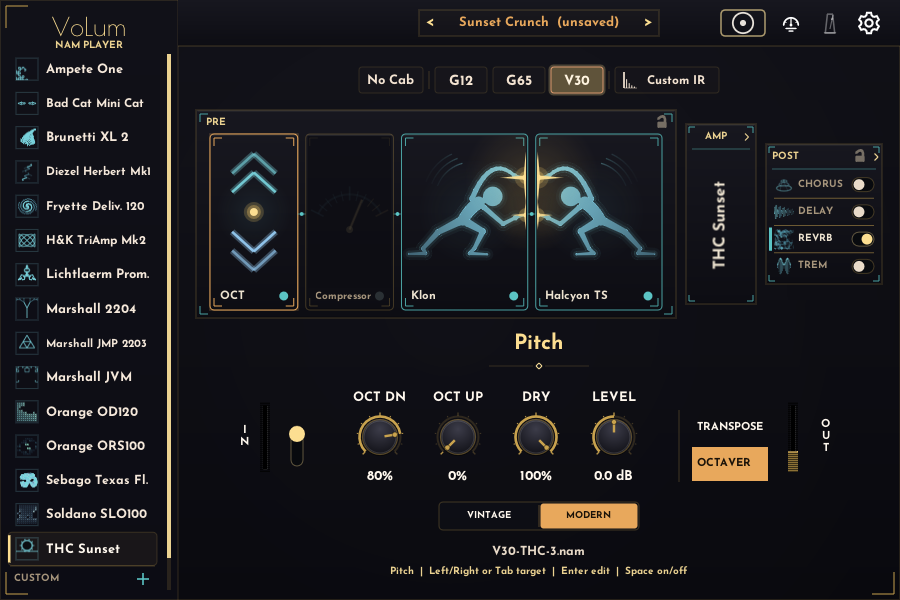

### Kompressor

**COMP** gleicht dein Anschlagen aus. **INPUT** stellt ein, wie stark er komprimiert, **ATTACK** und **RELEASE**, wie schnell er zupackt und loslässt, **OUTPUT** den Pegel.

### NAM-Pedale

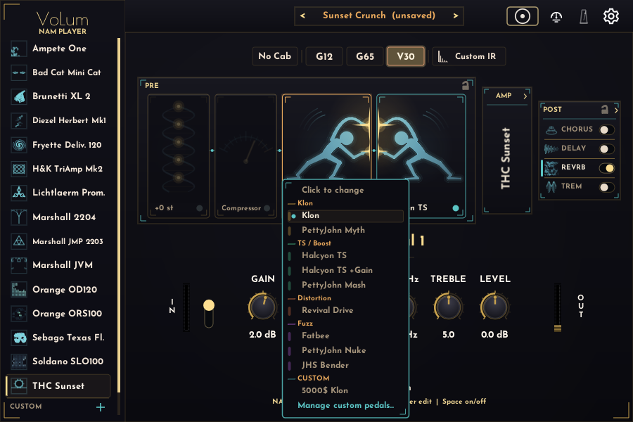

**NAM 1** und **NAM 2** nehmen je ein aufgenommenes Drive-, Boost- oder Fuzz-Pedal auf. Ein Klick auf eine leere Karte öffnet die Auswahl; bei einer belegten Karte wählt der erste Klick sie aus und der zweite wechselt das Pedal. Deine eigenen Pedale stehen unter **CUSTOM**.

Gute Startpunkte: Nuke, Bender, Myth oder Mash für Clean-Amps, Revival Drive an der Grenze zur Verzerrung, Klon, TS, TS+ oder Fatbee für Mid und High Gain.

Die Regler sind **GAIN**, **BASS**, **MID**, **MID Hz**, **TREBLE** und **LEVEL**.

## POST-Effekte

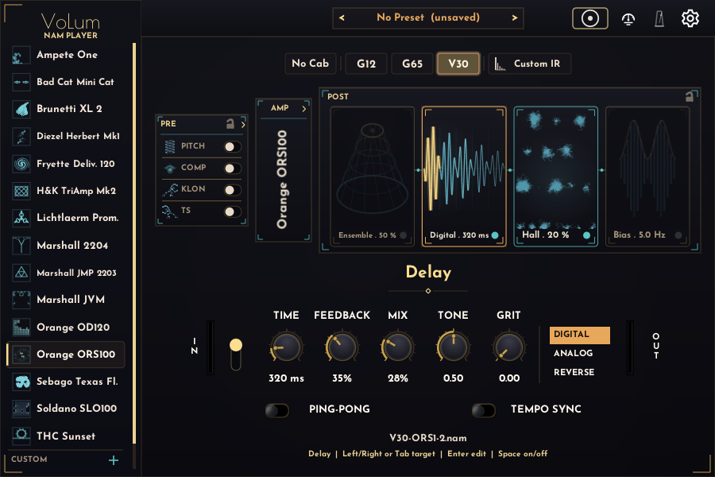

POST-Effekte liegen hinter dem Amp: **CHORUS**, **DELAY**, **REVERB**, **TREM**. Klicke **POST** (oder drücke `3`), klicke eine Effektkarte an, schalte sie mit ihrer LED ein (oder `Space`; `B` im Plug-in), wähle dann einen Modus und stell die Regler ein. Jeder Modus merkt sich seine eigenen Reglerstellungen.

### Chorus

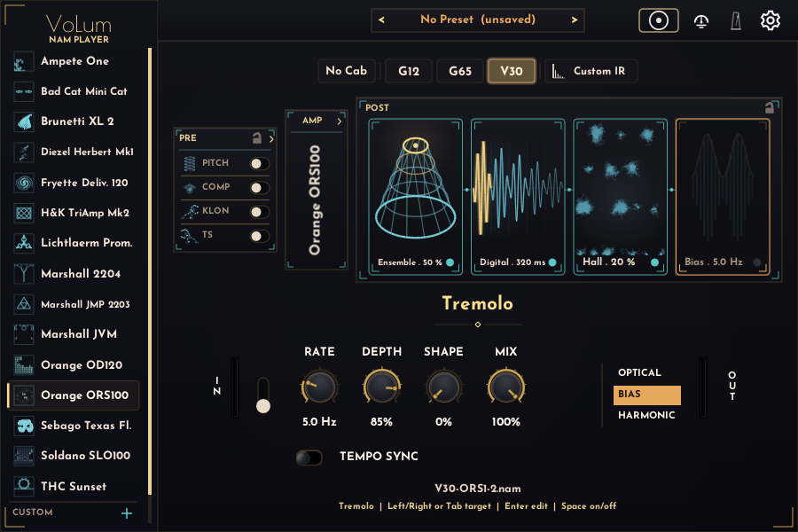

Chorus läuft direkt nach Amp und Cab, vor Delay, Reverb und Tremolo.

- **CLASSIC:** ein Stereo-Sweep im Stil des Juno-60.
- **WARPED:** Band-Wow-und-Flutter; bei **MIX** 100 % wird daraus ein Vibrato.
- **CLEAR:** ein breiter Chorus im Dimension-Stil, der auch in Mono in Stimmung bleibt.
- **ENSEMBLE** (Standard): ein 80er-Rack-Chorus, verteilt auf links, Mitte und rechts.

Die Regler sind **RATE**, **DEPTH**, **TONE**, **WIDTH** (0 % ist mono) und **MIX**.

### Delay

Wähle **DIGITAL**, **ANALOG** oder **REVERSE**. Die Regler sind **TIME**, **FEEDBACK**, **MIX**, **TONE** und dazu **GRIT**, **WEAR** oder **BLOOM** für den Charakter des Modus.

- **PING-PONG** (Digital und Analog) lässt die Echos zwischen links und rechts springen. Sie klingen etwas leiser als das normale Delay.
- **TEMPO SYNC** macht aus **TIME** einen Notenwert (**DIVISION**): 1/2, 1/4, 1/4., 1/4T, 1/8, 1/8., 1/8T, 1/16.

### Reverb

Wähle **HALL**, **PLATE** oder **OKTAVERB**. Die Regler sind **MIX**, **DECAY**, **TONE** und **PRE-DLY**. **OKTAVERB** fügt einen tonhöhenverschobenen Shimmer hinzu (**HALO**, **SHIMMER** oder **BLOOM**) und einen **INTENSITY**-Regler.

### Tremolo

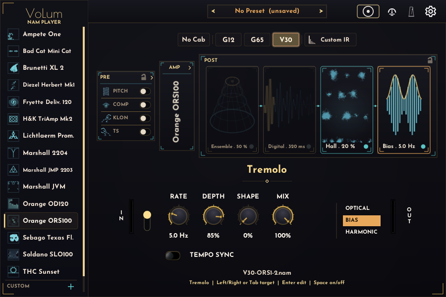

Tremolo läuft ganz zuletzt und pulsiert daher alles, auch den Hall.

- **OPTICAL** (Standard): ein abgehacktes Pulsieren.
- **BIAS:** ein weicher, gleichmäßiger Puls.
- **HARMONIC:** Bässe und Höhen pulsieren abwechselnd; **X-OVER** legt die Trennung fest.

Die Regler sind **RATE**, **DEPTH**, **SHAPE** (weich bis eckig) und **MIX**. **TEMPO SYNC** funktioniert wie beim Delay.

### Tempo

Delay und Tremolo teilen sich ein Tempo. In einer DAW folgen sie dem Song, in der Standalone-App dem BPM-Wert des Metronoms, auch wenn der Klick aus ist.

## Dual Amp

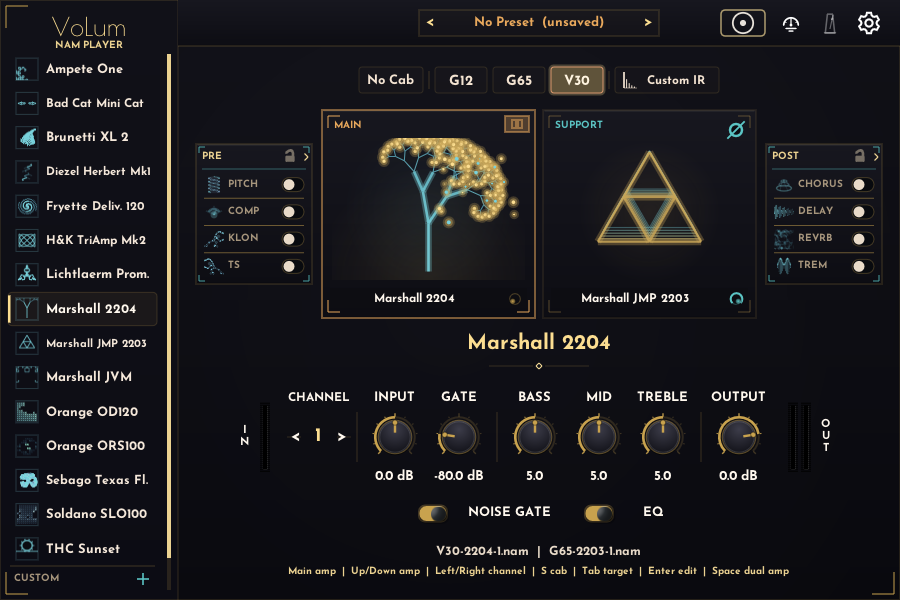

Dual Amp spielt zwei Amps gleichzeitig: **MAIN** und **SUPPORT**.

1. Öffne den AMP-Bereich (`2`).
2. Klicke die **Dual-Amp**-Taste ("Switch to Dual Amp") oder drücke `Space` (`B` im Plug-in).
3. Klicke die SUPPORT-Seite an (**Choose support amp**) und wähle den zweiten Amp. **(none)** leert sie wieder.
4. Klicke MAIN oder SUPPORT (oder drücke `Tab`), um zu wählen, welchen Amp du bearbeitest.

Jede Seite hat ihren eigenen Kanal, ihr Cab oder IR, ihre Regler und einen kleinen **PAN**-Regler. Beim ersten Einschalten geht MAIN nach links und SUPPORT nach rechts.

SUPPORT hat eine **Ø**-Taste (Polarität), standardmäßig an. Klingt ein Paar dünn oder hohl, schalte sie um.

## Presets

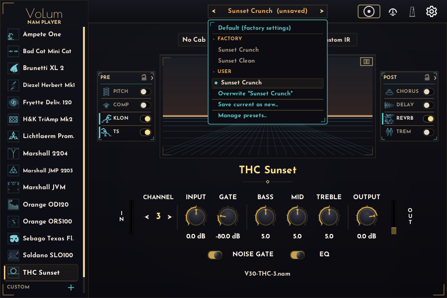

Ein Preset speichert das ganze Rig eines Amps. Jeder Amp hat seine eigene Liste.

### Werk-Presets

Jeder mitgelieferte Amp bringt ein oder zwei schreibgeschützte Werk-Presets mit, 21 insgesamt. Du kannst jedes davon ohne Speichern auf PLAY legen.

| Amp | Werk-Presets |
| --- | --- |
| Ampete One | Ampete Rhythm, Ampete Lead |
| Bad Cat Mini Cat | BadCat Crunch |
| Brunetti XL 2 | American Lead |
| Diezel Herbert Mk1 | Thicc Rhythm, Sanitarium |
| Fryette Deliv. 120 | Dry Rhythm |
| H&K TriAmp Mk2 | HiFi Heavy, HiFi Crunch |
| Lichtlaerm Prom. | Modern Rhythm, Modern Lead |
| Marshall 2204 | JCM800 Crunch |
| Marshall JMP 2203 | Crack the Skye |
| Marshall JVM | Modern British |
| Orange OD120 | Stoner |
| Orange ORS100 | An old Soul |
| Sebago Texas Fl. | The bestest Clean |
| Soldano SLO100 | SLO Lead, SLO Crunch |
| THC Sunset | Sunset Crunch, Sunset Clean |

### Preset speichern

Drücke **Strg+S**:

- Auf einem Werk-Preset oder einem unbenannten Rig schlägt das Namensfeld **New Preset** vor, und **Save** legt ein neues User-Preset an. Werk-Presets werden nie überschrieben.
- Auf einem deiner User-Presets heißt die Taste **Update** und überschreibt es. Tippst du einen anderen Namen, wird daraus **Save**, das ein neues Preset anlegt.
- Ein User-Preset darf wie ein Werk-Preset heißen; es steht dann unter **USER**. Ist ein Name doppelt vergeben, hängt VoLum eine Zahl an, zum Beispiel "SLO Lead 2".

`Enter` speichert; `Esc` oder **Cancel** schließt das Feld ohne Speichern.

### Das Preset-Menü

Klicke den Preset-Namen in der Kopfzeile:

- **Default (factory settings)** setzt den Amp zurück.
- **FACTORY** und **USER** listen die Presets.
- **Overwrite "Name"** speichert nach einer Rückfrage in das User-Preset, auf dem du gerade bist.
- **Save current as new...** öffnet das Namensfeld.
- **Manage presets...** listet deine User-Presets mit Tasten zum Überschreiben, Umbenennen und Löschen.

**(unsaved)** hinter dem Namen heißt, dass du seit dem Laden etwas geändert hast.

Löschst du ein Preset, das auf PLAY liegt, zeigen seine Schalter **Invalid slot**, bis du ihnen einen anderen Sound gibst.

## PLAY

PLAY ist deine Bühnenansicht: deine Sounds, acht Stomp-Schalter und das Amp-Bild. Wechsle mit `P` oder dem PLAY/BUILD-Umschalter; der Wechsel ändert nie, was du hörst.

Ein **Sound** ist ein Amp mit einem seiner Presets. Jeder Sound liegt auf einer Programmnummer von 0 bis 127, den Nummern, die ein MIDI-Fußcontroller sendet.

### Die fünf Start-Sounds

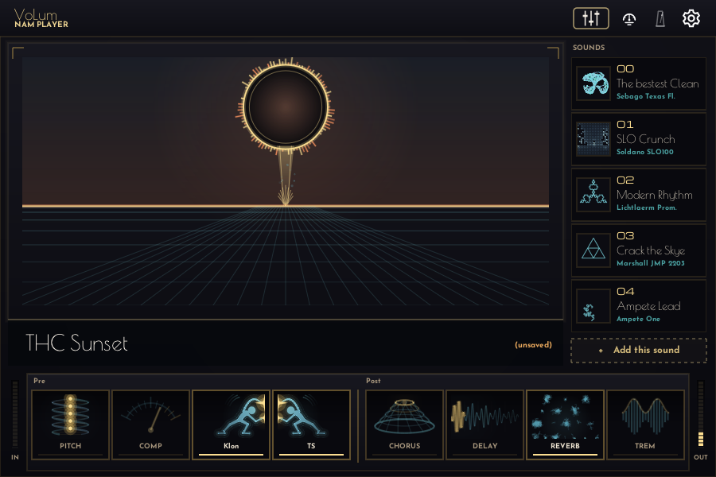

Beim ersten Öffnen deiner Bibliothek mit VoLum 1.3 bekommt PLAY fünf Werk-Sounds:

| Programm | Sound | Amp |
| --- | --- | --- |
| 0 | The bestest Clean | Sebago Texas Fl. |
| 1 | SLO Crunch | Soldano SLO100 |
| 2 | Modern Rhythm | Lichtlaerm Prom. |
| 3 | Crack the Skye | Marshall JMP 2203 |
| 4 | Ampete Lead | Ampete One |

Viele Fußcontroller zählen ab 1; dort sind das die Presets 1 bis 5. Das passiert nur einmal; ein Board, das du geändert oder geleert hast, wird nie wieder befüllt.

### Sounds spielen

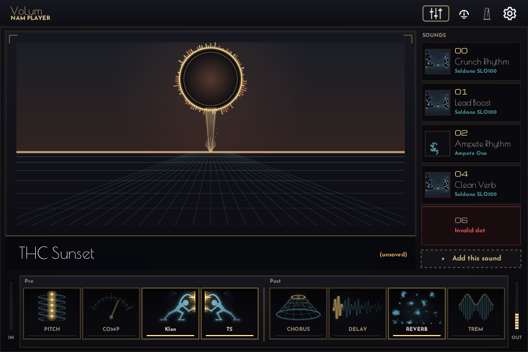

- **Sound aufrufen:** Zeile anklicken, Pfeiltasten nutzen oder MIDI senden.
- **LIVE** markiert den zuletzt aufgerufenen Sound.
- **Stomps:** schalten Pitch, Comp, NAM 1, NAM 2, Chorus, Delay, Reverb und Tremolo ein und aus. Klicke sie oder drücke `1` bis `8`. Rechtsklick auf einen Stomp öffnet dieses Pedal in BUILD.
- **Anpassen und speichern:** ändere einen Sound und drücke **Strg+S**. Hält der LIVE-Schalter noch den Sound, von dem du ausgegangen bist, nimmt deine gespeicherte Version seinen Platz ein; so wird ein geänderter Werk-Sound zu deiner eigenen Kopie.

### Sounds hinzufügen, ersetzen und anordnen

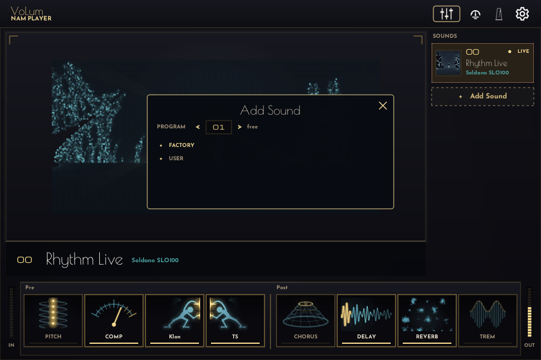

- **+ Add this sound** legt, was du hörst, auf die nächste freie Programmnummer (sind alle 128 belegt, öffnet es stattdessen die Auswahl). Hat es noch keinen Namen, öffnet sich zuerst das Namensfeld.
- **+ Add Sound** öffnet die Auswahl: wähle eine **PROGRAM**-Nummer, dann ein Werk- oder User-Preset.
- **Ersetzen:** Zeile doppelklicken. **Leeren:** ihr `×` klicken. **Umsortieren:** eine Zeile auf eine andere ziehen zum Tauschen, oder zwischen zwei Zeilen zum Verschieben.

### Bewegte Bilder

Das Amp-Bild bewegt sich, während du spielst, umso mehr, je härter du spielst, und steht still, wenn du aufhörst. Für ein ruhiges Bild und etwas weniger CPU schalte **Animate art in PLAY** in den [Einstellungen](#signal-tab) aus.

## MIDI-Fußcontroller

Ein Fußcontroller ruft deine PLAY-Sounds auf:

- **Program Change N** ruft den Sound auf Programm N auf.
- **CC 102 mit Wert N** tut dasselbe. Nimm das, wenn deine DAW Program Change nicht an Plug-ins weitergibt.

Eine Programmnummer ohne Sound wird ignoriert; der aktuelle Sound spielt weiter.

### Controller anschließen

- **Standalone:** wähle den MIDI-Eingang des Controllers unter **Einstellungen > SIGNAL > Audio & MIDI devices...**.
- **DAW:** leite das MIDI des Controllers auf die VoLum-Spur. Gibt dein Host Program Change nicht weiter, sende stattdessen den Recall CC.

### Der MIDI-Tab

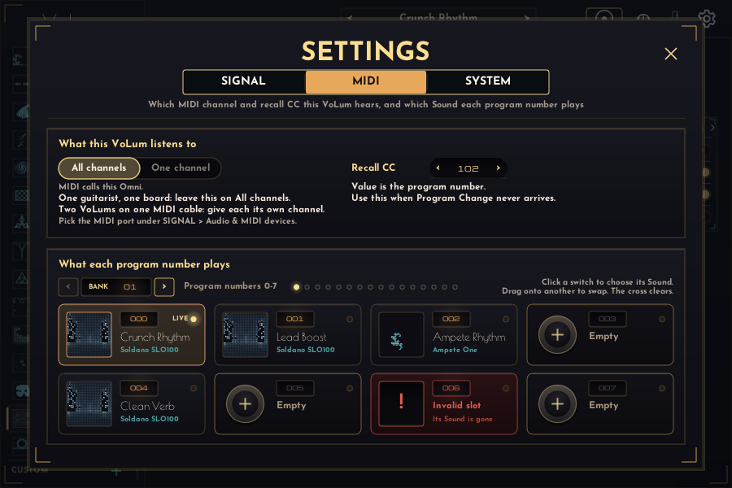

**What this VoLum listens to:**

- **All channels** (Standard) passt für einen Gitarristen mit einem Board.
- **One channel** (`CH 1` bis `CH 16`) lässt zwei VoLums ein MIDI-Kabel teilen.
- **Recall CC** legt die CC-Nummer fest, die Sounds aufruft (`0` bis `119`, Standard `102`). Jede davon, auch CC 0, kann der Recall CC sein.
- **VST3:** das Plugin empfängt MIDI nur auf Kanal 1, sende Recall-Nachrichten also auf MIDI-Kanal 1 (AU und Standalone akzeptieren den hier eingestellten Kanal).

**What each program number plays** zeigt deine Sounds als 16 Bänke mit je 8 Schaltern, dieselbe Liste wie in PLAY. Wechsle die Bank mit den Pfeilen, dem Mausrad oder `PageUp` / `PageDown`. Klicke einen Schalter, um seinen Sound zu wählen, zieh ihn zum Verschieben, oder fahr darüber und klicke `×` zum Leeren.

VoLum wechselt keine Bänke per Bank Select (CC 0/32) und nutzt keine MIDI-Noten, kein Pitch Bend, kein MIDI Learn und keine MIDI-Ausgabe.

## Tuner und Metronom

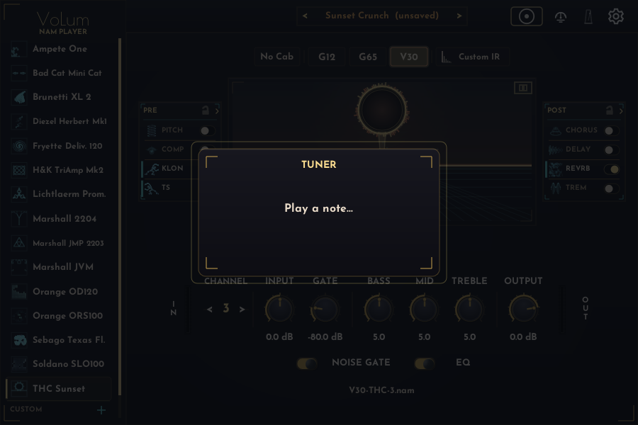

Öffne den Tuner mit seiner Toolbar-Taste oder `T`. Solange er offen ist, ist deine Gitarre stumm. Schließe ihn mit `Esc` oder einem Klick daneben.

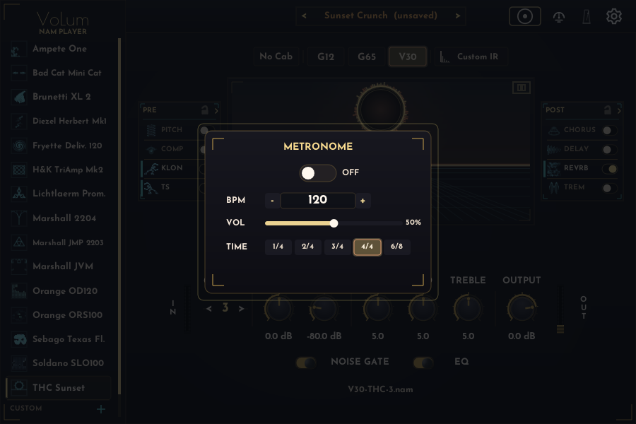

Öffne das Metronom mit seiner Toolbar-Taste oder `M`. Schalte es ein, stell Tempo (30 bis 300 BPM) und Lautstärke ein und wähle `1/4`, `2/4`, `3/4`, `4/4` oder `6/8`.

## Eigene Amps, IRs und Pedale

VoLum lädt deine eigenen NAM-Captures und Impulsantworten. Importe werden in VoLums Bibliothek kopiert und funktionieren daher weiter, wenn du die Originale verschiebst. Die Standalone-App und alle Plug-ins teilen sich diese Bibliothek.

### Eigene Amps

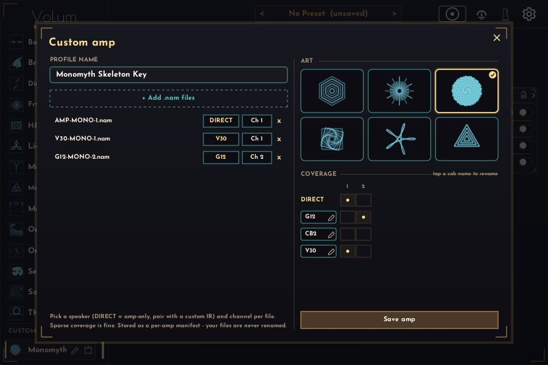

1. Klicke **+** im **CUSTOM**-Teil der Amp-Liste.
2. Gib dem Amp einen Namen und klicke **+ Add .nam files**.
3. Gib jeder Datei einen Cab-Slot und einen Kanal. Dateien mit Namen wie `V30-MeinAmp-2.nam` füllen das selbst aus: vorne das Cab (`AMP`, `DI` oder `DIRECT` heißt kein Cab), hinten die Kanalnummer.
4. Klicke **Save amp**.

Mit dem Stift- und dem Papierkorb-Symbol in der Amp-Liste bearbeitest oder löschst du einen eigenen Amp.

### Eigene IRs

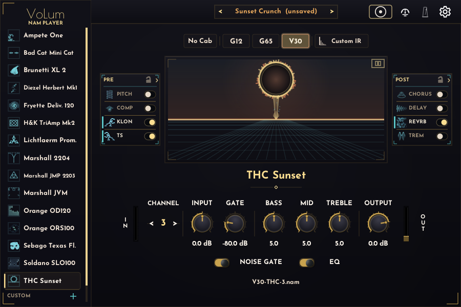

Ein eigenes IR ersetzt das Cab, deshalb braucht der aktuelle Kanal ein No-Cab-Capture. Jeder mitgelieferte Amp hat eines; nutze bei einem eigenen Amp einen Kanal mit einer Datei, die mit `AMP`, `DI` oder `DIRECT` beginnt. Auf anderen Kanälen ist die Schaltfläche Custom IR ausgegraut.

1. Klicke **Custom IR** in der Cab-Reihe.
2. Klicke **Manage custom IRs...**, dann **+ Import IR (.wav)**.
3. Wähle das IR im **Custom IR**-Menü.

VoLum prüft vor dem Kopieren in die Bibliothek, ob der Import eine lesbare WAV-Datei ist.

Zum Anpassen eines IRs klickst du das **Zahnrad** in seiner Zeile unter **Manage custom IRs**: **Level**, **Low cut** und **High cut**.

### Eigene Pedale

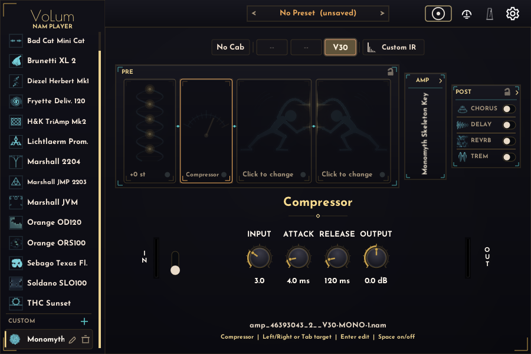

Klicke im NAM-Pedal-Menü **Manage custom pedals...**, dann **+ Import pedal (.nam)**. Deine Pedale stehen unter **CUSTOM**.

### Inhalte löschen

Löschst du etwas, das gerade spielt, macht VoLum weiter: ein gelöschter Amp fällt auf einen mitgelieferten zurück, ein gelöschtes Pedal lässt seinen Slot leer und ein gelöschtes IR kehrt zu einem eingebauten Cab zurück: Cab 1 bei einem mitgelieferten Amp, bei einem eigenen Amp das eingebaute Cab des aktuellen Kanals oder eins auf einem anderen Kanal, falls dieser Kanal keins hat (No Cab nur, wenn der Amp kein eingebautes Cab hat). VoLum fragt vorher nach.

## Sichern und Teilen mit Packs

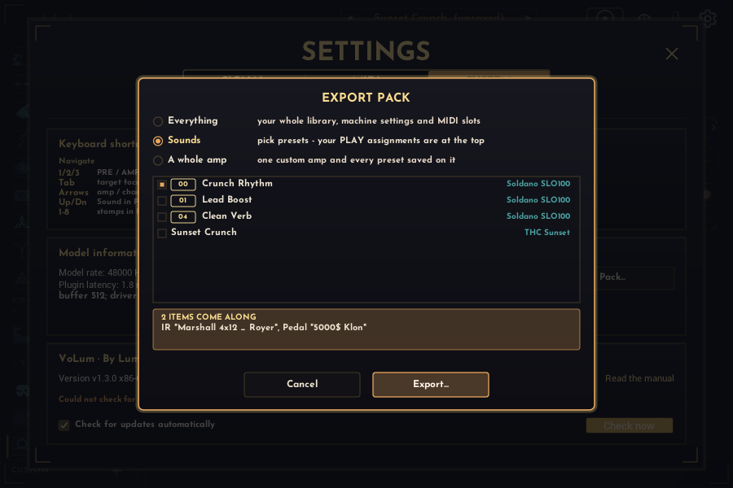

Ein Pack ist eine `.volumpack`-Datei mit deinen eigenen Amps, IRs, Pedalen und Presets. Damit sicherst du deine Bibliothek, ziehst sie auf einen anderen Rechner um oder teilst einen Teil davon. Öffne **Einstellungen > SYSTEM** und klicke **Export Pack...** oder **Import Pack...**.

### Export

- **Everything:** deine ganze Bibliothek und deine PLAY-Programmliste. Aus der Standalone-App kommen auch deine Rechner-Einstellungen mit.
- **Sounds:** die Presets, die du anhakst.
- **A whole amp:** ein eigener Amp mit allen seinen Presets.

**ALSO INCLUDING** listet, was deine Auswahl braucht, etwa ein IR oder ein Pedal. Es kommt immer mit, damit nichts kaputt ankommt.

### Import

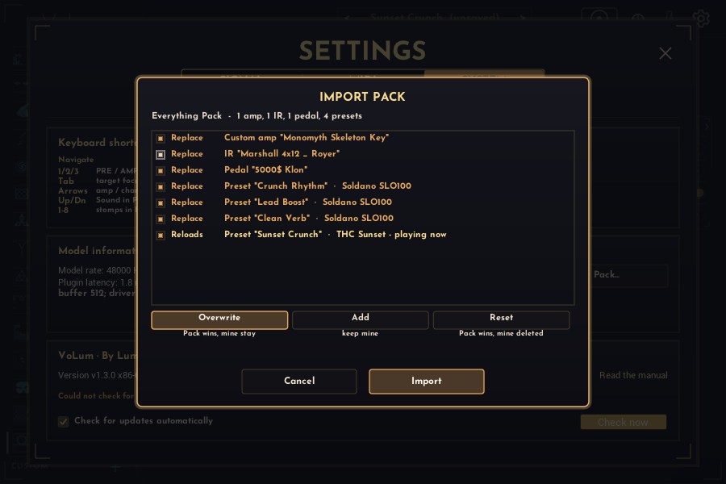

Die Vorschau listet alles im Pack. Entferne den Haken bei dem, was du nicht willst. Jede Zeile sagt, was passiert: **Add**, **Replace**, **Keep mine**, **Reloads** (spielt gerade) oder **Skip**.

VoLum erkennt ein Teil an seiner Identität, nicht an seinem Namen. Enthält das Pack genau das Teil, das du schon hast (zum Beispiel deinen eigenen Amp aus einer Sicherung), entscheidet der Mischmodus, welche Version gewinnt. Ein anderes Teil, das nur denselben Namen wie eines von dir trägt, kommt daneben dazu, und du behältst beide.

Ein **Everything**-Pack bietet drei Mischmodi:

- **Overwrite:** die Version aus dem Pack gewinnt. Deine anderen Teile bleiben.
- **Add:** deine Version gewinnt. Nur neue Teile kommen dazu.
- **Reset:** das Pack ersetzt deine Bibliothek; alles, was nicht darin ist, wird gelöscht. Nur möglich, solange alles angehakt ist.

Ein **Sounds**- oder **A whole amp**-Pack mischt immer wie Overwrite und löscht nie etwas.

**PLAY-Liste und Rechner-Einstellungen:** in der Standalone-App stellt ein Everything-Pack sie (letzter Amp, Szenen, Lite, Kalibrierung, Output mode, MIDI-Slots) nur wieder her, wenn du **Also restore machine settings** anhakst; der Haken ist anfangs aus. Ein Plug-in hat dieses Feld nicht: dort ersetzt ein Everything-Pack deine PLAY-Liste immer.

Vor dem Import bewahrt VoLum deine bisherige Bibliothek als `volum-content.json.packbak` auf. Ein beschädigtes Pack ändert nichts.

## Einstellungen

Öffne die Einstellungen mit dem Zahnrad oder `H`; schließe sie genauso, mit `Esc` oder einem Klick daneben.

### SIGNAL-Tab

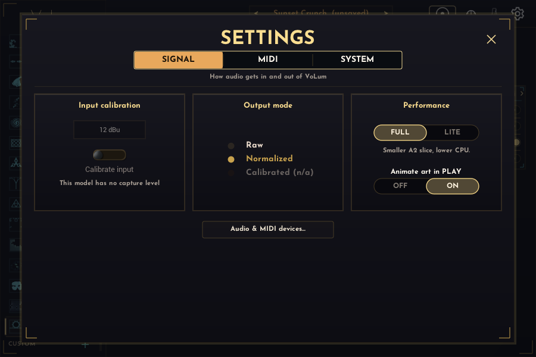

- **Input calibration:** gib den Eingangspegel deines Interfaces in dBu ein und schalte **Calibrate input** ein. Das geht nur mit Captures, die ihren Aufnahmepegel mitspeichern; die mitgelieferten Amps tun das nicht, deshalb zeigt die Karte "This model has no capture level".
- **Output mode:** **Raw**, **Normalized** (Standard, ähnliche Lautstärke für alle Amps) oder **Calibrated**. Calibrated braucht ein Capture, das seinen Ausgangspegel mitspeichert, und bleibt daher bei den mitgelieferten Amps aus. Die Standalone-App behält deine Wahl für den nächsten Start; in einer DAW speichert sie das Projekt.
- **Performance:** **FULL** (Standard) oder **LITE**, das weniger CPU braucht, bei etwas geringerer Qualität. **Animate art in PLAY** schaltet die bewegten Bilder ein oder aus.
- **Audio & MIDI devices...** (nur Standalone) öffnet das Gerätefenster.

### MIDI-Tab

Siehe [MIDI-Fußcontroller](#der-midi-tab).

### SYSTEM-Tab

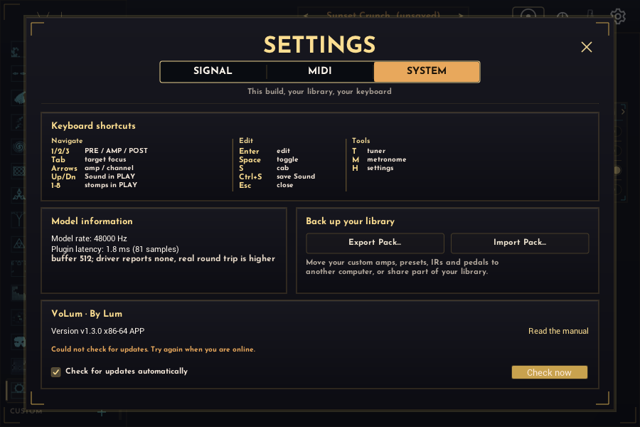

- **Keyboard shortcuts** und **Model information**.
- **Back up your library:** **Export Pack...** und **Import Pack...** (siehe [Packs](#sichern-und-teilen-mit-packs)).
- **About:** Version, **Read the manual** (englisches Handbuch) und die Update-Prüfung.

### Update-Prüfung und Datenschutz

VoLum sucht höchstens einmal am Tag nach einer neuen Version. Ein goldener Punkt am Zahnrad heißt, dass eine verfügbar ist; die Einstellungen verlinken zur Release-Seite. VoLum lädt oder installiert nie selbst etwas, und die Prüfung sendet keine Tracking-Daten. Abschalten kannst du sie mit **Check for updates automatically**.

### Audio- und MIDI-Geräte (Standalone)

Öffne das Fenster mit **Audio & MIDI devices...** auf dem SIGNAL-Tab (oder `Strg+,` unter Windows, **VoLum > Preferences...** unter macOS). Wähle Treiber, Ein- und Ausgabegerät, Samplerate, Puffergröße und MIDI-Eingang. Nimm einen Mono-Eingang für die Gitarre. Ein kleinerer Puffer bedeutet weniger Verzögerung, aber mehr CPU-Last.

## VoLum in einer DAW

- VoLum läuft als VST3 und unter macOS als AU (Logic Pro und GarageBand brauchen das AU).
- Ein neues Plug-in startet mit den Amp-Einstellungen aus deiner Standalone-App. Danach behält das DAW-Projekt seine eigenen Einstellungen.
- Deine eigene Bibliothek und die PLAY-Programmliste teilen sich alle VoLums auf dem Rechner.
- Im Plug-in schaltet `B` das gewählte Pedal ein und aus, damit `Space` für Play/Stop frei bleibt.
- VoLum meldet seine Verzögerung an die DAW, die sie ausgleicht.

## Tastenkürzel

Tasten wirken, solange kein Textfeld offen ist.

**Überall**

| Taste | Aktion |
| --- | --- |
| `P` | Zwischen BUILD und PLAY wechseln |
| `T` / `M` / `H` | Tuner / Metronom / Einstellungen |
| `Strg+S` | Preset oder Sound speichern |
| `Esc` | Offenes Panel oder Menü schließen |

**BUILD**

| Taste | Aktion |
| --- | --- |
| `1` / `2` / `3` | PRE / AMP / POST öffnen |
| `Up` / `Down` | Vorheriger / nächster Amp |
| `Left` / `Right` | AMP: vorheriger / nächster Kanal. PRE und POST: vorheriges / nächstes Pedal |
| `Tab` / `Shift+Tab` | Nächstes / vorheriges Pedal; mit Dual Amp MAIN / SUPPORT |
| `S` / `Shift+S` | Nächstes / vorheriges Cab |
| `Enter` | Einen Regler auswählen |
| `Space` (Standalone), `B` (Plug-in) | Gewähltes Pedal ein- oder ausschalten; in AMP Dual Amp |

**Ausgewählter Regler**

| Taste | Aktion |
| --- | --- |
| `Up` / `Down` | Regler drehen (`Shift` für feine Schritte) |
| `Left` / `Right` | Vorherigen / nächsten Regler auswählen |
| `Enter` | Genauen Wert eintippen |
| `Delete` / `Backspace` | Auf Standard zurücksetzen |
| `Esc` | Regler abwählen |

**PLAY**

| Taste | Aktion |
| --- | --- |
| `Up` / `Down`, `Left` / `Right` | Vorheriger / nächster Sound |
| `1` bis `8` | Die acht Stomps schalten |

## Fehlerbehebung

- **"Output safety active - lower output or wet mix" in der Fußzeile:** nimm den Amp-**OUTPUT**, Delay-**MIX** oder Reverb-**MIX** zurück.
- **Kein Ton bei offenem Tuner:** das ist Absicht; schließe den Tuner.
- **Dual Amp klingt dünn:** schalte **Ø** auf der SUPPORT-Seite um.
- **Fußcontroller in der DAW ignoriert:** sende den Recall CC (102) statt Program Change und prüfe den Kanal im MIDI-Tab.
- **Interface beim Start nicht angeschlossen:** VoLum öffnet ohne Audio. Schließ das Interface an und starte VoLum neu.
- **Windows: kein 48 kHz am Interface:** manche Interfaces (zum Beispiel das UA-2X2) bieten mit DirectSound kein 48 kHz an. Nimm stattdessen ASIO, mit dem Treiber des Herstellers oder ASIO4ALL.
- **Windows: VoLum meldet, dass schon eine Kopie läuft:** beende diese Kopie im Task-Manager und starte VoLum neu.
- **macOS: ein AU aus einer älteren VoLum-Version verhält sich nach dem Update seltsam:** entferne es von der Spur und füge es neu ein.
- **macOS: das Plug-in erscheint nach der Installation aus einem Zip nicht:** siehe [README](../README.de.md#wichtiger-sicherheitshinweis).

## Wo VoLum deine Dateien ablegt

| Was | Windows | macOS |
| --- | --- | --- |
| Einstellungen | `%LOCALAPPDATA%\VoLum\volum-settings.json` | `~/Library/Application Support/VoLum/volum-settings.json` |
| Eigene Bibliothek | `%LOCALAPPDATA%\VoLum\content` | `~/Library/Application Support/VoLum/content` |
| Diagnose-Log | `%LOCALAPPDATA%\VoLum\volum.log` | `~/Library/Application Support/VoLum/volum.log` |

## Fehler melden oder Feature vorschlagen

Öffne ein [Issue auf GitHub](https://github.com/guitarlum/VoLum/issues/new/choose). Nimm **Bug report** für Abstürze oder falsches Verhalten und **Feature request** für Ideen. Häng nach Möglichkeit `volum.log` an (siehe [Wo VoLum deine Dateien ablegt](#wo-volum-deine-dateien-ablegt)).
