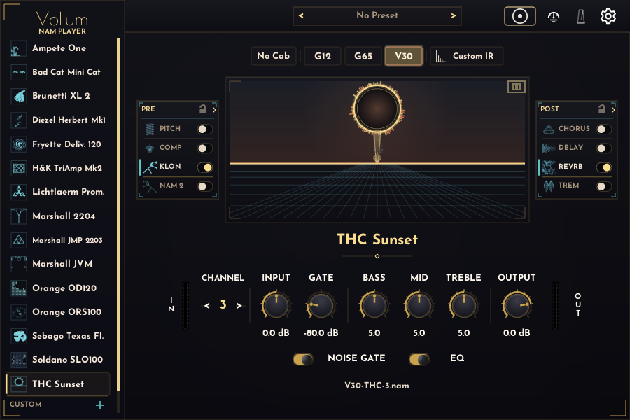
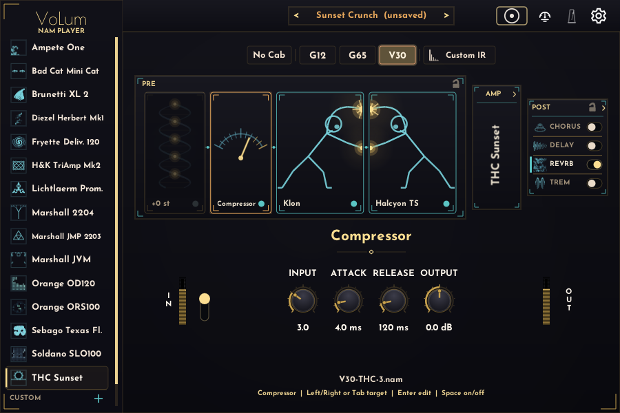
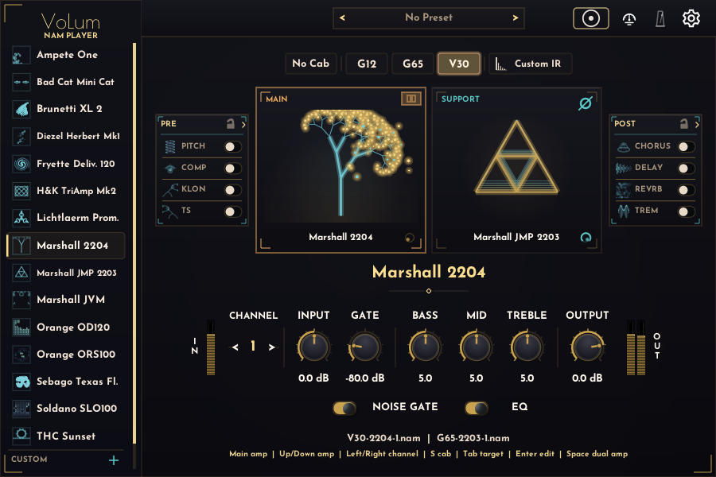
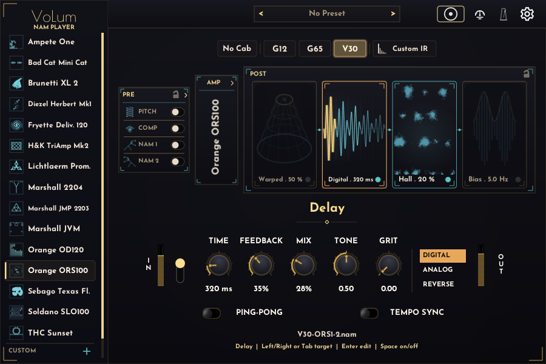
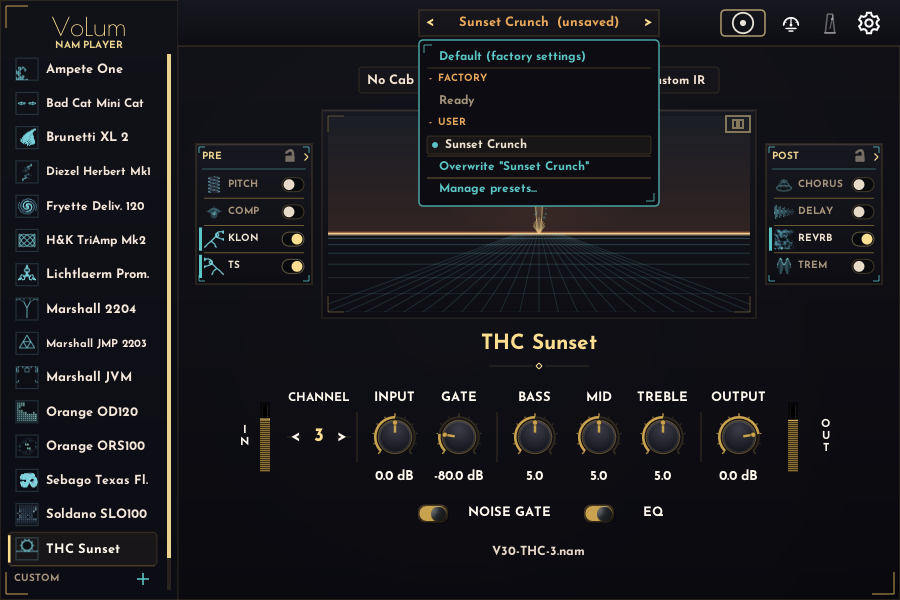
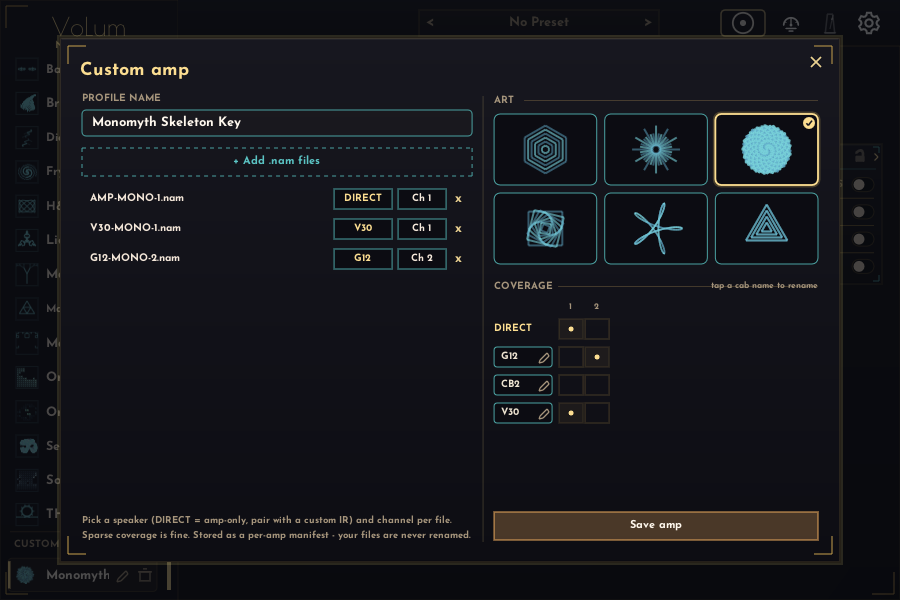
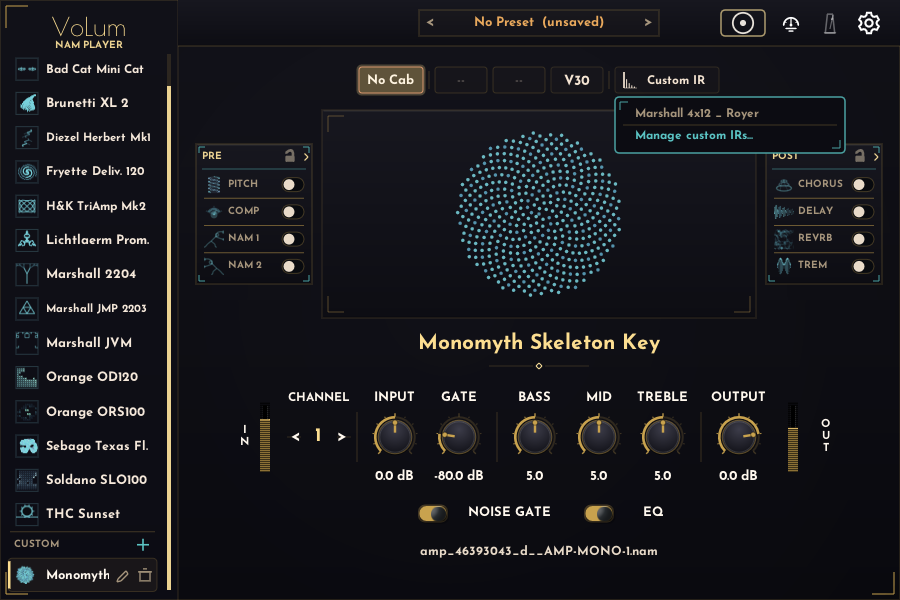
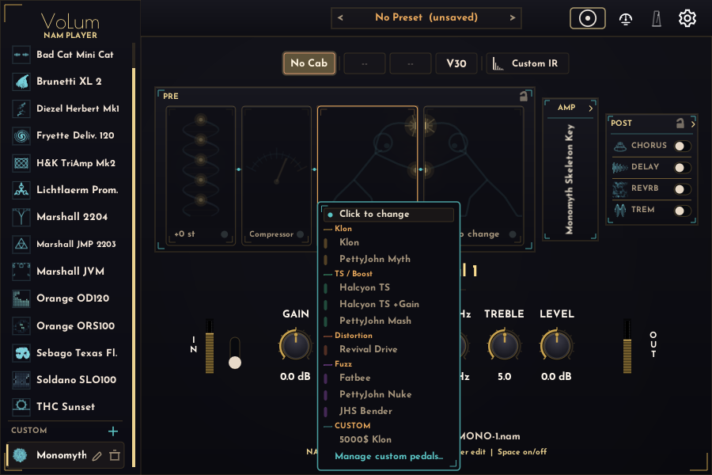
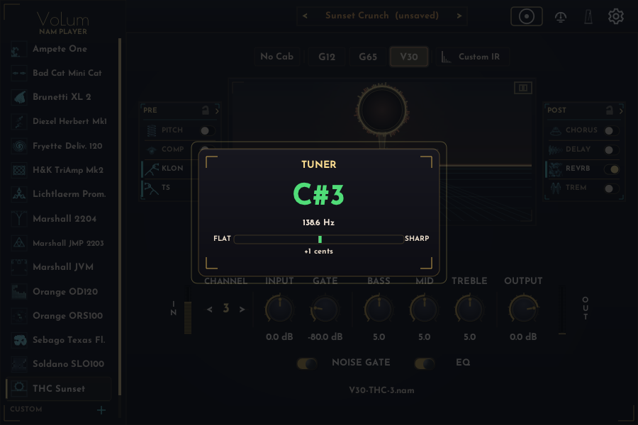
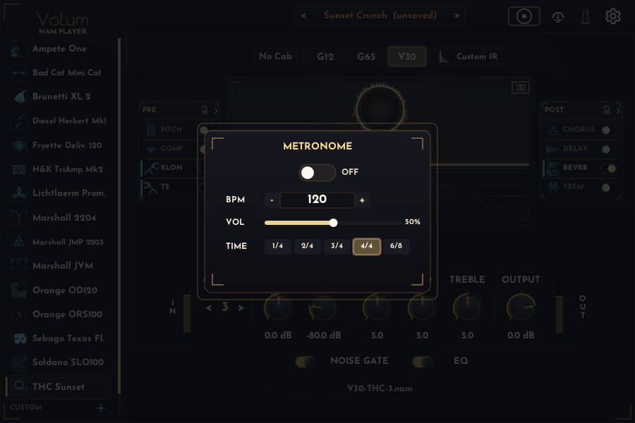

# VoLum User Guide

**Languages:** English | [Deutsch](user-guide.de.md)

This guide explains the VoLum 1.2 interface after installation. For downloads, unsigned-build warnings, and install paths, see the [main README](../README.md).

## Contents

- [Main View](#main-view)
- [Choose An Amp](#choose-an-amp)
- [PRE Section](#pre-section)
- [Dual Amp](#dual-amp)
- [POST Section](#post-section)
- [Presets](#presets)
- [Custom Content (Bring Your Own)](#custom-content-bring-your-own)
- [Tuner And Metronome](#tuner-and-metronome)
- [Keyboard Controls](#keyboard-controls)
- [Settings And Safety](#settings-and-safety)
- [Report A Bug Or Request A Feature](#report-a-bug-or-request-a-feature)

## Main View

1. **Amp browser:** choose one of the bundled amps.
2. **Amp panel:** see the focused amp. In Dual Amp mode it splits into MAIN and SUPPORT.
3. **Speaker and channel controls:** choose `AMP`, `G12`, `G65`, or `V30`, then pick the gain-stage channel.
4. **Knob row:** edit the focused amp, PRE pedal, or POST effect.
5. **PRE | AMP | POST strip:** open one section at a time.
6. **Toolbar:** tuner, metronome, and settings live in the top-right corner.

The bundled NAM profiles were captured with the interface input set around +4 dBu. Use a similar pro-line input level into VoLum for the closest match to the captured tones. Every bundled amp, cab, and PRE NAM capture is a NAM Architecture 2 (A2) profile, trained to its best fit between 700 and 1200 epochs. A2 captures always play at full size; VoLum never drops to the lite slice.

VoLum saves most playing choices per amp. When you come back to an amp, it restores the speaker, channel, knobs, PRE pedals, POST effects, and Dual Amp setup.

## Choose An Amp

Use the left sidebar for the 15 bundled amps. Each amp has four speaker modes and its own number of gain-stage channels. VoLum loads models in the background, so returning to a previously loaded amp is quick.

Short orientation:

- **Cleans, blues, and dynamic boutique:** Sebago Texas Flood (a Dumble Steel String Singer-style pedal platform), THC Sunset, Bad Cat Mini Cat.
- **Vintage and classic-rock crunch:** Orange ORS100, Orange OD120, Marshall JMP 2203, Marshall 2204.
- **Modern and high gain:** Soldano SLO100, Diezel Herbert, Marshall JVM, H&K TriAmp, Fryette Deliverance, Lichtlaerm Prometheus, Brunetti XL 2.
- **Do-it-all:** Ampete One pairs an American and a British voice in one amp.

Amp EQ and pedal EQ are extra tone-shaping controls. They do not need to match the physical knob positions used during profiling.

The amp **OUTPUT** knob keeps unity at `0.0 dB`. Turn it fully counter-clockwise to `-∞ dB` to mute the amp output completely.

## PRE Section

PRE runs before the amp. It contains a compressor and two assignable NAM pedal slots.

1. Click **PRE**.
2. Click **COMP**, **NAM 1**, or **NAM 2** to focus a card.
3. Use the knob row for that card.
4. Click a focused NAM card again to choose a capture.

Pedal captures are grouped by type and sorted from lower to higher gain. Good starting points:

- Clean or low-gain amps: Nuke, Bender, Myth, Mash.
- Edge-of-breakup amps: Revival Drive.
- Mid/high-gain amps: Klon, TS, TS+, Fatbee.

PRE settings are saved per amp.

Click the **lock** icon in the PRE header to carry the current PRE scene as a global overlay while you switch amps. While locked, PRE does not load from other amps and your live PRE tweaks are not written into their stored settings. If the live scene differs from the active amp's saved PRE, a **Store** arrow appears — click it to commit the overlay to the current amp only. Click the lock again to unlock; VoLum silently restores this amp's saved PRE scene and drops any unsaved overlay changes.

The compressor **OUTPUT** knob and both NAM pedal **LEVEL** knobs mute their stage completely at the fully counter-clockwise `-∞ dB` setting.

## Dual Amp

Dual Amp combines the main amp with a support amp.

1. Open the AMP view.
2. Click the split-panel **Dual Amp** button.
3. Click the SUPPORT side to choose the second amp.
4. Click MAIN or SUPPORT to focus a lane.
5. Set speaker, channel, knobs, and pan for the focused lane.

The support lane has a `Ø` polarity button. It is on by default for new Dual Amp setups because some centered amp stacks sum better that way. If a stack sounds thin or phasey, try toggling `Ø`, then check both lanes use the intended speaker and channel.

Each lane keeps its own speaker/cab, channel, and custom IR. Focus a lane, then set its cab or custom IR; the other lane is left untouched. A custom amp used as the SUPPORT partner remembers its cab and channel along with the rest of the rig — across preset recall, app restarts, and DAW projects.

VoLum aligns MAIN and SUPPORT NAM latency before panning and summing.

The SUPPORT lane **OUTPUT** knob also mutes that lane completely at the fully counter-clockwise `-∞ dB` setting.

## POST Section

POST runs after the amp. It contains Delay and Reverb cards.

1. Click **POST**.
2. Click **DELAY** or **REVERB**.
3. Use the card button or spacebar to enable it.
4. Edit the focused card in the knob row.

**Delay** offers Digital, Analog, and Reverse modes. The knobs are Time, Feedback, Mix, Tone, and a mode-specific character control: `Grit`, `Wear`, or `Bloom`. Ping-Pong is available for Digital and Analog.

**Reverb** offers Hall, Plate, and Oktaverb. Hall and Plate cover classic ambience. Oktaverb adds `HALO`, `SHIMMER`, and `BLOOM` pitch-wash voices with an Intensity knob.

The LED on each card shows whether it is active. The label shows the current mode or preset summary. POST settings are saved per amp, just like PRE. Use the **lock** icon in the POST header the same way as PRE to carry one delay/reverb scene while browsing amps; use the **Store** arrow when it appears to save the overlay to the current amp. Unlock restores this amp's saved POST scene without confirmation. Double-click a POST knob to restore that knob's default.

Switching Delay mode, Ping-Pong, Reverb mode, or Oktaverb voice clears the old tail so repeats and ambience from the previous mode do not leak into the new one.

## Presets

A preset is a named snapshot of the whole rig for the focused amp: speaker/cab, channel, all knobs, PRE pedals, POST effects, and the Dual Amp setup.

1. Dial in a tone, then open the preset bar in the AMP header.
2. Use **Save current as new** to store it under a name.
3. Cycle saved presets in place with the `<` / `>` arrows, or pick one from the list.
4. **Update** overwrites the selected preset with the live rig (it asks first); **Rename** and **Delete** manage the list.

Presets are per amp: each amp (factory or custom) keeps its own preset list. The bar shows **(unsaved)** whenever the live rig differs from the recalled preset, and clears as soon as the rig matches it again. The pinned **Default (factory settings)** row resets the focused amp to its shipped defaults.

## Custom Content (Bring Your Own)

VoLum can load your own NAM amp captures, impulse responses, and pedal captures. Imported files are copied into a VoLum-owned content library, so they keep working after you move or delete the originals, and every format sees the same library:

- **Windows:** `%LOCALAPPDATA%\VoLum\content`
- **macOS:** `~/Library/Application Support/VoLum/content`

**Custom amps.** Click the **+** in the CUSTOM section of the amp browser to open the builder. Name the amp, add one or more `.nam` files, and assign each to a cab slot and channel (files named `PREFIX-CODE-CHANNEL.nam` auto-fill). Both NAM Architecture 1 (A1) and Architecture 2 (A2) captures load, and A2 containers play at full size like the bundled profiles. Saved custom amps appear in the CUSTOM list and load and play exactly like factory amps — including as the dual-amp SUPPORT partner. Use the pen/bin icons to edit or delete one.

**Custom IRs.** A custom IR convolves the amp's **DIRECT** (amp-only) capture — the raw amp with no speaker baked in. It is meant for a custom amp that includes a DIRECT capture; selecting the **Custom IR** cab switches the amp to its DIRECT/No Cab capture first. A custom amp built only from full amp-plus-cab captures has no raw signal for an IR to shape — for those amps the **Custom IR** cab button is greyed out (hover it for the reason), and the IR cannot be selected. In the speaker row, choose the **Custom IR** cab, then import a `.wav` impulse response from its dropdown. The custom IR belongs to the **focused lane**: in Dual Amp mode the MAIN and SUPPORT lanes each carry their own custom IR, so changing one never affects the other. Impulse responses are short cabinet captures — only the first fraction of a second is used — so VoLum rejects very large WAV files (a whole song picked by mistake) with a message instead of loading them.

Custom names (amps, IRs, pedals, and presets) have sensible length limits so they always fit their labels — long names are capped as you type.

**Custom pedals.** In the PRE NAM-capture dropdown, the **CUSTOM** group lets you import and manage your own `.nam` pedal captures; an imported capture loads into its PRE slot like a factory one.

The content library is shared across all open instances and tracks. In a DAW, the project stores stable references (ids) to your custom amps, IRs, pedals, and the active preset, so reopening a project restores them as long as the items still exist in your library.

## Tuner And Metronome

Open the tuner from the toolbar. While it is open, VoLum mutes the output so you can tune silently. Click outside it or press `Esc` to close.

Open the metronome from the toolbar. You can enable it, set BPM with `+` / `-` or direct entry, adjust volume, and choose `1/4`, `2/4`, `3/4`, `4/4`, or `6/8`.

## Keyboard Controls

- No knob selected: `Up` / `Down` changes amp, `Left` / `Right` changes channel in AMP view.
- `1` / `2` / `3` switches PRE / AMP / POST.
- `Tab` / `Shift+Tab` moves focus inside the current section; `Left` / `Right` also moves focus in PRE/POST.
- `Enter` edits the focused target; `Space` toggles it when it has an on/off state.
- In some DAWs (notably REAPER), transport keys like `Space` reach the host first. Right-click the plugin FX header and enable **Send all keyboard input to plug-in** to route shortcuts to VoLum.
- `S` cycles speaker/cab for the focused amp lane; `Shift+S` goes backward.
- `T` opens the tuner; `M` opens the metronome; `H` opens Settings.
- Selected knob: `Up` / `Down` adjusts, `Left` / `Right` selects another knob, `Shift` makes smaller steps.
- `Enter` enters an exact value, `Delete` / `Backspace` resets, `Esc` leaves knob edit.

This covers the main playing and editing workflow. Full screen-reader support is not implemented yet.

## Settings And Safety

Open Settings with the top-right gear or `H`. The overlay includes the shortcut guide and global settings.

VoLum stores user settings automatically:

- **Windows:** `%LOCALAPPDATA%\VoLum\volum-settings.json`
- **macOS:** `~/Library/Application Support/VoLum/volum-settings.json`

Use the standalone app as your tone library editor. It writes the global per-amp defaults in this file, including speaker, channel, knobs, PRE pedals, POST effects, and Dual Amp setup.

Fresh VST3 instances read those defaults when you add VoLum to a track. After that, the DAW project owns that plugin instance. Reaper, Cubase, Live, and other hosts save and recall the VST3 state with the project and with their normal plugin preset systems. VST3 instances do not write the global VoLum settings file, so two tracks cannot overwrite each other's defaults.

### Standalone Audio Settings

In the standalone app, open **File -> Preferences** or press `Ctrl+,` to choose the audio driver, separate input and output devices, sample rate, and channel routing. In the VST3, use your DAW's audio settings instead.

Pick an input device and an output device independently. On macOS, built-in microphone and speakers are often listed as separate devices. Choose one mono input channel for the guitar signal and route output L/R as needed. The standalone buffer list uses a stable set of common pro-audio sizes: 48, 64, 96, 128, 256, 512, 1024, 2048, 4096, and 8192 samples. Older saved settings below the visible range are moved up to the next listed size.

If you select a driver that has no usable device, such as ASIO on a laptop without an ASIO interface, VoLum shows an error and reverts to the previous working audio settings instead of closing.

VoLum also runs an always-on final output safety stage after Delay and Reverb. Normal playing is unchanged. If a hot rig and heavy POST effects create runaway peaks, the OUT meter turns red and the footer shows `Output safety active - lower output or wet mix`. Lower Output, Delay Mix, or Reverb Mix if you see that often.

## Report A Bug Or Request A Feature

Open an [issue on GitHub](https://github.com/guitarlum/VoLum/issues/new/choose). Use the **Bug report** template for crashes or wrong behavior, and **Feature request** for ideas.
