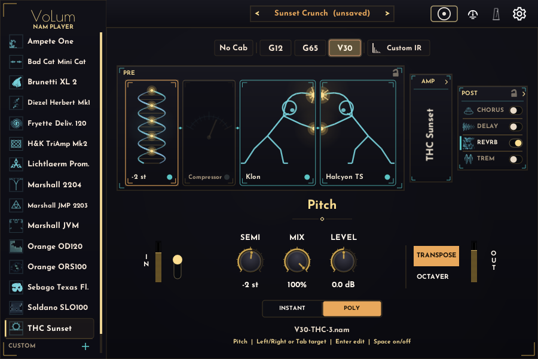
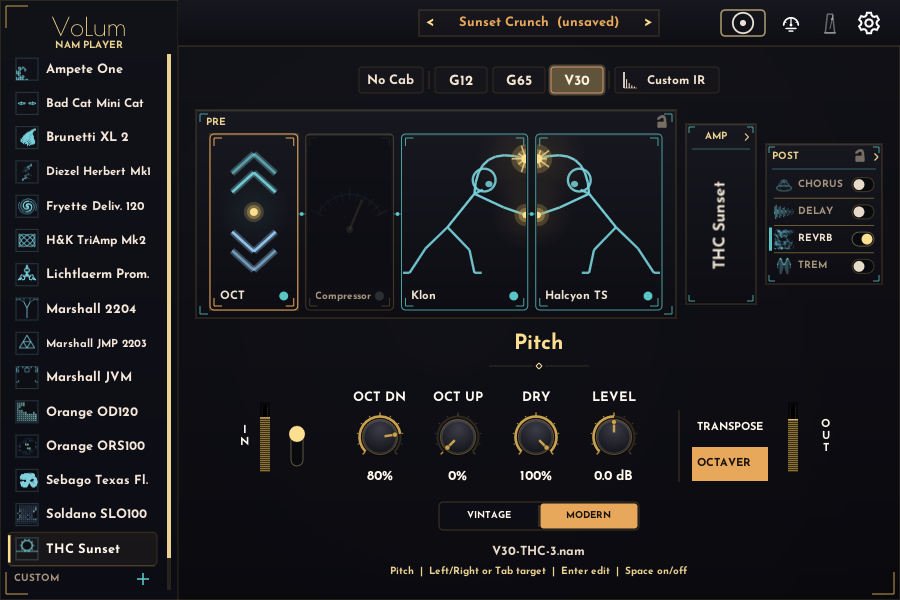
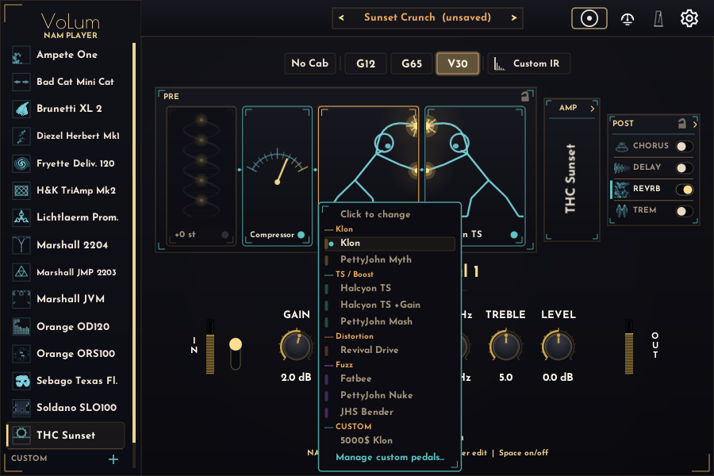
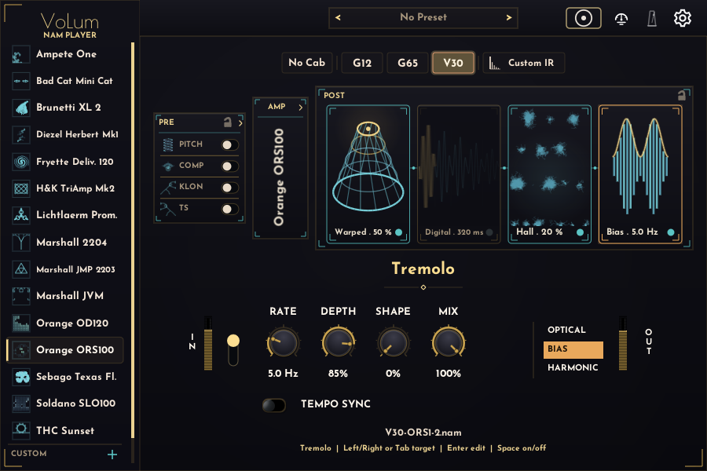

# VoLum User Guide

**Languages:** English | [Deutsch](user-guide.de.md)

This guide explains the current VoLum interface after installation. For downloads, unsigned-build warnings, and install paths, see the [main README](../README.md).

## Contents

- [Main View](#main-view)
- [Choose An Amp](#choose-an-amp)
- [PRE Section](#pre-section)
- [Dual Amp](#dual-amp)
- [POST Section](#post-section)
- [Presets](#presets)
- [Custom Content (Bring Your Own)](#custom-content-bring-your-own)
- [Tuner And Metronome](#tuner-and-metronome)
- [Keyboard Controls](#keyboard-controls)
- [Settings And Safety](#settings-and-safety)
- [Report A Bug Or Request A Feature](#report-a-bug-or-request-a-feature)

## Main View

1. **Amp browser:** choose one of the bundled amps.
2. **Amp panel:** see the focused amp. In Dual Amp mode it splits into MAIN and SUPPORT.
3. **Channel and cab controls:** pick the gain-stage channel, then the speaker cab (`AMP`/`No Cab`, `G12`, `G65`, `V30`). For custom amps the channel comes first: the row shows only the cabs that exist for the selected channel, and switching channel keeps your cab when it still fits or snaps to an available one.
4. **Knob row:** edit the focused amp, PRE pedal, or POST effect.
5. **PRE | AMP | POST strip:** open one section at a time.
6. **Toolbar:** tuner, metronome, and settings live in the top-right corner.

The bundled NAM profiles were captured with the interface input set around +4 dBu. Use a similar pro-line input level into VoLum for the closest match to the captured tones. Every bundled amp, cab, and PRE NAM capture is a NAM Architecture 2 (A2) profile, trained to its best fit between 700 and 1200 epochs. VoLum plays the full A2 slice by default; the optional Lite mode is described under Settings.

VoLum saves most playing choices per amp. When you come back to an amp, it restores the speaker, channel, knobs, PRE pedals, POST effects, and Dual Amp setup.

## Choose An Amp

Use the left sidebar for the 15 bundled amps. Each amp has four speaker modes and its own number of gain-stage channels. VoLum loads models in the background, so returning to a previously loaded amp is quick.

Short orientation:

- **Cleans, blues, and dynamic boutique:** Sebago Texas Flood (a Dumble Steel String Singer-style pedal platform), THC Sunset, Bad Cat Mini Cat.
- **Vintage and classic-rock crunch:** Orange ORS100, Orange OD120, Marshall JMP 2203, Marshall 2204.
- **Modern and high gain:** Soldano SLO100, Diezel Herbert, Marshall JVM, H&K TriAmp, Fryette Deliverance, Lichtlaerm Prometheus, Brunetti XL 2.
- **Do-it-all:** Ampete One pairs an American and a British voice in one amp.

Amp EQ and pedal EQ are extra tone-shaping controls. They do not need to match the physical knob positions used during profiling.

The amp **OUTPUT** knob keeps unity at `0.0 dB`. Turn it fully counter-clockwise to `-∞ dB` to mute the amp output completely.

## PRE Section

PRE runs before the amp. It contains a pitch pedal, a compressor, and two assignable NAM pedal slots.
All PRE and POST pedal controls remain editable while their block is bypassed, including by mouse wheel, so you can prepare settings before engaging the effect.

1. Click **PRE**.
2. Click **PITCH**, **COMP**, **NAM 1**, or **NAM 2** to focus a card.
3. Use the knob row for that card.
4. Click a focused NAM card again to choose a capture.

### Pitch (Transpose + Octaver)

The **PITCH** pedal sits at the very front of the chain. Use the **TRANSPOSE / OCTAVER** picker to pick a mode:

- **TRANSPOSE** shifts the whole signal up or down. **SEMI** sets the interval in semitones (−12 to +7), tuned for drop tunings and capo-style shifts, **MIX** blends the shifted signal with your dry tone, and **LEVEL** trims the output. The **INSTANT / POLY** pill picks the engine: **INSTANT** (the default) is **monophonic** with the lowest latency (~8.6 ms) and the tightest attack — use it for single notes and lead lines. **POLY** is **polyphonic**: it tracks whole chords (dyads, triads, power chords) with every voice shifted correctly, at slightly higher latency (~14 ms) — use it for riffs and chords. Both hold pitch cleanly on low drop-tuned and extended-range strings (down to 8-string F#).
- **OCTAVER** is a polyphonic (chord-friendly) octave generator. **OCT DN** and **OCT UP** set the level of the down- and up-octave voices, **DRY** keeps your original note in the blend, **LEVEL** trims the output, and the **VINTAGE / MODERN** pill chooses the voicing — Vintage adds grit and a darker low-pass for an analog feel, Modern stays clean.

The pitch engine is a low-latency time-domain shifter built for guitar: it tracks fast and holds its tuning steady through a long sustain instead of drifting off-pitch as the note rings. VoLum reports its pitch latency to your host for plugin delay compensation so the shifted signal stays time-aligned with the rest of your mix; the amount depends on the Transpose engine (about 8.6 ms in INSTANT, about 14 ms in POLY) and is re-reported when you switch engine or mode.

Pedal captures are grouped by type and sorted from lower to higher gain. Your own imported captures appear under a **CUSTOM** group at the bottom of the same list. Good starting points:

- Clean or low-gain amps: Nuke, Bender, Myth, Mash.
- Edge-of-breakup amps: Revival Drive.
- Mid/high-gain amps: Klon, TS, TS+, Fatbee.

PRE settings are saved per amp.

Click the **lock** icon in the PRE header to carry the current PRE scene as a global overlay while you switch amps. While locked, PRE does not load from other amps and your live PRE tweaks are not written into their stored settings. If the live scene differs from the active amp's saved PRE, a **Store** arrow appears — click it to commit the overlay to the current amp only. Click the lock again to unlock; VoLum silently restores this amp's saved PRE scene and drops any unsaved overlay changes.

The compressor **OUTPUT** knob and both NAM pedal **LEVEL** knobs mute their stage completely at the fully counter-clockwise `-∞ dB` setting.

## Dual Amp

Dual Amp combines the main amp with a support amp.

1. Open the AMP view.
2. Click the split-panel **Dual Amp** button.
3. Click the SUPPORT side to choose the second amp.
4. Click MAIN or SUPPORT to focus a lane.
5. Set speaker, channel, knobs, and pan for the focused lane.

The support lane has a `Ø` polarity button. It is on by default for new Dual Amp setups because some centered amp stacks sum better that way. If a stack sounds thin or phasey, try toggling `Ø`, then check both lanes use the intended speaker and channel.

Each lane keeps its own speaker/cab, channel, and custom IR. Focus a lane, then set its cab or custom IR; the other lane is left untouched. A custom amp used as the SUPPORT partner remembers its cab and channel along with the rest of the rig — across preset recall, app restarts, and DAW projects.

VoLum aligns MAIN and SUPPORT NAM latency before panning and summing.

The SUPPORT lane **OUTPUT** knob also mutes that lane completely at the fully counter-clockwise `-∞ dB` setting.

## POST Section

POST runs after the amp. It contains Delay, Reverb, and Tremolo cards.

1. Click **POST**.
2. Click **DELAY**, **REVERB**, or **TREM**.
3. Use the card button or spacebar to enable it.
4. Edit the focused card in the knob row.

**Delay** offers Digital, Analog, and Reverse modes. The knobs are Time, Feedback, Mix, Tone, and a mode-specific character control: `Grit`, `Wear`, or `Bloom`. Ping-Pong is available for Digital and Analog. Turn on **TEMPO SYNC** to lock the repeats to the beat: the **TIME** knob becomes a musical **DIVISION** stepper (1/2 down to 1/16, including dotted and triplet values).

Both tempo-synced POST pedals — Delay and Tremolo — share one tempo source. In a DAW they follow the host tempo; in the standalone app they follow the metronome BPM (set it in the metronome overlay, and it applies even while the metronome click is muted).

**Reverb** offers Hall, Plate, and Oktaverb. Hall and Plate cover classic ambience. Oktaverb adds `HALO`, `SHIMMER`, and `BLOOM` pitch-wash voices with an Intensity knob.

`PRE-DLY` sets how long the reverb waits before it starts. Since 1.2.1 that is the whole story: the wet signal begins exactly there. Earlier versions had a built-in delay of their own before any reverb arrived, so the knob only ever added to it — which is why new patches now default to a short 10 ms rather than the 20–30 ms that used to be hidden inside it. Your saved presets keep the values you gave them.

**Tremolo** runs last, after Reverb, so it modulates the whole wet wash. The **OPTICAL / BIAS / HARMONIC** picker selects the voice:

- **Optical** is a choppy, photocell-style amplitude gate.
- **Bias** is a smooth, symmetric sine modulation — the classic "Bang Bang (My Baby Shot Me Down)" tremolo, and the factory default voice.
- **Harmonic** splits the signal at a crossover frequency and modulates the low and high bands in opposite phase for a phasey sweep.

The shared knobs are **RATE**, **DEPTH**, **SHAPE** (morphs the LFO from a smooth sine toward a hard square), and **MIX**. In Harmonic mode an extra **X-OVER** knob sets the band-split frequency. Turn on **TEMPO SYNC** to lock the rate to the song: in a DAW it follows the host tempo, and in the standalone app it follows the metronome BPM. When sync is on, the RATE knob becomes a musical **DIVISION** stepper (1/2 down to 1/16, including dotted and triplet values). Left and right channels stay phase-linked for a coherent stereo tremolo.

The LED on each card shows whether it is active. The label shows the current mode or preset summary. POST settings are saved per amp, just like PRE. Use the **lock** icon in the POST header the same way as PRE to carry one delay/reverb/tremolo scene while browsing amps; use the **Store** arrow when it appears to save the overlay to the current amp. Unlock restores this amp's saved POST scene without confirmation. Double-click a POST knob to restore that knob's default.

Switching Delay mode, Ping-Pong, Reverb mode, or Oktaverb voice clears the old tail so repeats and ambience from the previous mode do not leak into the new one.

## Presets

A preset is a named snapshot of the whole rig for the focused amp: speaker/cab, channel, all knobs, PRE pedals, POST effects, and the Dual Amp setup.

1. Dial in a tone, then open the preset bar in the AMP header.
2. Use **Save current as new** to store it under a name.
3. Cycle saved presets in place with the `<` / `>` arrows, or pick one from the list.
4. **Update** overwrites the selected preset with the live rig (it asks first); **Rename** and **Delete** manage the list.

Presets are per amp: each amp (factory or custom) keeps its own preset list. The bar shows **(unsaved)** whenever the live rig differs from the recalled preset, and clears as soon as the rig matches it again. The pinned **Default (factory settings)** row resets the focused amp to its shipped defaults.

## Custom Content (Bring Your Own)

VoLum can load your own NAM amp captures, impulse responses, and pedal captures. Imported files are copied into a VoLum-owned content library, so they keep working after you move or delete the originals, and every format sees the same library:

- **Windows:** `%LOCALAPPDATA%\VoLum\content`
- **macOS:** `~/Library/Application Support/VoLum/content`

**Custom amps.** Click the **+** in the CUSTOM section of the amp browser to open the builder. Name the amp, add one or more `.nam` files, and assign each to a cab slot and channel (files named `PREFIX-CODE-CHANNEL.nam` auto-fill). Every file is a discrete captured snapshot of one gain stage/cab combination; VoLum switches between them and does not infer a continuous gain knob from a multi-capture folder. Both NAM Architecture 1 (A1) and Architecture 2 (A2) captures load, including files selected from Windows usernames/folders or filenames containing non-ASCII characters. On **Save**, VoLum copies and validates every capture before committing the amp. If one file cannot be copied or parsed, the whole save is cancelled, the builder stays open, and the failing filename is shown; valid captures are never silently saved as an amp that still plays the previous factory model. Saved custom amps appear in the CUSTOM list and load and play exactly like factory amps — including as the dual-amp SUPPORT partner. Use the pen/bin icons to edit or delete one. If a previously imported file later goes missing or becomes corrupt, the footer reports the failed load and names the last known-good capture that remains active.

**Custom IRs.** A custom IR convolves the amp's **DIRECT** (amp-only) capture — the raw amp with no speaker baked in. It never applies on top of the speaker already baked into CB1/CB2/CB3 captures. It is meant for a custom amp that includes a DIRECT capture; selecting the **Custom IR** cab switches the amp to its DIRECT/No Cab capture first. A custom amp built only from full amp-plus-cab captures has no raw signal for an IR to shape — on a channel with no DIRECT capture the **Custom IR** and **No Cab** buttons are greyed out (hover for the reason) and cannot be selected; switch to a channel that has a DIRECT capture to use them. In the speaker row, choose the **Custom IR** cab, then import a `.wav` impulse response from its dropdown. The custom IR belongs to the **focused lane**: in Dual Amp mode the MAIN and SUPPORT lanes each carry their own custom IR, so changing one never affects the other. Impulse responses are short cabinet captures — only the first fraction of a second is used — so VoLum rejects very large WAV files (a whole song picked by mistake) with a message instead of loading them. Custom IRs are automatically level-matched on import so they sit at roughly stock-cab loudness instead of arriving much quieter. To fine-tune one, open **Manage custom IRs** and click the **gear** on its row: a small panel lets you adjust **Level** (±24 dB), a **Low cut**, and a **High cut**. Use the **+/−** buttons to step through the usual values — a button greys out once that value reaches the end of its range — or click the number to type an exact one. Typed values are free rather than restricted to the stepper's steps, so `2.5k`, `-3 dB` and `137` all work, and `0` or `off` disables either cut. The panel stays open until you click outside it. These settings are stored with the IR in your library, so they follow it everywhere it is used (both lanes), and a gear shown in gold marks an IR you have shaped.

Custom names (amps, IRs, pedals, and presets) have sensible length limits so they always fit their labels — long names are capped as you type.

**Custom pedals.** In the PRE NAM-capture dropdown, the **CUSTOM** group lets you import and manage your own `.nam` pedal captures; an imported capture loads into its PRE slot like a factory one.

The content library is shared across all open instances and tracks. In a DAW, the project stores stable references (ids) to your custom amps, IRs, pedals, and the active preset, so reopening a project restores them as long as the items still exist in your library.

## Tuner And Metronome

Open the tuner from the toolbar. While it is open, VoLum mutes the output so you can tune silently. Click outside it or press `Esc` to close.

Open the metronome from the toolbar. You can enable it, set BPM with `+` / `-` or direct entry, adjust volume, and choose `1/4`, `2/4`, `3/4`, `4/4`, or `6/8`.

## Keyboard Controls

- No knob selected: `Up` / `Down` changes amp, `Left` / `Right` changes channel in AMP view.
- `1` / `2` / `3` switches PRE / AMP / POST.
- `Tab` / `Shift+Tab` moves focus inside the current section; `Left` / `Right` also moves focus in PRE/POST.
- `Enter` edits the focused target. In the standalone app, `Space` toggles its on/off state. In plug-ins, `B` toggles it so `Space` remains available for DAW Play/Stop.
- `S` cycles speaker/cab for the focused amp lane; `Shift+S` goes backward.
- `T` opens the tuner; `M` opens the metronome; `H` opens Settings and closes it again.
- Selected knob: `Up` / `Down` adjusts, `Left` / `Right` selects another knob, `Shift` makes smaller steps.
- `Enter` enters an exact value, `Delete` / `Backspace` resets, `Esc` leaves knob edit.
- In the exact-value box a comma counts as a decimal point, and the unit the readout shows (`dB`, `%`, `ms`, `Hz`, `s`, `st`) may be typed after the number. Anything that is not a number leaves the control where it was; a number outside the range clamps to the nearest end.

This covers the main playing and editing workflow. Full screen-reader support is not implemented yet.

## Settings And Safety

Open Settings with the top-right gear or `H`, and close it with either the gear, `H` again, or `Esc`. The overlay includes the shortcut guide and global settings.

VoLum stores user settings automatically:

- **Windows:** `%LOCALAPPDATA%\VoLum\volum-settings.json`
- **macOS:** `~/Library/Application Support/VoLum/volum-settings.json`

Use the standalone app as your tone library editor. It writes the global per-amp defaults in this file, including speaker, channel, knobs, PRE pedals, POST effects, and Dual Amp setup.

Fresh VST3 instances read those defaults when you add VoLum to a track. After that, the DAW project owns that plugin instance. Reaper, Cubase, Live, and other hosts save and recall the VST3 state with the project and with their normal plugin preset systems. VST3 instances do not write global per-amp scenes, so two tracks cannot overwrite each other's rigs. Input calibration is the deliberate exception described below: a direct calibration edit becomes the machine default, while saved project state still wins when that project is restored.

### Update Checks And Privacy

The standalone app and plug-in check for a newer stable VoLum release at most once every 24 hours. A gold dot on the Settings gear means an update is available. Open Settings to read the reminder; the dot stays until you use the update row or **Check now**. The update row opens the release page in your browser. VoLum only notifies you: it never downloads or installs an update.

**Check automatically** is on by default and can be switched off in Settings; **Check now** performs a manual check. Each check is a plain HTTPS GET of `https://guitarlum.github.io/VoLum/appcast.json`, with no query string, telemetry, or VoLum-generated identifier. The 24-hour throttle and reminder are stored separately in `volum-update-state.json` beside the main settings file.

### Input Calibration

The **Input calibration** card describes your audio interface's analog level at digital 0 dBFS. Enter the interface value in dBu and enable **Calibrate input**. When the loaded NAM capture contains an input-calibration value, VoLum offsets the AMP Input gain so the model sees the level used during capture; models without that metadata leave the calibration controls unavailable.

The Calibrate switch and dBu value are machine-global startup defaults. A direct edit in standalone, VST3, or AU writes those two values to `volum-settings.json`, so a new instance starts calibrated the same way. A DAW project's saved plugin state remains authoritative when reopened and can intentionally use different calibration values.

### A2 Lite Mode (Performance)

The Settings overlay's **Performance** card has a **FULL / LITE** switch; the active mode is highlighted (FULL is the default), so you can always see which quality mode is running. Lite trades a little quality for lower CPU. VoLum's A2 amp and pedal captures are packed so each file holds both a full-size version and a smaller "Lite" version. Switch to Lite and VoLum runs the smaller version on every NAM lane: both PRE NAM pedals, the main amp, and the dual-amp support lane. Lite does not change the separate Pitch/Octaver DSP, so bypass Pitch/Octaver or use a larger audio buffer if that effect is the CPU bottleneck.

Lite mode is a per-computer preference: it is saved in `volum-settings.json`, not in the project, so it stays on for every project and DAW session on that machine, and a project saved on a fast computer still plays Lite on a slow one. Captures that are not A2 containers (older single-size models and most custom imports) are unaffected, so the switch simply does nothing for them. Default is Full.

### Standalone Audio Settings

In the standalone app, open **File -> Preferences** or press `Ctrl+,` to choose the audio driver, separate input and output devices, sample rate, and channel routing. In the VST3, use your DAW's audio settings instead.

Pick an input device and an output device independently. On macOS, built-in microphone and speakers are often listed as separate devices. Choose one mono input channel for the guitar signal and route output L/R as needed. The standalone buffer list uses a stable set of common pro-audio sizes: 48, 64, 96, 128, 256, 512, 1024, 2048, 4096, and 8192 samples. Older saved settings below the visible range are moved up to the next listed size. Some drivers refuse the size you pick and grant a different one; VoLum then keeps what the driver granted, so the list and the saved setting describe what is actually running.

If you select a driver that has no usable device, such as ASIO on a laptop without an ASIO interface, VoLum shows an error and reverts to the previous working audio settings instead of closing.

If the problem is there from the start - your interface is unplugged, or switched off - there is nothing to revert to, so VoLum keeps your settings exactly as they are and opens without audio. Connect the interface and start VoLum again and your setup is where you left it.

If VoLum ever refuses to start and says another copy is already running, that copy really is still there and ending it in Task Manager will let the next launch through. A copy that Windows still lists but has already exited no longer blocks anything.

The sample rate VoLum displays is the one the driver is actually running. Some interfaces take their rate from their own control panel or an external clock and will not change it on request; VoLum shows you what happened rather than what it asked for, and tells you when the rate you picked was refused and which one is in use instead. Change the rate in your interface's control panel while VoLum is open and it follows, reopening the stream at the new rate. If a rate saved from a previous session is not available on the current device, VoLum picks the nearest one that is and saves that instead.

The **Latency** line in the standalone reports the round trip you actually hear — VoLum's own processing delay plus the latency your audio driver reports — whenever the driver reports one. ASIO drivers do. WASAPI and DirectSound usually do not, and in that case VoLum shows only its own delay plus the buffer size and states that the real round trip is higher, rather than presenting a guess as a number: the difference is not small, and a plausible-looking figure would be worse than none. Most of the round trip belongs to the driver and the buffer size, so a smaller buffer or a better driver moves it far more than any VoLum setting does.

VoLum's own delay is legitimately **0.0 ms** when your captures run at the host sample rate with no pitch shifting, however many NAM blocks are enabled — amp and pedal captures need no lookahead, so they add no delay. It becomes non-zero when a capture's sample rate differs from the host's (resampling, around 1.4 ms at 44.1 kHz) or when the PITCH pedal is on (about 8.6 ms in INSTANT, 14 ms in POLY). In a plugin the host owns the audio device, so the same line shows only VoLum's own delay, which your DAW compensates for automatically.

VoLum also runs an always-on final output safety stage after Delay and Reverb. Normal playing is unchanged. If a hot rig and heavy POST effects create runaway peaks, the OUT meter turns red and the footer shows `Output safety active - lower output or wet mix`. Lower Output, Delay Mix, or Reverb Mix if you see that often.

## Report A Bug Or Request A Feature

Open an [issue on GitHub](https://github.com/guitarlum/VoLum/issues/new/choose). Use the **Bug report** template for crashes or wrong behavior, and **Feature request** for ideas.

VoLum keeps a small diagnostic log that is useful to attach:

- **Windows:** `%LOCALAPPDATA%\VoLum\volum.log`
- **macOS:** `~/Library/Application Support/VoLum/volum.log`

It records startup and version, the sample rate and buffer size in use, every amp and IR load with its file path and the reason for any failure, and library upgrades. It has a size cap and trims itself, so there is nothing to switch on or clean up.
