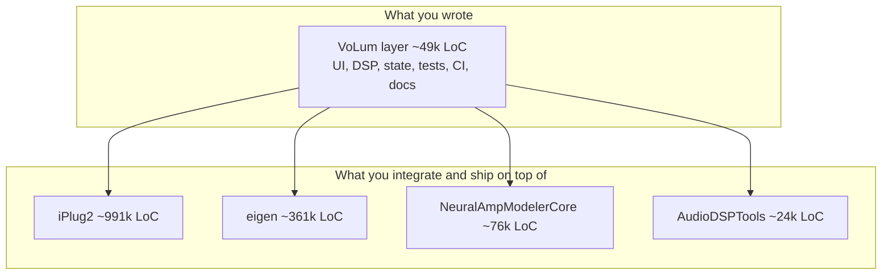

# VoLum Engineering Review

A candid, evidence-backed assessment of how big VoLum is and how well it was built
as an agentic-engineering effort. Written to be reusable when explaining "how do I
AI / how do I agentic-engineer?" to others.

- Scope of judgment: hard evidence from this repository (git history, code, tests,
  CI, Cursor rules/skills). GitHub release/repo metadata is included as color.
  Reddit (`/user/guitarlum/`) was requested but the automated fetch returned
  `403 Forbidden`, so community reception is noted only where I have firsthand data.
- No code or behavior was changed to produce this report.

> Snapshot date: 2026-06-01. All numbers are from the working tree at that time and
> will drift as the project evolves.

---

## 1. How big is VoLum, really? (three honest layers)

The size question only has an honest answer in layers, because most of the
checked-out tree is vendored code you build and integrate against, not code you
wrote.

### Layer 1 - the VoLum layer you authored

| Bucket | LoC | Files |
| --- | ---: | ---: |
| `VoLum*` source + `tests/` | ~40,185 | 84 |
| Scripts + `docs/` + CI workflows | ~9,224 | (32 scripts, 2 workflows, bilingual guide) |
| **Authored total (approx.)** | **~49,000** | |

This is the part that is genuinely "yours": the triptych UI, DSP helpers, state
serialization/versioning, the test suite, the build/release scripting, and the
documentation.

### Layer 2 - the full product directory

`NeuralAmpModeler/` C++ (excluding `tests/third_party/` like doctest/dr_wav):
**~35,780 LoC across 91 files.** This mixes your VoLum code with the upstream NAM
plugin you forked and modified in place (e.g. `NeuralAmpModeler.cpp`).

### Layer 3 - the iceberg you actually ship and integrate

| Component | LoC | Files |
| --- | ---: | ---: |
| Parent repo tracked tree | ~158,048 | 724 |
| `iPlug2/` (plugin framework) | ~990,920 | 3,483 |
| `eigen/` (linear algebra) | ~361,282 | 1,854 |
| `NeuralAmpModelerCore/` (NAM DSP) | ~75,781 | 123 |
| `AudioDSPTools/` | ~24,110 | 35 |
| **Total source you build against** | **~1,610,000** | **~6,200** |

So the practical reality: you are operating inside a **~1.6M-LoC native C++ build
tree**, having authored and tested roughly **49k LoC** of product-specific code on
top of it.



### Activity and traction

- **286 of 593 commits are yours**; the remainder is inherited upstream NAM/iPlug2
  history (the first commit dates to 2022, long before your fork).
- Your commit cadence: **112 commits in 2026-04, 165 in 2026-05** - an intense,
  sustained two-month burst.
- **13 tags**, public releases from `v0.4.1` (2026-04-18) through `v1.0.1`.
- GitHub repo published **2026-04-07**, reached **v1.0.0 in ~7 weeks** (2026-05-16).
- **48 stars, 2 forks** at snapshot time - real, if niche, traction for a guitar
  tool.
- **308 `TEST_CASE`s** across ~30 doctest files.

---

## 2. Candid scored rubric

Scores are 1-5. They are deliberately critical: a 4 is "clearly good," a 5 is
"exemplary, hard to improve."

### Dimension 1 - Brownfield complexity: 5/5

This is not a greenfield toy. You forked a real, shipping cross-platform C++ audio
plugin and extended it across hard domains:

- **Real-time audio DSP** with non-negotiable invariants: NaN/Inf scrubbing
  (`volum::ScrubNonFiniteInPlace`, `SoftSafetyClip`), no audio-thread allocation
  (pre-reserved dual-amp scratch buffers in `OnReset`), POST-effect reset on
  active->inactive edges, smoothed parameters to kill zipper noise. See
  [.cursor/rules/neural-amp-modeler-native.mdc](.cursor/rules/neural-amp-modeler-native.mdc).
- **Concurrency across an audio fence**: a lock-free worker-queue drain on the
  audio thread plus `mStagingMutex`-guarded model/IR staging in `_ApplyDSPStaging`.
- **State versioning and back-compat**: [NeuralAmpModeler/VoLumChunkVersion.h](NeuralAmpModeler/VoLumChunkVersion.h),
  [NeuralAmpModeler/VoLumChunkCodec.h](NeuralAmpModeler/VoLumChunkCodec.h), JSON
  migration, and forward-tolerant settings (downgrading 1.0.1 -> 1.0.0 keeps tweaks).
- **A substantial UI architecture** split across ~30 `VoLum*` headers (triptych,
  hero art, tuner/metronome overlays, fractal art).

Verdict: genuinely brownfield. The constraints (legacy code, vendored deps,
real-time correctness, serialization back-compat) are exactly the constraints that
make enterprise work hard, just at smaller scale.

### Dimension 2 - Engineering discipline: 4.5/5

- **308 test cases** covering the things that actually break audio software: NaN
  guards ([test_volum_nan_guard.cpp](NeuralAmpModeler/tests/test_volum_nan_guard.cpp),
  [test_volum_master_safety.cpp](NeuralAmpModeler/tests/test_volum_master_safety.cpp)),
  golden presets/DSP, chunk round-trip and bounds
  ([test_volum_chunk_codec.cpp](NeuralAmpModeler/tests/test_volum_chunk_codec.cpp)),
  bypass identity, and **pinned parameter order/step sizes**
  ([test_eparam_order.cpp](NeuralAmpModeler/tests/test_eparam_order.cpp),
  [test_keyboard_steps.cpp](NeuralAmpModeler/tests/test_keyboard_steps.cpp)).
- **Disciplined changelog**: [NeuralAmpModeler/installer/changelog.txt](NeuralAmpModeler/installer/changelog.txt)
  reads like a professional release log - each line explains the "why," not just the
  "what."
- **Bilingual user docs** kept in sync (`docs/user-guide.en.md`, `.de.md`).
- **Branching model**: `main` (released) / `dev` (integration) / `feature/*`.

Half-point off only because the rubric reserves 5 for "hard to improve," and there
are thin spots (see weaknesses).

### Dimension 3 - Agentic-specific practice: 5/5

This is the standout, and the most transferable part of your work. You did not just
"vibe code with an AI" - you **engineered the agent's environment**:

- **8 Cursor rules** that encode the workflow as enforceable policy, not vibes:
  [vo-lum-workflow.mdc](.cursor/rules/vo-lum-workflow.mdc) (vertical slices +
  mandatory build/test gate + changelog),
  [measure-twice-cut-once.mdc](.cursor/rules/measure-twice-cut-once.mdc) (plan first,
  hand off with model/skill recommendations),
  [neural-amp-modeler-native.mdc](.cursor/rules/neural-amp-modeler-native.mdc)
  (RT-safety invariants the agent must respect),
  [git-remote-https.mdc](.cursor/rules/git-remote-https.mdc) (a machine-specific
  footgun captured as a rule).
- **7 project skills** that act as repeatable runbooks:
  `release-manager`, `native-build-debugger`, `upstream-sync`,
  `volum-param-state-change`, `volum-ui-change`, plus utility skills.
- **Plan files** in `.cursor/plans/` (this review was itself produced plan-first via
  a grilling interview).
- **A routing `AGENTS.md`** that keeps context small by pointing each task type at
  the right scoped rule/skill.

This is materially more sophisticated than how most people use coding agents, and
it is the single biggest reason the project held together over 277+ commits.

### Dimension 4 - Product/release maturity: 4.5/5

- **Real installers**, not just zips: Windows setup + portable, macOS dmg /
  `.component` (AU) / `.vst3`, with code-signature verification baked into packaging.
- **Release CI that refuses to ship broken builds**: defaults to `patch`, aborts on
  first platform failure, runs installer + standalone smoke checks, asserts built
  bundle version matches the tag, and runs **automated upgrade-install smoke tests**
  (install prior release, install new over it, assert version + settings preserved).
- **Platform-specific hard problems solved**: macOS TCC mic-permission persistence,
  Gatekeeper / resource-fork zip pitfalls, RtAudio non-divisible buffer handling.

This is shipping-product maturity, well beyond a hobby plugin.

### Dimension 5 - Weaknesses and risks: scored as 3/5 (honest gaps remain)

Real issues, not nitpicks:

1. **`NeuralAmpModeler.cpp` is ~3,268 lines** - a monolith that violates the
   project's own "~500 line" refactor rule in
   [vo-lum-workflow.mdc](.cursor/rules/vo-lum-workflow.mdc). It is partially
   mitigated by `.inc.cpp` tail-includes (`VoLumProcessBlock.inc.cpp`,
   `VoLumLoader.inc.cpp`, `VoLumSettings.inc.cpp`), but the core file is still the
   highest-risk surface in the codebase.
2. **Working-tree hygiene**: 12 untracked artifact directories sit in the tree
   (`ci-artifacts-*`, `rc-artifacts-*`, `release-1.0.1-artifacts/`, etc.). Only
   `NeuralAmpModeler/build-win/` is in `.gitignore`; downloaded CI/release artifacts
   are not, so they clutter `git status` and risk accidental commits of large
   binaries.
3. **Single-author bus factor**: 286/286 of the VoLum-specific commits are yours.
   Great for velocity, a risk for continuity - the knowledge lives in the rules/docs
   (good) but not in a second human.
4. **Test coverage is behavior/logic-focused, not line-coverage measured**: there is
   no coverage instrumentation, so thin areas (e.g. the large UI controls in
   `VoLumTriptych.h`, fractal art) are asserted mostly via regression smoke rather
   than unit coverage.
5. **License is "Other"** on GitHub - intentional for a fork of GPL-ish upstream, but
   worth making explicit for anyone evaluating contribution/reuse.

---

## 3. Is this "brownfield enough"? Verdict.

**Yes - this is genuine brownfield engineering, not a hello-world.** Place it on the
spectrum like this:

```
hello-world  --  CRUD side-project  --  [ VoLum ]  --  mid-size product  --  1M-LoC enterprise
```

VoLum is not enterprise-scale by LoC of *your* code (~49k). But "brownfield" is about
**constraints, not line count**, and VoLum has the constraints that actually make
senior engineering hard:

- You inherited and modified a large existing codebase in place (a fork), with an
  **upstream fence** you must respect to keep merging upstream changes.
- You work against **~1.6M LoC of vendored dependencies** you do not control.
- You carry **backward-compatibility obligations** (preset/state migration across
  shipped versions).
- You ship **real artifacts to real users across two OSes** with signing, installers,
  and upgrade paths.
- You operate under **real-time-correctness invariants** where a single NaN or
  audio-thread allocation is a user-visible defect.

What it does *not* exercise that a 1M-LoC enterprise app would: large multi-team
coordination, long-lived service operations / on-call, data migrations at scale,
org-level compliance, and deep dependency-graph blast-radius management.

**Defensible framing to use when asked:** "VoLum is a real brownfield native project -
a fork of a 1.6M-LoC C++ audio stack with backward-compatible state, cross-platform
signed releases, and real-time DSP constraints. It is not enterprise-scale in
headcount or data, but the engineering constraints are the same class as enterprise
work, and I drove it solo with an agent across ~280 commits in two months." That is
both honest and credible.

---

## 4. Agentic engineering playbook (derived from what you actually did)

These are transferable talking points for "how do I AI?", each grounded in a concrete
artifact in this repo - so you are teaching from evidence, not theory.

1. **Encode the workflow as rules, not vibes.** The agent forgets; the rule does not.
   Your [vo-lum-workflow.mdc](.cursor/rules/vo-lum-workflow.mdc) makes "build + run
   tests + append changelog before you stop" a *policy*, so quality does not depend on
   the human remembering to ask. **Lesson:** turn every "I keep having to remind it"
   into a rule.

2. **Ship vertical slices behind a mandatory test gate.** One behavior or one bugfix
   per pass, with a working build + green tests before the next idea. **Lesson:** the
   agent's superpower is speed; the test gate is what keeps speed from becoming
   entropy.

3. **Plan-first, then hand off deliberately.** [measure-twice-cut-once.mdc](.cursor/rules/measure-twice-cut-once.mdc)
   forces a plan to end with an explicit *model + skills + first step* recommendation.
   **Lesson:** separate "think" from "do," and make the handoff pick the right tool for
   the task shape.

4. **Build skills as runbooks for the boring, error-prone, repeated tasks.** Releases,
   build-failure triage, and upstream sync are exactly where humans make mistakes;
   `release-manager`, `native-build-debugger`, and `upstream-sync` make them
   repeatable. **Lesson:** if you have done it twice and it has a checklist, it should
   be a skill.

5. **Use tests as the agent's eyes where you cannot eyeball correctness.** You cannot
   "look at" a NaN in an audio buffer, so you encoded 308 assertions instead
   (NaN guards, golden DSP, chunk round-trips, pinned param order). **Lesson:** in any
   domain without a visual diff, tests are how the agent knows it succeeded.

6. **Capture environment footguns as rules.** [git-remote-https.mdc](.cursor/rules/git-remote-https.mdc)
   turns a machine-specific SSH-timeout trap into one-time knowledge. **Lesson:** every
   "the agent wasted 20 minutes on my weird local setup" is a missing rule.

7. **Keep context small with a routing index.** `AGENTS.md` points each task type at
   the right scoped rule/skill so the agent loads only what it needs. **Lesson:** a
   small router beats one giant always-on prompt.

### Model / skill selection heuristic (from your own measure-twice rule)

| Task shape | Tier to reach for |
| --- | --- |
| Wording, docs, config, small script tweaks | Fast implementation-tier model |
| DSP/state/serialization, refactors, architecture, anything safety-critical | Strong reasoning-tier model |
| Ambiguous / multi-branch decisions | Plan first (grill-me), then choose tier per the plan |

Pair the tier with the right skills *before* coding (e.g. load
`volum-param-state-change` before touching serialization), and reserve retro/review
skills for after, on demand.

---

## 5. Backlog appendix (ideas, not actioned)

Captured for your backlog. None of these were implemented as part of this review.

**Engineering / hygiene**

- Extend `.gitignore` to cover `ci-artifacts-*/`, `rc-artifacts-*/`,
  `release-*-artifacts/`, and downloaded `*.dmg`/`*.zip`/`*.exe` release blobs so they
  stop appearing in `git status` and cannot be committed by accident.
- Continue decomposing `NeuralAmpModeler.cpp` (~3,268 lines) - it is the largest
  single risk surface and exceeds the project's own 500-line refactor guideline.
- Add optional coverage instrumentation (even a rough gcov/llvm-cov pass) to find
  untested UI/state paths, complementing the existing behavior tests.

**Process / agentic**

- A `captain-hindsight`-style retro after each release to fold lessons back into
  rules/skills (you already have the skill - make it a release-step habit).
- A short `CONTRIBUTING.md` / architecture overview to lower the single-author bus
  factor if you ever invite collaborators.

**Product (for triage, not commitments)**

- Native Linux build (currently only Windows VST3 via yabridge is reported working).
- Preset/rig sharing or import-export beyond the bundled catalog.

**Sharing / external**

- Reddit reception could not be auto-fetched (403). If you want it folded into a
  public-facing version of this review, paste the thread titles/links and I will add a
  "community reception" section.

---

## Appendix: how the numbers were produced

- LoC via `git ls-files` per scope piped through `Measure-Object -Line` (PowerShell),
  so build artifacts and untracked binaries are excluded.
- Submodule LoC measured inside each submodule working tree (`git -C <sub> ls-files`).
- Commit/author/tag/cadence figures from `git log` / `git shortlog` / `git tag`.
- GitHub release and repo metadata via `gh` against `guitarlum/VoLum`.
- Reddit fetch attempted against `https://www.reddit.com/user/guitarlum/`; returned
  `403 Forbidden`.
